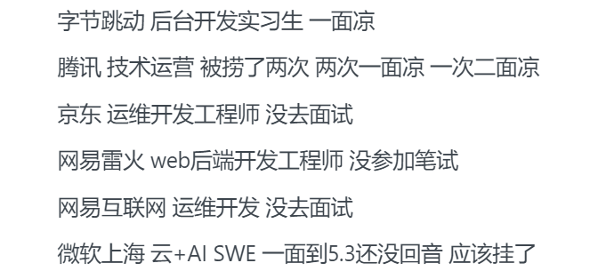
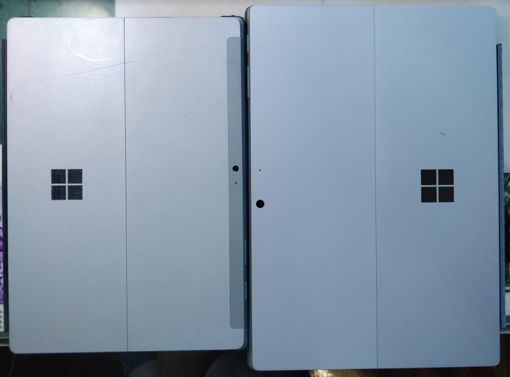
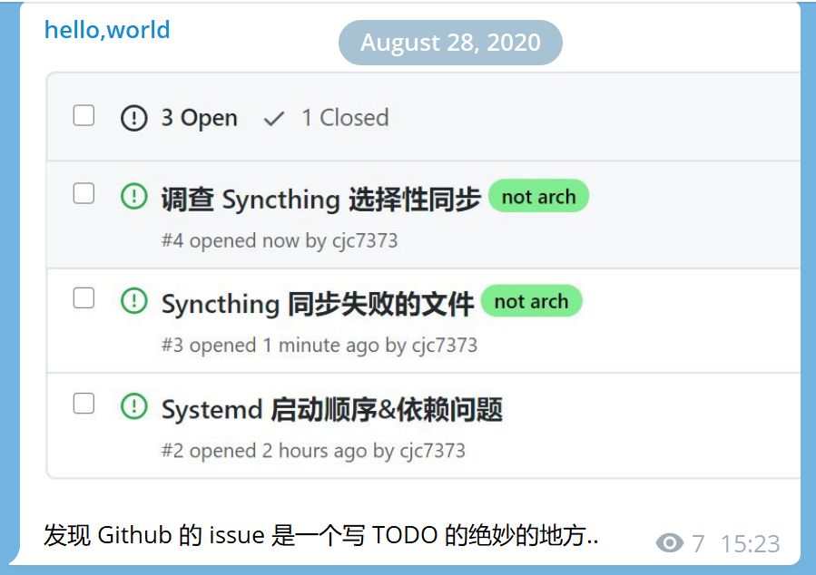
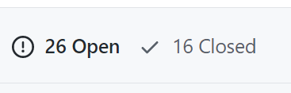

又到了传统艺能~~年终~~年初总结时间, 在一天鸽一天的情况之下, 今天已经是正月十四了..

<!-- more -->

## 2020 总结

一句话总结的话, 知识的广度提升了, 深度还不够, 学习状态仍旧不能让自己满意. 以及这一年我始终在担心有没有学上, 找不找得到工作.

### 学业

- 由于疫情的爆发, 导致了 2020 春季学期完全在家上课, 更加方便摸鱼了(

  一开始港哥在群里说武汉疫情的时候, 我还不觉得这是什么大事, 后来才发现我错得离谱.

- 二月底到三月初, 陆续投了几个实习, 被拒了几个, 后来决定考研之后, 又鸽了几个

  

  说实话我对以后能不能找到工作还是有点怀疑的..

- 从三月开始, 断断续续地开始准备考研了, 然而实际上还是不够努力吧, 到考试前一天我还没完全搞懂二次型..

  不过从时间上来说, 暑假之后就全力准备考研了..

  我很想说考研让我变得更沉得下心来学习了, 但事实上这并不是真的.

- 只准备了两三天之后 (因为太晚看到了), 尝试申请了一下 GSoC, 不出意外凉了..

- 七月到十月, 参加开源之夏, 也算是赚到了人生的第一桶金吧

### 玩

- 一月, 去滑雪+攀岩, 还是挺有意思的
- 二月初, 折腾了一下 Windows 10 on Arm for Lumia 1520, 并没有什么用, 于是继续吃灰
- 七月, 乘着沪通铁路的开通, 去上海玩了一次, 居然被我碰到了一次高铁延误..

### 环境

- 二月末, 开始搞 Manjaro, 一开始两个系统都用, 逐渐就只用 Linux 了 (特别是我发现了 proton 和 lutris 之后..)
- 三月初, 开始尝试 Typora+第三方云同步
- 七月, 从 Onedrive 转向 Syncthing (是不是有一种 Anything can be self-hosted 的趋势呢..

### 书

本年度仍然没有怎么看书..

- 看完了心理学与生活, 心理学啊, exciting
- 看完了 Dark Forest

### 代码

总的来说, 感觉自己乱七八糟的项目一堆, 却没什么拿得出手的..

- zaobot, 基本一整年都在维护 (虽然目前的代码还是挺是💩的, 打算再次重构
- 云盘在年初把后端重构了一下, 后来就鸽了 (事实上我这是重复造轮子, seafile 的体验就很好..)
- pip, 四五月吧, 修了一些 bug, 做了点微小的贡献, 主要还是 codebase 没太理解..
- Hackergame, 七到九月, 后端应该基本可用了, 然后答应的前端鸽了.. 当时天天看文档..
- 九十月考研的时候, 稍微学了一点 Anki, 为了自己用得顺手, 写了一个小插件.
- 建了个[仓库](https://github.com/cjc7373/my_scripts)写一些日常使用的脚本, 然而目前觉得可以全扔 Ansible 里..
- 花~~半个小时~~三天写了个课程评价, 然而并没有人用..

### 学习

- 年中, 学了下小鹤双拼, 虽然似乎打字速度没快多少..
- 十一月, 终于把 Learning How To Learn 学完了, 然而我学到了什么呢..

### 剁手

- 一月初, 本来已经买了联想小新 Pro 13, 然而压感触控的体验不是很好, 又碰到了下方向键有概率用不了的问题, 于是退了..

- 一月, 购置了网件 R7900p, 终于能在电视上用 smb 看电影不卡了.. 然而 ipv6 是个坑..

- 二月, 捡了个洋垃圾 Surface 3, 虽然电池有坑, 但是 Surface 总体还是可以的. 后来出了.

- 六月中, 入手了 Surface Pro 7, 除了续航有点差其他都很满意. 18 年开始就种下的草 (指买轻薄本) 终于拔了.

  附一张合照:

  
  
- 十一月, 由于创新 IE3P 的线老是掉, 我终于买了个无线耳机, Galaxy Bud+.

### 财务

基金今年还是没怎么动, 看着大盘涨.. 稍微学了点投资的知识.

记账方面, Spendee 在年中放弃了, 因为感觉意义不大. 后来知道了 Plain Text Accounting, 于是学了点 Beancount, 不过还没应用到实践中.

### 其他

- 

  事实证明这是很好的追踪一个问题的工具..

  

  但是浏览条目还是有些不爽 (比较慢)..

- 六月, 开始用 KeePassXC 管理密码.

- 暑假里, 看了人类星球, 自然与人文纪录片交汇的佳作

- 2020 秋季学期运动的次数显著增加了, 经常会去打打羽毛球.

- 十月, 和 Moo 在北门合租了, 环境比之前在樱花广场好了很多..

- 十二月, 用 rsync 删了一波自己的 home 目录, 血的教训.. 没想到我也有删库的一天..

- 这一年没怎么管博客, 因为考研, 外加想着迁移 Pelican, 结果又挖了一个大坑

## 2021 计划

还有两天考研出分了.. 说实话挺害怕的.. 考不上就只能找工作了.

- 今年还是想尝试一下 GSoC, 到四月中旬申请结束还有一个半月.. 努力去混混脸熟吧.
- 事实上, 我还有一堆开的坑, 包括但不限于:
  - 给 Wikipedia 贡献一个优良条目的翻译
  - 写个 (或者找找) 各板块指数的 PB 中值温度计.
  - 所有 VPS 都使用 Ansible 维护
  - 写一个 Pelican 的主题, 类似 [diary](https://github.com/amazingrise/hugo-theme-diary).
  - 学习 CSAPP
- 毕设, 写一个第三方网易云, 毕竟是自己提的项目, 还是要好好写的.. 这又是一大堆不熟悉的技术栈..
- 还是要多看点书..

不管怎么样, 我还是要以更加积极的心态去迎接未来. 冲!

