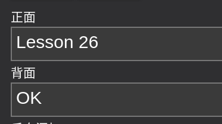
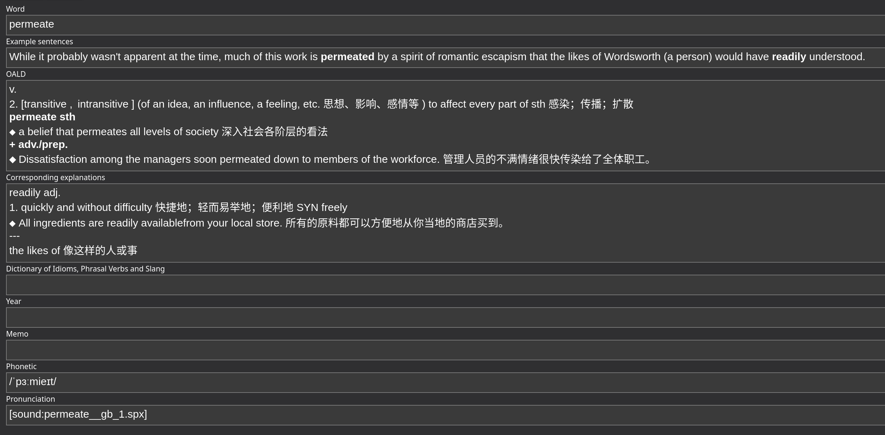
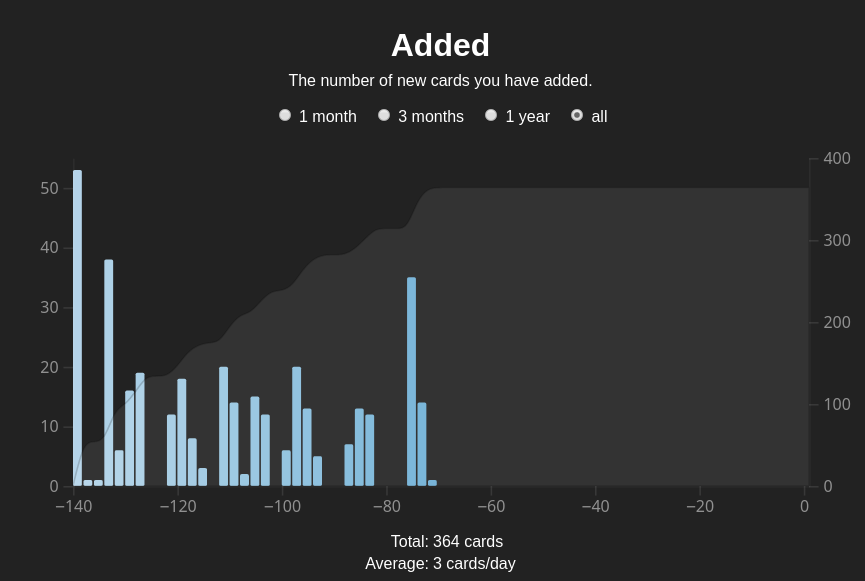
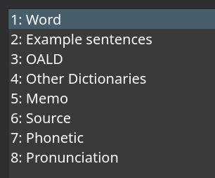

[Anki](https://apps.ankiweb.net/) 是一个间隔式重复的"闪卡 (flashcard)"记忆软件. 下面来谈谈我考研及日常生活中的 Anki 工作流.

<!-- more -->

## 为什么选择 Anki

和市面上其他的记忆软件一样, Anki 也是基于遗忘曲线, 基于间隔式重复这一原理的. 最大的不同在于它是高度自定义的. 自己制作卡组, 设计模板, 甚至编写自己的插件. 还有很多特性例如 Notes 和 Cards 相分离我其实并没有用到.

其次 Anki 是一款开源软件, 在我希望所有软件都用自由软件替换的如今, 这无疑是一个重要的理由.

最后它在 Windows, Linux, Android 上都有客户端, 并支持同步. 虽然内置的同步服务器是由 Ankiweb 提供的 (我至今不知道 Ankiweb 和 Anki 的关系以及它是如何运作的), 然而也能够用自建的替换.

虽然网上能够找到很多已制作好的卡组, 然而这些卡组并不一定适合自己. 以记单词而言, 卡组中的许多卡片都是自己已经熟知的. 况且制卡这个过程本身能够帮助自己记忆. 所以我还是选择了自己构建卡组的方式.

## 基础卡片

对于一般的记忆来说, 基础的 Note type 就够用了.. 比如我一开始用 Anki 来提醒我复习新概念英语, 用的是以下的 Note type:

十分简单.

## 考研

考研的时候打算用 Anki 背单词, 于是我做真题的时候碰到不认识的单词记录下来, 然后用 Anki 制卡.

其中最主要的问题是音标, 发音和释义. 一开始想的办法是发音用 TTS, 于是找到了 Azure 的 API, 然而一个缺点是每次制卡要等很久 (请求 API), 而且 Azure 的 API 很贵.. 我给一个几百张卡的卡组加发音花了我五块钱..

于是我就想到了从词典中导入, 我平时主要使用的词典是 OALD8 (很久之前从 [pdawiki](https://www.pdawiki.com/forum/) 下的), 于是我就自己糊了个[插件](https://ankiweb.net/shared/info/738556640).. 功能很简单, 根据单词字段从词典 mdx 文件里查询音标和发音, 并填充到相应字段中.

最后的成品卡片是这样的:

制卡的时候首先手打单词和例句, 然后从词典里选一个释义复制过来就行了. 个人感觉也不是很麻烦..

看一下成果:

考研的那一百多天里我总共背了 364 个单词.. 其实挺少的..

之后的卡组中我优化了一下 Note 的字段, 于是现在变成了这样:

## 咕咕咕时间

- 释义的导入我肯定也想自动化的. 而选择释义势必要做一个弹窗, 那么这就涉及到 Qt 的知识了, 于是目前搁置了
- 有的单词不同的词性有不同的发音, 这个也没有处理..
- 有一个 [chrome 插件](https://github.com/ninja33/ODH)已经基本上把我想做的都实现了, 可以借鉴一下..

