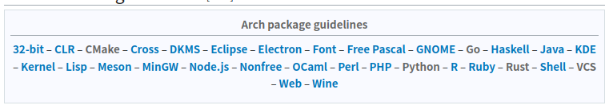

记录一下打包过程. 本文为一篇本成品博文, 笔者写了一半鸽了.

<!-- more -->

Archwiki 给人的感觉还是有点零碎了.. 与打包相关的条目大概有:

- [Creating packages](https://wiki.archlinux.org/title/Creating_packages)
- [Arch package guidelines](https://wiki.archlinux.org/title/Arch_package_guidelines)
- [makepkg](https://wiki.archlinux.org/title/Makepkg)
- [PKGBUILD](https://wiki.archlinux.org/title/PKGBUILD)
- [AUR submission guidelines](https://wiki.archlinux.org/title/AUR_submission_guidelines)
- [Arch Build System](https://wiki.archlinux.org/title/Arch_Build_System)

好吧, 这可能就是 Wiki 的组织形式, 但对新手来说确实不友好. 另外 makepkg 和 PKGBUILD 的 man 文档也是很有用的.

## 概览

ABS 是一个 [ports](https://en.wikipedia.org/wiki/Ports_collection)-like 构建系统, 其打包的主要工具为 makepkg, 根据当前目录下的 PKGBUILD 打包. 据说是比 Debian 系的打包容易不少.

## 打包

首先 makepkg 会下载 source 变量中指定的文件列表, 它们可以是一个 URL, 一个 git 仓库, 或一个在当前目录下的文件. makepkg 会校验文件的哈希并解压到以文件名命名的目录. 可用 `-g, --geninteg` 命令来下载文件并生成哈希. 注意 VCS 的 source 是没有哈希的.

事实上看一看每种语言对应的 guidelines 是非常有用的.

我在打这个 go 包的时候, makepkg 有个警告: `==> WARNING: Package contains reference to $srcdir`, 而 Go package guideline 里就给了解决办法.

## 上传 AUR

AUR 还挺有意思的, 它是个 git 仓库, 我们只要 push 一个仓库到 `ssh://aur@aur.archlinux.org/pkgbase.git` 就能创建一个 pkgbase 包. 当然, 除了创建新包外,应该是只有 maintainer 有权限了. 所以首先我们需要去 AUR 的网页里添加公钥. 顺便吐槽一下 SSO 什么时候才能被应用到所有 Arch 的网站中.

每次修改 PKGBUILD 上传 AUR 之前, 我们都必须运行 `makepkg --printsrcinfo > .SRCINFO` 来生成 `.SRCINFO`, 这是 AUR 显示在网页上的元数据.