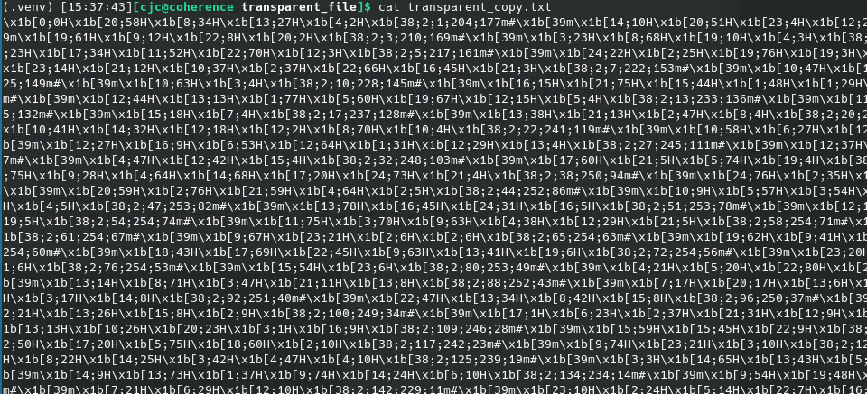
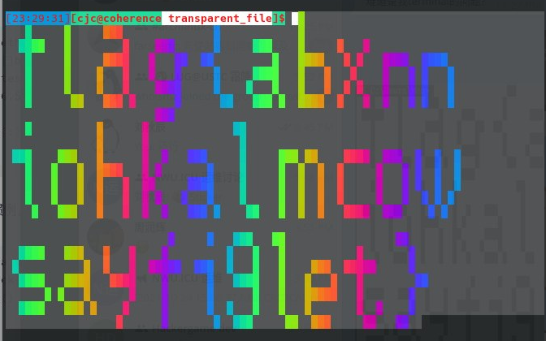
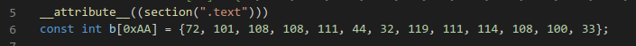
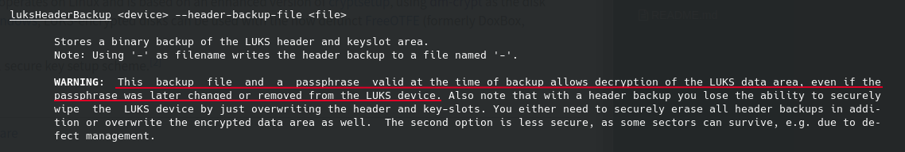
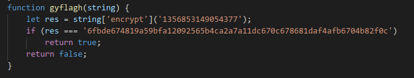
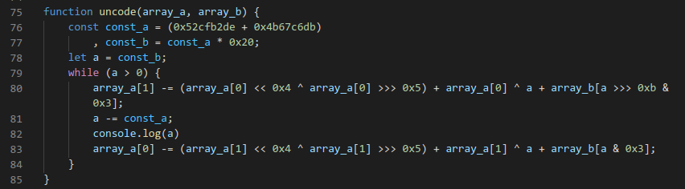
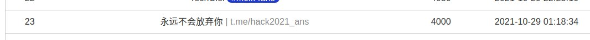
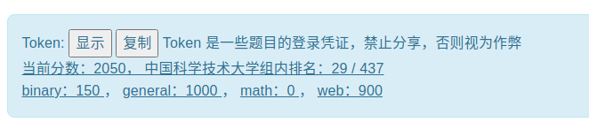
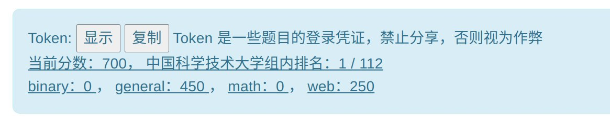

记录一下比赛期间踩到的坑.

<!-- more -->

## 签到

开始完全没有读题直接进题目, 然后想了半天没思路并随机测试了一些数.. 直到我读了题..

## 进制十六——参上

显然, 大家都知道怎么编辑十六进制, 然而我并不想手输这么多文本, 于是 Google 在线 OCR, 结果 OCR 的内容有部分是错的.. 被迫找同学要了一份 OCR 结果.

## 去吧！追寻自由的电波

直接 Google ffmepg 音频速度. 然而很多结果给的一个过滤器是不改变音调的方案, 后来发现直接改采样率就行了..

```bash
[cjc@coherence hackergame_2021]$ file radio.mp3 
radio.mp3: Audio file with ID3 version 2.4.0, contains: MPEG ADTS, layer III, v1, 128 kbps, 48 kHz, Stereo
[cjc@coherence hackergame_2021]$ ffmpeg -i radio.mp3 -af "asetrate=16000" radio_output.mp3
```

命令来自[这里](http://johnriselvato.com/ffmpeg-how-to-change-the-pitch-sample-rate-of-an-audio-track-mp3/), 虽然我根本没有看这篇文章..

## 猫咪问答 Pro Max

没错, 被第二题坑了.. 以为是第四题不对, 于是写了个暴力跑了几万次..


提示: 这是一个提示.

## 卖瓜

已经被同学提示了这是个 PHP 溢出问题.. 甚至都找到了 (同学给的) [PHP 文档中的一条评论 (甚至题解也给了这个)](https://www.php.net/manual/zh/language.types.integer.php#125251), 但是并不知道怎么做.. 于是用 `b1=2**63//6+n` (n 为 -10~10 之间的一个随机数) 瞎试做出来了.

## 透明的文件

看[这篇文章](https://learnku.com/articles/26231)学到了一些 ANSI 转义序列的知识. 题解上说只需简单地在 `[` 前加上 `\x1b` 就行, 然而并不行.. 我的终端并不能解析这些转义序列..



于是在进行了一些我也忘记了是什么的操作之后终于成功了:



只记得 Python 从文件读然后 print 和直接 print 一个字符串的结果还不一样.. (也可能是是否在 REPL 下的区别.. 不管了)

找个时间可以好好学一学这方面的内容..

PS: 直接使用 `cat transparent.txt | sed 's/\[/\x1b[/g' | sed 's/ /#/g'` 是可以的.. 那看来是 VSCode 的替换的锅了.. 在 VSCode 中我直接用字符串 `\x1b` 替换的.. 而 sed 替换出来的是一个字节 `\x1b`..

## 旅行照片

纯社工题. 第五题题解中说的百度街景里并没有找到.. 小红书发挥了重要作用..

## FLAG 助力大红包

居然真的有人在求助力..


第一时间就想到了 `X-Forwarded-For`. 我以为并不会这么简单, 没想到恰恰是这么简单..

这题因为题目的请求并发限制还被坑了一会..

## Amnesia

没想到题解这么简单, `putchar` 中的一个 char 字符会被分配到栈上, 我还用了一个很魔法的方法..



这样似乎能强制把 b 数组 .text 段上..

第二问显然我不会..

## 图之上的信息

基本没遇到什么障碍, Google 到 [How to query all the GraphQL type fields without writing a long query?](https://stackoverflow.com/questions/34199982/how-to-query-all-the-graphql-type-fields-without-writing-a-long-query) 之后试了几分钟就试出来了.

## Easy RSA

## 加密的 U 盘

一开始各种 Google `luks exploit`, `luks attack`, 但是总感觉这么一个应用广泛的标准有明显的漏洞不太可能.. 直到我读了一下 `man cryptsetup`..



从题解中我得知了 LUKS 使用 passphrase 用来加密 master key, master key 加密全盘文件, 这是为了避免改 passphrase 时重新加密全盘的开销.

## 赛博厨房

## 阵列恢复大师

## 马赛克


## minecRaft

扫了一遍源码发现核心逻辑应该是在 flag.js 中. 打开一看经典混淆了.. 操作了一番后尝试把 `gyflagh` 函数的返回改成 `true`, 发现并没有用. 那看来是要解密那个字符串了..



核心逻辑在 code 函数里:


本以为这个过程是不可逆的, 但最后一天仔细看了一下后发现第 68 行 array_a[0] 的操作中只涉及了 array_a[1], 第 71 行也是同理, 于是只要简单地减一下就行了.



还好几个辅助函数比如 `LongToBase16`, `Base16ToLong` 没有混淆.. 不然肯定做不出了..

## 其他

- 震惊! 排行榜上有选手公然发题解!

  

  嗯.. 看昵称就知道是什么了..

- 最后校内排名 29, 总排名推测一下应该在 100~200 之间

  

  全靠 web 和 general 拿分..

- 不过在第一天甚至短暂地冲到过第一, 人生巅峰.jpg

  

  

