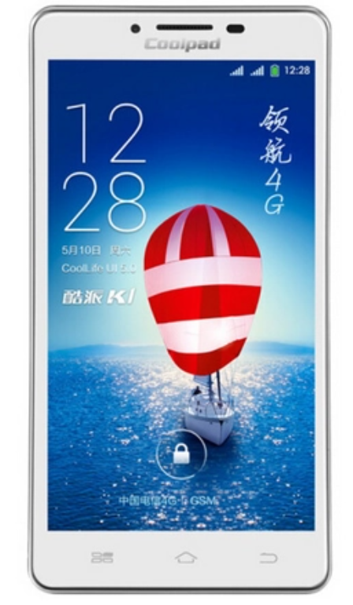
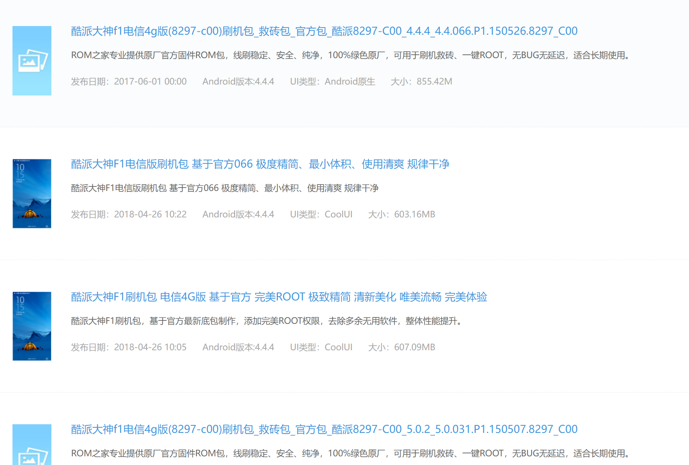

本文纯属回忆, 描述可能会有偏差.

小学时, 为方便联系, 我爸给了我一个 ZTE 的功能机, 里面只有一个打砖块的小游戏.

后来这手机被我在路上掉了, 于是我换成了一个 LG 的功能机. 这个 LG 的神奇之处在于它自带了一个浏览器, 于是我可以用 2G 上网去起点, 纵横看小说. 另外它自带电信的一个应用商店, 里面有一些免费的小游戏可以下 (不知道是啥技术, 估计是 java..), 因为我当时并没有流量套餐, 后来还因为话费异常被我爸查到并追问我在上网干什么, 我记得我用看新闻蒙混过去了. 这个手机陪伴我度过了初中.

考上省中后, 爸妈为了奖励我, 给我换了个新手机, 这时我爸被中国电信忽悠买了个酷派 K1 (酷派 5952).

这也算是当时第一批 4G 手机了, 进网贴纸贴的还是进网试用. 但是 1G 的内存根本比不过同期的小米 2S.

后来因为我忘了什么原因了我又买了个手机, 这个给我爸用. 听信了当时中华酷联的鬼话我又入了酷派的坑 (加之当时电信手机确实不好买), 买了酷派大神 F1 电信版 (8297-C00), 采用了"极为先进"的 64 位高通 410 SoC (据称是高通首款 64 位), 对, 我又听信了 Android 5.0 优化 (ART, Android Runtime) 和 64 位的鬼话, 买了这个 1G RAM 的手机.
事实上出厂系统还是 4.4, 32 位. 于是我天天去酷派论坛蹲, 还真蹲到了 64 位的 5.0. 但事实上硬件的局限在那, 提升并没有那么大.
于是当时整天折腾各种 ROM, 各种优化. 在那个我 root 还靠各种一键 root app 的年代, 很难想象我都在优化什么.

这里提一件我印象很深的事. 酷派自带的系统有个安全 app, 叫酷管家, 显然我并不想用它, 但是一旦你删了它或者想动它什么组件, 手机就会弹一个正在优化系统的弹窗 (实际上是软重启), 然后一切归零.
另外还值得一提的是刚拿到手机的那几个月里系统更新还是很频繁的, 而且似乎确实解决了一些问题, 这点还是好评.

ROM 之家这种网站也是时代的眼泪了

后来由于学习的原因手机被迫上交. 但没过多久我偷偷搞到了我爸之前用的一个安卓 2.3 的小手机. 型号已经忘了, 大概是 htc, 性能非常差, 大概只有单核, 200 多 MB 内存, 触摸屏中间一部分还是坏的, 但用来看小说完全够了.

到了高三娱乐活动更加匮乏, 于是我托同学在闲鱼上买了个 iPhone 5s, 顿时感到苹果是多么好看, 多么精致, 还有极为先进的 Touch ID, 当时用它打炉石感到难以想象地流畅 (毕竟之前的垃圾酷派实在是卡). 唯一的问题是被卖家坑了, 电池雪崩, 有时一半电直接关机. 但是其和温度有很大关系, 有时候你把它捂一会捂热它就又能开机了. 后来不得已花了一百多换了块电池.

用了一段时间我顿感苹果索然无味, 于是卖了买了 Nexus 6. 在 16, 17 年高通 805 + 3G RAM + 5.95' 2k 屏说不上顶配, 但也足够优秀了, 很难想象这是 14 年发布的手机. Google 亲儿子无成本解锁 BL 的特性让刷机和 root 变得非常方便.
而且它那个屏幕的手感非常不错, 在现在看来滑动也是丝般顺滑, 可惜后来屏幕被我摔碎了.

高中毕业后, 虽然 Nexus 6 性能还够用, 但这不能给我爸妈看到呀, 于是直接买新手机. 一开始抢小米 6 没抢到, 然后买了一加 5. (还好没抢到!) 以我现在的眼光自然是觉得 Oxygen OS 这种类原生是要比 MIUI 好很多的.

这一加 5 钉子户一当就当了四年. 到大学毕业实在感到 835 性能不够用了. 我当时是想挑一个小屏旗舰, 挑来挑去也没挑出来, 要么太贵, 要么不能解锁 BL, 于是又买了一加, 一加 8T.
