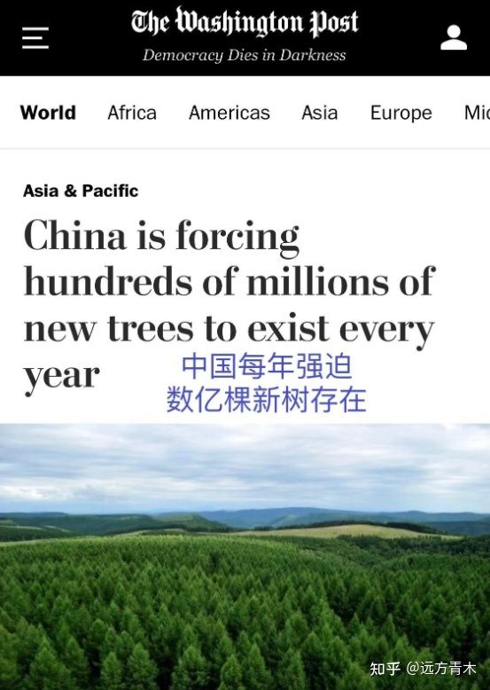
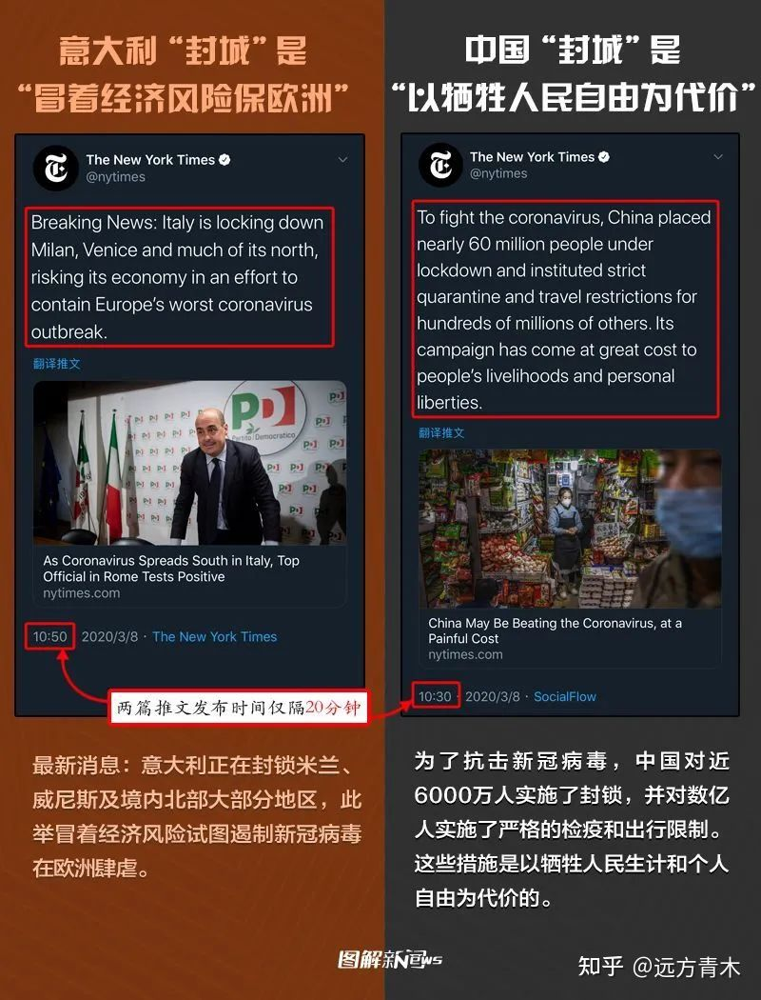
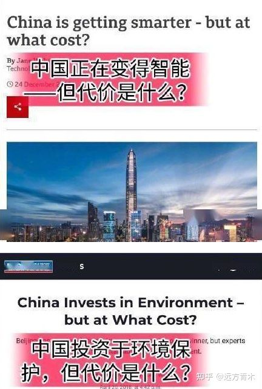

原文: [西方媒体是怎样给西方人洗脑的？ - 远方青木的回答 - 知乎](https://www.zhihu.com/question/428451991/answer/2431916538), [archive](http://web.archive.org/web/20220429053052/https://www.zhihu.com/question/428451991/answer/2431916538)

抛开文中的情绪性观点不谈, 以下对文中的观点以及列出的事实一一作了分析. 没有列出来源的事实, 比如 "欧美媒体报道" 这种我就懒得找了.

---

观点: "中国人每吃一口肉，亚马逊热带雨林就会冒出一缕白烟" , 这是歪理邪说, 是造谣生事
论据: [纽约时报 中国人会购买人造肉吗？](https://www.nytimes.com/2020/01/07/business/fake-pork-china.html), 另见[环球网报道](https://world.huanqiu.com/article/9CaKrnKoNzC)

反驳: 虽然文章很有"反华"的倾向性, 但文章主要讲的是人造肉在中国难以推广. 肉类消费对于气候的影响是不争的事实. 所以"中国人每吃一口肉，亚马逊热带雨林就会冒出一缕白烟"这句话也不能算错, 但应该把主语换成全世界人.
要求中国牺牲国民营养而减少肉类消费是不合理的, 但是推广人造肉是合理的.

---

观点: 中国种树有罪, 因为中国每年强迫数亿棵新树被种植, 这很显然侵犯了树权. 这种观点很荒谬
论据: 华盛顿邮报的一张图.

反驳: 据 [checkyourfact](https://checkyourfact.com/2022/04/18/fact-check-washington-post-china-trees-article/), 该截图为杜撰, 最初流传于 Facebook 和 Twitter.

---

观点: 一次性筷子不是用森林做出来的, 用木头成本太高商家会亏本, 西方媒体以森林是宝贵的来指责中国

论据: [华盛顿邮报《中国对一次性筷子的成瘾正在摧毁森林》](https://www.washingtonpost.com/news/worldviews/wp/2013/03/14/chinas-disposable-chopstick-addiction-is-destroying-its-forests/)

反驳:
华盛顿邮报 2013 年的报道, 主要援引的是时任吉林森工集团董事长柏广新的一句话: "我国每年生产800亿双一次性筷子，相当于要砍伐2000万棵生长20年的大树". [中国政府网](http://www.gov.cn/2013lh/content_2349497.htm)和[光明网](http://cpc.people.com.cn/pinglun/n/2013/0312/c78779-20759994.html)均能找到这句话以及相关对一次性筷子的批评. 报道中均指出了木头和竹子均是一次性筷子的原料.

---

观点: 中国人花费几代心血把沙漠变成了绿洲，对人类如此巨大的贡献居然招来西方期刊的指责？治理沙漠居然都能成为破坏环境的罪证。
论据: [nature 文章 China's tree-planting drive could falter in a warming world](https://www.nature.com/articles/d41586-019-02789-w)

反驳:
但凡看一下文章就会觉得文章的中立性是没问题的. 文章警告了非原产地树木对当地水资源的大量消耗, 可能会导致干旱地区的扩散. 也引用了多位中国科学家的意见.

---

观点: 澳大利亚和美国森林大火，烧毁无数森林，漫天黑烟，西方说这都是很正常的行为，对人类环境没有丝毫损害。
论据: 无

反驳: 因果倒置, 是气候变化导致了森林火灾的可能性增加

---

观点及论据:

反驳:
这个好像反驳不了.. 只能说 NY Times 的屁股是有点歪..

---

观点: 把中国的好事变坏简直太简单了，你这个好事似乎存在，但代价是什么？
论据:

反驳:
好几张类似的图.. 一眼都是只看个标题没看正文的.. 有稻草人论证的嫌疑.

---

总结: 看这种自媒体真的降智商.. 以后要少看.. 虽然有贴标签的嫌疑, 但是这种民族主义的泛滥不是什么好事.
