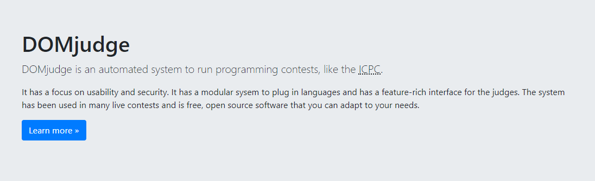
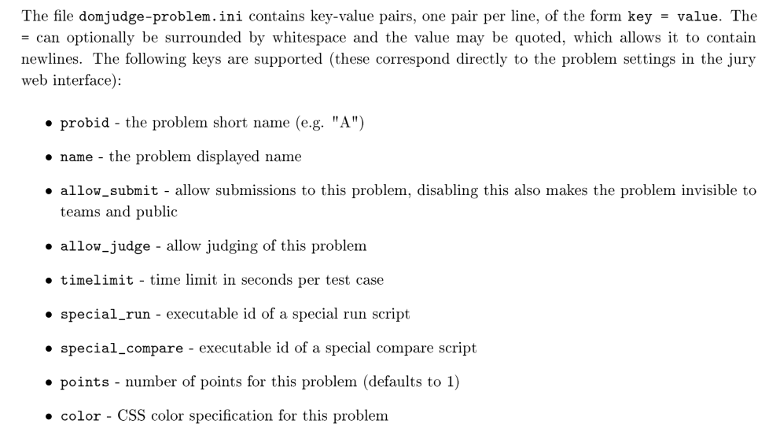
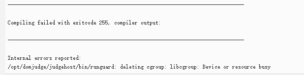

我校新生赛也能用上 World Final 同款评测系统啦~

DOMjudge 提供了详尽的[官方文档](https://www.domjudge.org/documentation)，然而对于博主这种英文弱鸡来说读的很痛苦。前前后后折腾了有两个星期吧，以此文作为避（踩）坑指南。

<!-- more -->

## 简介

DOMjudge，作为一款开源的 CCS([Contest Control System](https://clics.ecs.baylor.edu/index.php?title=Contest_Control_System))，现已被ICPC钦定为官方的比赛评测系统。比 pc^2 这种闭源而含有诸多 Bug 的 CCS 高到不知道哪里去了啊。



根据官方文档的描述，DOMjudge 的主要特性有：

* 分布式且自动评测的 judge host
* Web 用户界面
* 模块化的系统，方面添加不同的语言/编译器

整个 DOMjudge 主要分为两个部分，Domserver 和 Judgehost，据其名字即可得出它们的功能。需要注意的是，DOMjudge 使用数据库来存放几乎一切数据，所以我们还需配置 MySQL 或者 MariaDB。

## 安装

DOMjudge 只能运行在 Linux 环境下。博主的运行环境是 Ubuntu Server 18.04 LTS，以及 DOMjudge 7.1.1。

除了传统的安装方式外，DOMjudge 还提供了 Docker 镜像以供安装，这样就大大简化了安装的困难程度。

关于 Docker 的使用这里不作详细描述。（其实是博主也一知半解）

然而[官方的 Docker 文档中](https://hub.docker.com/r/domjudge/domserver)仅使用了命令来启动容器，为了进一步简化安装，也为了方便修改配置，我决定采用 Docker Compose 。以下是 `docker-compose.yml `文件：

```yaml
version: "3"
services:
  mariadb:
    image: mariadb
    container_name: dj-mariadb
    environment: 
      - MYSQL_ROOT_PASSWORD=rootpw
      - MYSQL_USER=domjudge
      - MYSQL_PASSWORD=djpw
      - MYSQL_DATABASE=domjudge
    volumes:
      - $PWD/data:/var/lib/mysql
    ports:
      - 13306:3306
    command: 
      - --max-connections=1000
      - --innodb-log-file-size=480M
  domserver:
    image: domjudge/domserver:latest
    container_name: domserver
    environment:
      - MYSQL_HOST=mariadb
      - MYSQL_USER=domjudge
      - MYSQL_DATABASE=domjudge
      - MYSQL_PASSWORD=djpw
      - MYSQL_ROOT_PASSWORD=rootpw
      - CONTAINER_TIMEZONE=Asia/Shanghai
    restart: always
    depends_on:
      - phpmyadmin
      - mariadb
    ports:
      - 80:80
    links: 
      - mariadb
  judgehost:
    image: domjudge/judgehost:latest
    container_name: judgedaemon-0
    privileged: true
    environment:
      - CONTAINER_TIMEZONE=Asia/Shanghai
      - DAEMON_ID=0
      - JUDGEDAEMON_PASSWORD=whatthehell
    depends_on:
      - domserver
    links:
      - domserver
    restart: always
    volumes:
      - /sys/fs/cgroup:/sys/fs/cgroup:ro
  phpmyadmin:
    image: phpmyadmin/phpmyadmin
    container_name: myadmin
    ports:
      - 8080:80
    environment:
      - PMA_HOST=mariadb
    links:
      - mariadb:mariadb

```

然后运行 `docker-compose up -d` 即可完成部署。

Judgehost 利用了 Linux 内核的 Cgroup 特性，所以需进行一步额外设置（似乎部分内核较新的系统不需要）。编辑 `/etc/default/grub` 文件，将默认的命令改为：

```sh
GRUB_CMDLINE_LINUX_DEFAULT="quiet cgroup_enable=memory swapaccount=1"
GRUB_CMDLINE_LINUX="quiet cgroup_enable=memory swapaccount=1"
```

然后运行 `update-grub` 并重启。

需要多核判题的话创建多个 Judgehost 容器并修改 DAEMON_ID 为不同的值即可。

目前存在的问题：

* judgehost 用户的初始密码不定，需要手动去 web 端更改并添加 `JUDGEDAEMON_PASSWORD` 的环境变量。（默认环境变量的密码是 `password`）
* 整个系统对我来说是个黑盒...

除了 MariaDB , DOMserver , Judgehost 这三个必要的容器外，我还使用了 phpMyAdmin 来进行图形化的数据库管理（备份)。数据库（即 `mariadb` 容器的数据卷）创建在了当前目录的`data`文件夹下，方便备份。

其中，Domserver 映射到了主机的 80 端口， phpMyAdmin 映射到了 8080 端口。由于是内网环境，故不准备采用 HTTPS 加密。

需要注意的是，DOMjudge 提供的 Judgehost 镜像中仅包含 C, C++, Java 三种语言的运行环境。

## 配置

Domserver 部署成功后，即可通过 Web 端来访问了。默认的管理员账号用户名 `admin` ，默认密码被打印在domserver启动时的日志中，同时也可以用`docker exec -it domserver cat /opt/domjudge/domserver/etc/initial_admin_password.secret`来获取 。

可以在 Config Checker 中进行配置检查。

C++ 的默认编译选项没有 C++11， 需手动添加。

### 题目导入

DOMjudge 支持用 zip 格式的压缩包导入/导出题目。

具体的文件结构是：

```
│  domjudge-problem.ini
│
├─data
│  ├─sample
│  └─secret
│
└─problem_statement
        problem.{pdf,html,txt}
```

在 `domjudge-problem.ini` 中定义了如下信息：



（懒得翻译了，有时间再补）

在 secret 文件夹中存放测试数据，在 sample 文件夹中存放样例数据， 在 problem_statement 存放题面。

（不知道为什么博主在压缩包内上传题面没有成功过，只能通过 Web 端来上传）

测试数据的扩展名为 `.in` 和 `.ans`。

### 队伍导入

队伍及用户导入采用 tsv(*tab-separated values*) 格式，即信息之间采用制表符（TAB）分隔。事实上，文件的扩展名并不需要采用`.tsv`。我们可以直接在Excel中创建一个表格然后将其后复制至一个文本文件中。

格式由[ ICPC 官方定义](https://clics.ecs.baylor.edu/index.php?title=Contest_Control_System_Requirements#Appendix:_File_formats)。

teams 格式：

```
teams    1
team_id    external_ID    group_id    team_name    institution_name	institution_short_name    country_code
```

参考[CSL的博客](https://cubercsl.cn/notes/DOMjudge-Note.html)发现：

>  在导入teams表的时候，在`Country Code`后追加一列，填写`Institution External ID`。
> 这步是阅读[源代码](https://github.com/DOMjudge/domjudge/blob/master/lib/lib.impexp.php#L108)后猜测的，当时的实际操作是直接在数据库中的`team_affiliation`用SQL语句更新`ExternalID`的。

博主采用了这种方式，并在导入队伍后通过 Web 界面手动添加 Affiliation 信息。

事实上，institution_name	institution_short_name    country_code这三个字段都不是必要的，只需要有External ID就可以。而如果没有External ID的话，会创建和队伍数量一样多的Affiliation。

accounts 格式：

```
accounts	1
account_type	fullname	username	password
```

一种（可能）简单的方式是先导入队伍再导入用户，并且用户 username 的后缀数字与 team_id 相同。不需要的字段可以直接留空。（不能缺少分隔符）

tsv 文件可以采用 Excel 生成。在 Excel 中输入完数据后选择另存为文本文件（制表符分隔）即可。

如需使用`institution_name institution_short_name country_code` 三项需在 Team Affiliations 中提前创建相应的条目。

### API

参考官方的 API 说明，DOMjudge 包含[ ICPC 定义的 API ](https://clics.ecs.baylor.edu/index.php/Contest_API)和[自有的 API](https://www.domjudge.org/demoweb/api/doc)。


### 滚榜

尝试使用官方的 [ICPC tools](https://icpc.baylor.edu/icpctools/)，发现总是提示比赛未结束，查阅日志认为是 DOMjudge 的 event feed 格式与 ICPC tools 提供的 resolver 工具的格式不兼容。

尝试 DOMjura 发现同样不能正确读取 event-feed 。

----

2019年校赛补充：滚榜采用了 Github 上的[这个项目](https://github.com/hex539/scoreboard)。这比官方的滚榜工具好用多了，但是也有坑。

首先它使用bazel作为构建工具，但是bazel对于Windows很不友好（至少对于这个项目而言），会有奇怪的报错。所以我使用了Ubuntu。其次，由于构建过程中大部分源都在国外，对于国内的网络环境来说很不友好。我的解决办法是使用proxychains代理bazel，实测无需任何配置即可支持Domjudge 7.1.1（2019/12/7）。

## 2018冬季新生赛概况

闲扯几句。

热身赛一切良好。出题人数据出锅，被批判了一个多小时2333。

正式赛赛前比赛账号导入的时候，有个人是后来添加的，和之前的版本没有对应上，导致部分队伍登录到了后一个队伍的账号，重新导入 team 后发现无法登录，还需导入 accounts。这导致比赛推迟了 5 分钟。

由于 Submission 的输出数据是保留的，而赛前我的服务器硬盘空间本来就不多了，比赛时当服务器的硬盘占用达到 90% 时，所有 judgehost 就都被关了。我只能胡乱删几个软件包腾出空间。还好没有造成大的影响。

然后直到最后还是没有搞出滚榜。

GG。总体来说还是挺顺利的，服务器没有崩，甚至平均 CPU load 只有 1.0 左右，就是感觉比较吃 I/O，还好我用的是固态（~~先见之明~~）。

总结一下，DOMjudge 体验极佳，可以在校赛再推广一波。

## 2019冬季新生赛概况

由于今年懒得去嫖学校的服务器了，所以打算用公网服务器。本来在GCP和阿里云之间纠结用哪个，给我恰好滑稽给我提供了他在镇江的独服，于是建了一个16C，16G内存的虚拟机用作评测服务器（顺带送了个域名）。

这台服务器的网络结构比较复杂，首先，他是Windows Server，通过一个软件把某些端口的流量转发至一台Debian虚拟机中（为了方便管理证书等），然后由Debian上的Nginx反代至Domjudge的虚拟机中。这样我自己就不用配置证书也能有HTTPS。

但是Windows有一个老生常谈的坑：时间问题。Windows的硬件时钟是本地时间，而Linux为UTC时间，这导致了一开始Domjudge里的时间是假的，需要手动设置。

本次Domjudge的配置基本与之前相同，用Docker-compose一键部署。

之前一直没有做过压力测试一直是我的遗憾，这次在研究了Domjudge的[API文档](https://www.domjudge.org/demoweb/api/doc)之后，写了一个[自动交题的脚本](Domjudge-config/submit.py)，并且用Locust辅助做压力测试，然后评测机不负众望炸了。。



其实还不止这个错，还有各种奇怪的错误。幸好在正式比赛中评测机表现得很稳健，并没有出锅，应该是压力还不够大。。

比赛时还碰到一个bug，在一道题重测后这道题的一血变更了，但是榜单上的一血是错的，重新刷新榜单也未解决。查看数据库表发现有一张叫`scorecache`的表，推测该表即为榜单的缓存，于是更改`is_first_solved`字段后，成功解决。