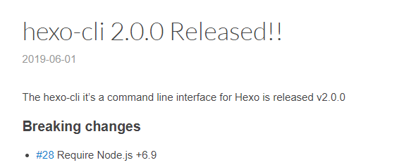

## 缘由

直接原因是 Github 的一个假装很贴心的功能：


由于我的 Hexo 已年代久远，所以有了一堆漏洞，在尝试 Github 的自动修复未果之后，同时也因为当初搞 Hexo 的时候不是很懂，文档也没写好，就决定重新装一遍。

<!-- more -->


## 过程

### 环境

node.js 6.4.1

hexo 3.9.0

hexo-cli 2.0.0



官方文档上写需要 node.js 6.9+，然而我是 6.4，不知道会不会锅。

### Hexo 安装

首先，把仓库 clone 下来后，备份一份源文件。然后找一个空文件夹，按照官方文档的指引，执行：

```
hexo init
npm install
```

（我发现现在 `hexo init` 会同时自动执行 `npm install`命令了）


然而还是有一个漏洞，不管了。

然后删除原文件夹中文件（保留.git），把新的文件复制过去。同时把备份文件夹中的`source`文件夹覆盖过去。（自动创建 .gitignore 好评）

这时候基本的安装就完成了，接下来打开 Github Desktop 开始对比差异。

在全局配置`_config.yml`中，


这个配置是为每篇博文创建一个单独的资源文件夹。

基本不用变，直接 discard changes 即可。

`.travis.yml` 和 `deploy.sh` 也直接还原。

[图片的问题](https://cjc7373.github.io/2018/10/13/Hexo%E6%90%AD%E5%BB%BA%E5%B0%8F%E8%AE%B0/#Hexo%E5%9B%BE%E7%89%87%E6%8F%92%E5%85%A5%E6%8C%87%E5%BC%95)先不管，有问题再说。

### 主题安装

剩下的差异全是主题文件。既然都重新搞了，那就换一个主题吧。在自己的 stars 里找了个主题 [hexo-theme-indigo](https://github.com/yscoder/hexo-theme-indigo)，看了下也支持 Analysis、Disqus，就决定用它了。

接下来就开始按照[主题文档](https://github.com/yscoder/hexo-theme-indigo/wiki)来安装。首先 clone 仓库，我选择 card 分支，感觉比较好看（其实也没有对比）。

在 hexo 根目录执行`git clone -b card https://github.com/yscoder/hexo-theme-indigo.git themes/indigo`，下载主题文件。安装插件`hexo-renderer-less hexo-generator-feed hexo-generator-json-content hexo-helper-qrcode`。

> ## 开启标签页
>
> ```
> hexo new page tags
> ```
>
> 修改 `hexo/source/tags/index.md` 的元数据
>
> ```
> layout: tags
> comments: false
> ---
> ```
>
> ## 开启分类页
>
> 仅 card theme 支持。
>
> ```
> hexo new page categories
> ```
>
> 修改 `hexo/source/categories/index.md` 的元数据
>
> ```
> layout: categories
> comments: false
> ---
> ```

话说用 Github Desktop commit 的时候因为主题文件夹也是一个 git 仓库，所以报错了，在命令行中 add，提示


于是我去 Google 了下[子模块]([https://git-scm.com/book/zh/v2/Git-%E5%B7%A5%E5%85%B7-%E5%AD%90%E6%A8%A1%E5%9D%97](https://git-scm.com/book/zh/v2/Git-工具-子模块))，感觉这会让问题变复杂，同时这个主题已经很久没更新过了，干脆把主题的版本库删了吧。删除 `.git`文件夹后，提交成功。

### 主题配置

编辑站点配置文件。启用主题`theme: indigo`。feed 是用来 rss 的，不管。jsonContent 用来搜索，如下：

> ### jsonContent配置
>
> 为了节约资源，可以对 jsonContent 插件生成的数据字段进行配置，减少数据文件大小。参考 [hexo-generator-json-content](https://github.com/alexbruno/hexo-generator-json-content)
>
> ```
> jsonContent:
>   meta: false
>   pages: false
>   posts:
>     title: true
>     date: true
>     path: true
>     text: true
>     raw: false
>     content: false
>     slug: false
>     updated: false
>     comments: false
>     link: false
>     permalink: false
>     excerpt: false
>     categories: false
>     tags: true
> ```

编辑主题配置文件，`themes/indigo/_config.yml`。

左侧菜单： 

> 添加新菜单项时，在 menu 下增加子属性即可。属性说明如下：
>
> ```
> menu:
>  link:               # fontawesome图标，省略前缀，本主题前缀为 icon-，必须
>    text: About       # 菜单显示的文字，如果省略即默认与图标一致，首字母会转大写
>    url: /about       # 链接，绝对或相对路径，必须
>    target: _blank    # 是否跳出，省略则在当前页面打开
> ```
>
> fontawesome 图标已集成到主题中，你可以到 [这个页面](http://fontawesome.io/icons/) 挑选合适的图标。

我修改为如下：

```
menu:
  home:
    text: 主页
    url: /
  archives:
    url: /archives
  tags:
    url: /tags
  th-list:
    text: Categories
    url: /categories
  github:
    url: https://github.com/cjc7373
    target: _blank
  user:
    text: 关于
    url: /about
```

其余改动略。

由于这个主题为国人制作，配置文件都带有中文注释，还是很友好的。

## 修锅

图片不出意外地崩了。。而且不止首页图片，是所有。。装插件试试。`npm install hexo-asset-image --save`。装完又多了两个漏洞，这插件是有多久没更新了。。自动修复试试。


GG。

语言是错的。hexo 配置文件改成 zh-cn 试试。

头像好丑。改成猫头鹰了。

---

坑爹啊，img不说清楚在哪里。。我在根目录下创建了img，结果找了一下发现是在`themes\indigo\source\img`下，图片还是炸。待修。暂时回滚至以前的版本。

## 回滚

Updated in 2019/10/7


时隔两个月,重新拾回了我的博客..

这个主题的锅不想修了..

又看了几个主题之后,看看似乎原主题也挺好的..

所以我又用回了 Next..

看了一下 Next 换维护者了..


仓库地址从[这个](https://github.com/iissnan/hexo-theme-next)变为[这个](https://github.com/theme-next/hexo-theme-next)(话说居然不是 fork 过去的)

大致过程是~~重来一遍上述过程~~回退到某一个提交即可.

不过我把 node.js 的版本更新到了 v12.11.1

首先这四个 commit 记录不需要了,我建了个新的分支 theme-indigo 扔着..

然后,先fetch一下,因为我在远程仓库上回滚了之前的更改..然后发现记错了,回滚的是 master 分支..

然后看一下 log, 回退到 2939aa 这个 commit.


`git reset --hard 2939aa`

此时本地分支已经落后于远程分支了,需要强制推送一遍.`git push --force`


看了一下这个提交是 [Hexo 安装](#Hexo 安装) 完成之后.

接下来安装主题, 先从 Github 下载一个 release. 目前是 v7.4.1

看了一眼[从5.x升级](https://github.com/theme-next/hexo-theme-next/blob/master/docs/zh-CN/UPDATE-FROM-5.1.X.md)文档, 全局配置中 language 要从 zh-Hans 变为 zh-CN

~~然后并没有发现其他配置文档~~ 是有的, 只不过是英文, 在[这里](https://theme-next.org/docs/getting-started/), 只能一行一行看 `_config.yml` 了.

用 sublimerge 对比一下新旧配置文件的差异..


瞎改了一点.

ok. 测试一下, 果然图片又崩了. 原因引用的图片地址多了一级. 把多余的地址删掉是能够正常显示的.


然而原来那个插件 `hexo-asset-image` 没用了. 无奈继续 Google, 找到了一篇[英文博文](https://liolok.github.io/en/How-to-Add-Image-to-Hexo-Blog-Post/), 指出了另一个插件[hexo-asset-link](https://github.com/liolok/hexo-asset-link), 尝试之, 发现能完美在首页及内容页显示图片.

至此, 我的博客算是修好了. (这篇博客写得不成样子,大雾,希望没人看到吧

## 结语

两次修锅的过程, 让我看到了 Hexo 的插入图片的巨坑. 用图床能够避免这个问题, 然而图床也有缺点, 我还是更喜欢直接插入图片. 感觉上这部分是由 Hexo 来处理的, 与主题无关, 所以还是可以换个主题玩玩的, 目前来说, 还是先专注于内容吧.

有时间也可以试试 Typecho, Jekyll, Pelican, Hugo 等其他博客生成器.