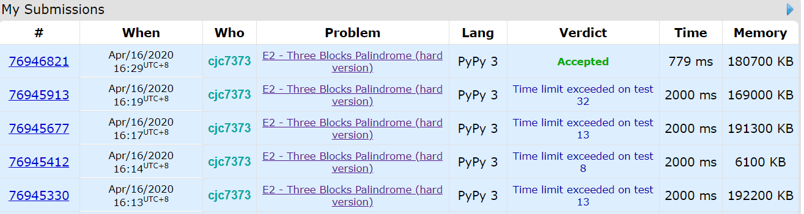

## [1335A - Candies and Two Sisters](https://codeforces.com/contest/1335/problem/A)

`1/0 Accepted`

快乐签到。

## [1335B - Construct the String](https://codeforces.com/contest/1335/problem/B)

`1/0 Accepted`

先构造长度为 $a$ 的字符串，然后第 $i+a$ 个字母为第 $i$ 个字母，输出即可。

## [1335C - Two Teams Composing](https://codeforces.com/contest/1335/problem/C)

`2/1 Accepted`

给 $n$ 个数，每个数有一个值，要求把它们分成数量相同的两组，一组所有的值相等，一组所有的值不等。

先统计每个值的数量，得出最大个数 $m$，和不同值的数的个数 $l$，

`ans = min(l, m) if m < l + 2 else ans = min(l, m) + 1`

## [1335D - Anti-Sudoku](https://codeforces.com/contest/1335/problem/D)

`1/0 Accepted`

给一个求解好的数独，求改动不超过 9 个数，使其每行、列、区块内皆有两个相同的数。

想了两分钟，发现将所有的 1 替换为 2 即可。

## [1335E - Three Blocks Palindrome](https://codeforces.com/contest/1335/problem/E2)

`Not Attempted`

给一个含有$n$个数的序列，定义三区块的回文数为：$[\underbrace{a, a, \dots, a}_{x}, \underbrace{b, b, \dots, b}_{y}, \underbrace{a, a, \dots, a}_{x}]$，$x, y$是大于等于0的整数，a可以等于b。求一个最长子序列使它为三区块的回文数。输出长度。

又是一道需要神奇的优化的题。。



按官方题解的思路是这样：

```python
import sys
input = sys.stdin.readline

t = int(input())
for _ in range(t):
    n = int(input())
    s = [int(i) for i in input().split()]
    prev = [[0] * n for i in range(201)]
    pos = [[] for i in range(201)]
    for i in range(n):
        for j in range(201):
            if i == 0: continue
            prev[j][i] = prev[j][i-1]
        prev[s[i]][i] += 1
        pos[s[i]].append(i)
    ans = 0
    for i in range(201):
        # if x == 0
        ans = max(ans, len(pos[i])) 
        
        # if x != 0
        for j in range(1, (len(pos[i]) // 2) + 1):
            m = 0
            for k in range(201):
                m = max(m, prev[k][pos[i][-j]-1] - prev[k][pos[i][j-1]])
            ans = max(ans, m + 2 * j)
    print(ans)
```

但是超时了。翻别人的代码发现创建prev数组还能优化：

```python
import sys
input = sys.stdin.readline

t = int(input())
for _ in range(t):
    n = int(input())
    s = [int(i) for i in input().split()]
    prev = [[0] * 201] * n
    pos = [[] for i in range(201)]
    for i in range(n):
        prev[i] = prev[i-1].copy()
        prev[i][s[i]] += 1
        pos[s[i]].append(i)
    ans = 0
    for i in range(201):
        # if x == 0
        ans = max(ans, len(pos[i])) 
        
        # if x != 0
        for j in range(1, (len(pos[i]) // 2) + 1):
            m = 0
            for k in range(201):
                m = max(m, prev[pos[i][-j]-1][k] - prev[pos[i][j-1]][k])
            ans = max(ans, m + 2 * j)
    print(ans)
```

700多ms过了。。