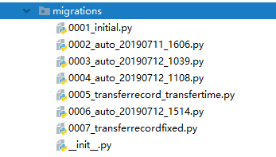
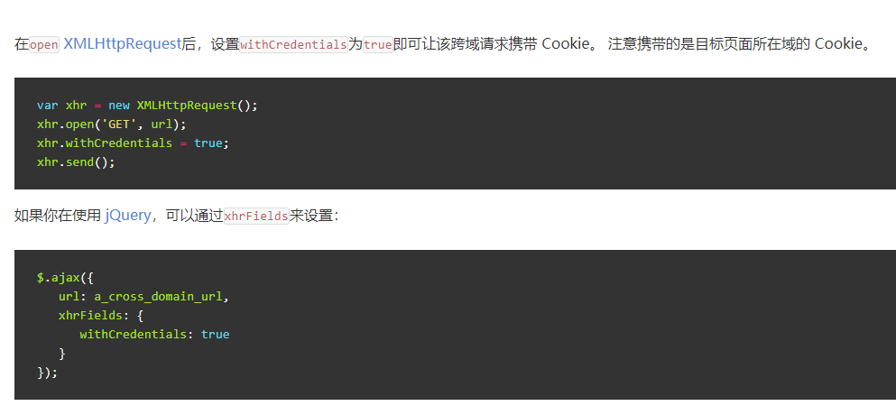
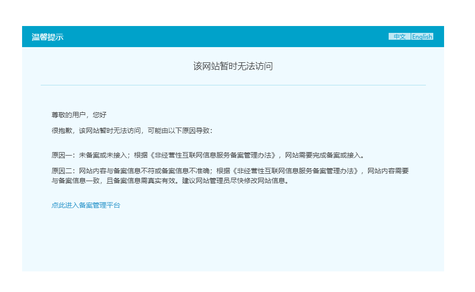
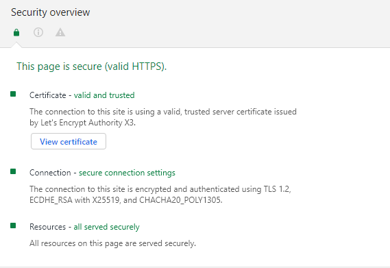

## 序

二年级下学期期末，有一个两周的实习，学校给了我们三个选项，其中软通算是知名度最高的一家公司了。


然而网上这家公司的风评很差，不过其他两家似乎更差，于是我们班大概四分之三的人都来了软通。

<!-- more -->

## 经历

实习第一天，上午讲的开发流程，团队角色，每日例行项目好似我们已经接手了一个实际项目，然而到了下午瞬间变成培训班，开始教我们配置环境。看下发的文档是用 Java Spring Boot 框架来开发。第二天又开始复习 Java。然后到了第三天，负责我们的老师（就叫他项目经理好了）突然说，你们想用什么技术就用什么技术吧。终于不用写 Java 了（逃

我们大概使用的是 Scrum 敏捷开发方法，最有特色的一点大概就是每日站会了。还有 Story 列表其实也挺不错的，只是没有贴在公告板上感觉失去了灵魂。

可能是时间短的原因，从一开始需求包括 Story 列表就已经确定了，我认为如果只是说做一个什么系统而不说具体需求会让大家的产品更有差异化，亮点也会更多。

## 技术栈

由于我很倾向 Python，加上青岛大学的开源 OJ 采用的就是 Django+Vue 前后端分离的开发模式，于是我便也想采用这个模式。

最终我们决定采用前后端完全分离，前后端之间使用 HTTP 协议通信。前端采用：HTML+CSS+JavaScript（JQuery+AJAX），后端采用：Django，数据库采用：PostgreSQL

## 版本管理

我有一些 Git 的知识，然而软通提供的版本管理工具是 SVN。用了一段时间后发现，两个工具没有本质的区别，最大的大概是 SVN 需要中心服务器，权限控制似乎也比较强大，所以像在公司内部比较好用，而 Git 分布式，分支创建极为方便，在开源社区中被广泛使用。


然而我们甚至没有用到分支这个功能，总体上还是没有利用好版本管理。

## 前端：三剑客

zpc 第一天就不知道在哪找了个模板网站，然后冲了十块钱下了个模板。接下来就开始改改改。

### 调试

一个问题是，后端的代码如何给前端调试。我们选择：

1. 后端首先使用 Django 的本地服务器，用 Postman 进行测试，测试通过后上传代码。
2. 不定期部署至服务器上
3. 前端从服务器调用接口调试

然而，在其他组答辩的时候，我们才知道有个东西叫 [mock](http://mockjs.com/)，能够简化调试难度。

## 后端：Django

很早就听说了 Python Web 一些有名的框架，后来又知道了青岛大学的开源 OJ 后端使用的就是 Django，所以很想尝试一下。曾经看过几节慕课，也看了一些官方文档（一开始是真的看不懂）。在做微信小程序的时候，我就想用 Django，奈何技术不够，放弃了。

实习前，我去找 zjb 两小时速成了一下 Django，发现 Django 虽然是 MTV（Model——Template——View）三级结构，但是前后端分离的话就没有模板了，同时我们用了 REST Framework，在函数名中直接声明要调用的方法，大大简化了开发。REST Framework 也提供了[官方中文文档](https://q1mi.github.io/Django-REST-framework-documentation/)，不过感觉写得不是很好。

后端代码非常简单，我们先用`token = request.COOKIES.get("token")`获取token，查询`user = User.objects.get(userToken=token)`，若 token 无效则会抛出`User.DoesNotExist`错误，查询操作之后调用一个序列化方法`users = serializers.serialize("json", allMessage, fields=("userID"))`，但是如果直接这样返回会有问题，所以需要把它转化成字典类型`rtn['data']=json.loads(users)`，然后调用`JsonResponse`返回。

Django 查询数据库返回的是一个 [QuerySet](https://docs.djangoproject.com/zh-hans/2.2/ref/models/querysets/) 对象，我们能对它进行很多操作，但是其实我们都没用到..

### Cookies

我一开始以为 Cookies 是前端负责维护的，后来发现这只是浏览器的工作。所以实际上 Cookies 是后端维护的。在登陆时设置 Cookie，调用 API 时获取 Cookie，退出时删除 Cookie 即可。

### 测试

我们用了 Postman 模拟 HTTP 请求进行测试，很可惜的是没有用到 Django 的自动化测试。

### 几个坑

Django 的文档宣称：

> **会自动重新加载的服务器 [`runserver`](https://docs.djangoproject.com/zh-hans/2.2/ref/django-admin/#django-admin-runserver)**
>
> 用于开发的服务器在需要的情况下会对每一次的访问请求重新载入一遍 Python 代码。所以你不需要为了让修改的代码生效而频繁的重新启动服务器。然而，一些动作，比如添加新文件，将不会触发自动重新加载，这时你得自己手动重启服务器。

然而有时候重新载入并不会生效（可能是 PyCharm 的问题？），这种时候就很烦..


数据库中的`DateTimeField`字段存储的时间总是 UTC 时间，在`settings.py`中设置：

```
TIME_ZONE = 'Asia/Shanghai'
USE_TZ = False
```

这样返回的时间是正常的，虽然数据库里的时间还是 UTC 时间，不过不影响了。

## 数据库：**PostgreSQL**

据说 PostgreSQL 和 MySQL 的区别是..


虽说 Django 官方支持 PostgreSQL，而且我们的数据库部署在服务器上，但是本地还是要一个中间件`psycopg2 `，在 Windows 下安装无问题，在 Linux 下需要一个额外的包 `libpq-dev`，而在 Mac 下需要先安装 PostgreSQL。这也是一个坑点。

图形化管理界面方面，我使用了 pgadmin，一开始我以为这是个客户端，还奇怪为什么它提供 Docker 镜像，下完才发现它是网页端。果断卸载然后 docker pull..

数据库由于我们的设计问题，改了一万次。



七次其实还是我们重置过一次数据库的结果，真实改动可能有十一二次吧。虽然 Django 提供了方便的 migrate 功能，但是这功能锅很多，能不改还是尽量不改。

* 在自己设置主键然后又取消使用自动主键时，Django 会报没有默认值的错。？？？AutoField 你要什么默认值。网上也有同样的情况，应该是 Django 的 Bug。
* 在改某张表的时候一直碰到报错一个不存在的列不存在，这张表就似乎坏了。我们的解决方案是重建一张新的表2333

## 接口

### 文档

我们的接口文档直接写在 Story 列表后面。主要写明了接口地址，方法（GET，POST，PUT，DELETE，我是想 RESTful 的，可是其他人基本随缘了），请求字段，响应字段，以及相应的解释和示例。

### 跨域

前端调试接口的时候产生了跨域的问题。Cookie，Ajax 请求都会遭到浏览器[同源策略](https://www.ruanyifeng.com/blog/2016/04/same-origin-policy.html)的限制。临时的解决方案是，在 Django 上装一个插件 [`django-cors-headers`](https://github.com/ottoyiu/django-cors-headers)，并且修改`settings.py`，在`INSTALLED_APPS`中加入`corsheaders`，在`MIDDLEWARE`中加入`corsheaders.middleware.CorsMiddleware`（位置尽量靠前），并设置字段：

```
CORS_ORIGIN_ALLOW_ALL = True
CORS_ALLOW_CREDENTIALS = True
```

而在前端每个 Ajax 请求中加上：



而在生产环境中由于同源，所以不存在跨域的问题。

然而，一个新的问题是，本地浏览器并不能够成功地存储 Cookie，当时的解决办法是，每改动一个页面就部署至服务器上进行调试，然而这个方法效率极低。后来我发现其实这只是 Chrome 浏览器的问题，其他浏览器则没有这个问题。

## 部署

在开发中，采取的方案是前端静态网页由 Nginx 部署，而后端 Django 代码则使用 Django 自带的服务器部署，而显然，这绝不能用于生产环境。

> DO NOT USE THIS SERVER IN A PRODUCTION SETTING. It has not gone through security audits or performance tests. 

（不过我还是用了，甚至都没关 DEBUG 选项）

因为 Django 服务器使用 `python3 manage.py runserver`运行的， SSH 断开后进程就被中断了，所以需要让它能够后台运行，尝试了 nohup，子 shell 等方法后（都不好用），最终选择了 screen。主要命令有：

```
screen -S [NAME] 创建一个新 shell
screen -ls 查看后台 shell
screen -r [ID] 进入某个 shell
Ctrl+A,D 把当前 shell 切换至后台
```

Nginx 配置我就直接改默认配置了，路径在`/etc/nginx/sites-enabled/default`下。除了静态页面外，还需配置后端请求转发：

```
location /api {
            proxy_pass http://127.0.0.1:8000;
            proxy_set_header X-Real-IP $remote_addr;
            proxy_set_header Host $http_host;
            client_max_body_size 200M;
        }
```

（这个配置我是抄青岛大学 OJ 的）

### HTTPS

尝试把域名解析至阿里云的服务器，发现不管是 HTTP 还是 HTTPS 请求都会被拦截，并被劫持到一个备案页面。



于是换用 GCP，一切顺利。使用 Let's Encrypt 的证书以及官方推荐的 [certbot](https://certbot.eff.org/) 工具。简单几步即可签发证书并自动配置 Nginx。

 


## 参考资料

[前后端分离的django项目服务器跨域](https://blog.csdn.net/summer2day/article/details/81358815)

[CORS 跨域发送 Cookie](https://harttle.land/2016/12/28/cors-with-cookie.html)

[使用uWSGI和nginx来设置Django和你的web服务器](https://uwsgi-docs-zh.readthedocs.io/zh_CN/latest/tutorials/Django_and_nginx.html)

[django web Cookie 和 Sessions 应用](https://www.cnblogs.com/lhj588/archive/2011/10/27/2226976.html)

[从零开始建立单元测试-以Django项目为例](https://www.jianshu.com/p/15af33d2c2c4)

[查询操作](http://www.liujiangblog.com/course/django/129)

[Django 模型](https://www.runoob.com/django/django-model.html)

[django DateTimeField 时区问题解决](https://blog.csdn.net/zhu_free/article/details/48176779)