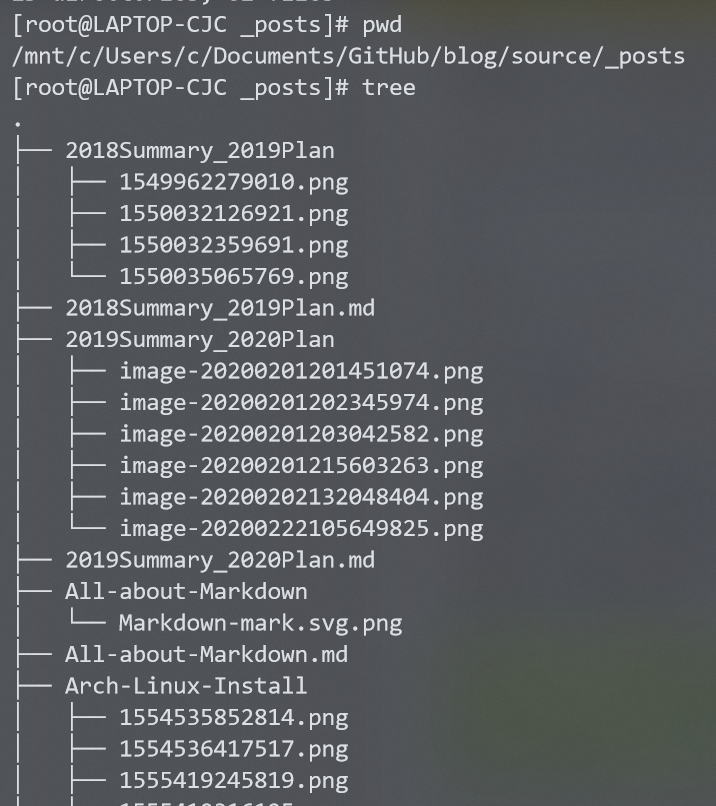

我原来的博客文件夹结构是这样的：

博文数量少的时候，还挺直观，但是数量一多，看着就很杂乱，因此，萌生了重新归类的想法。

思路大概是这样：按年份归类，然后图片统一放到当前目录下的`images`文件夹里。

## 实践

脚本的逻辑大概是对每一篇博文，寻找其元数据的 date 字段，将其移动到对应的文件夹下，同时对同名的文件夹也进行递归移动。由于图片都是相对引用的，所以不会出问题。（即使出了咱还有 git）