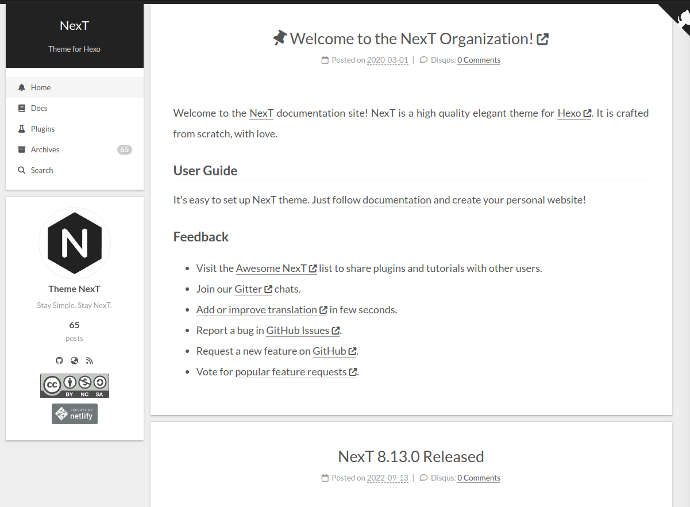
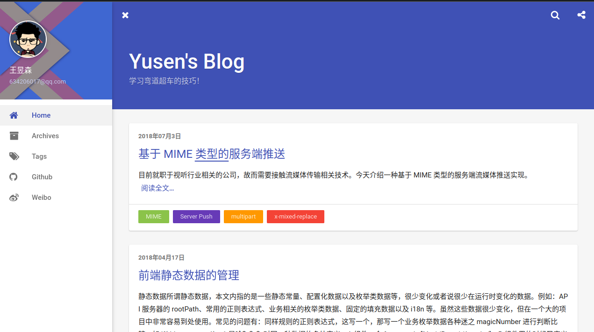
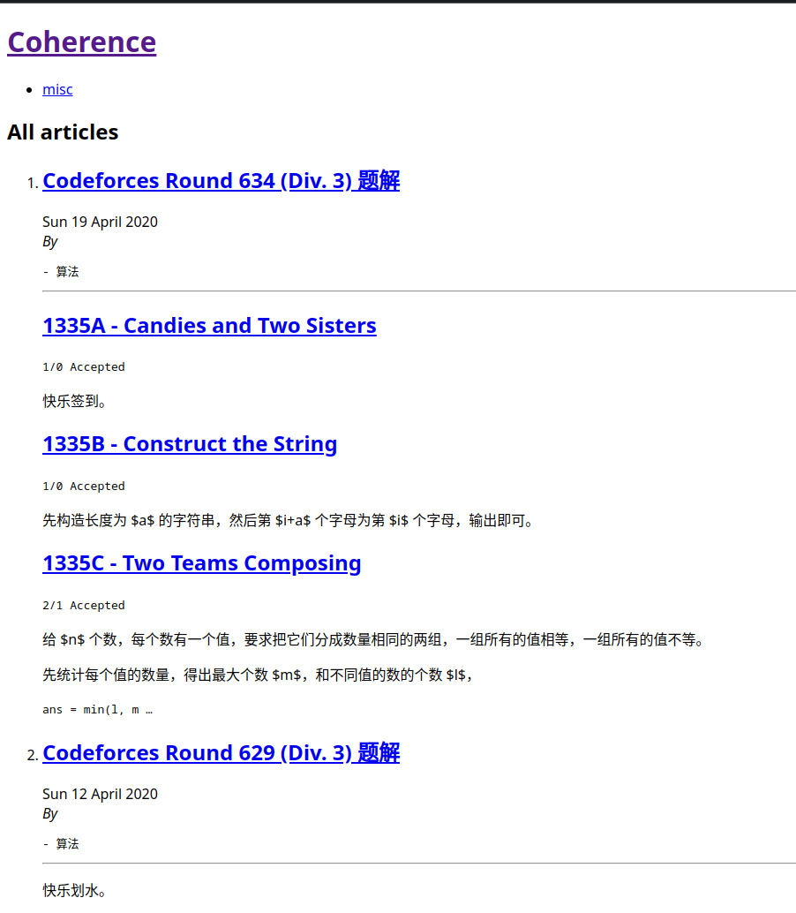
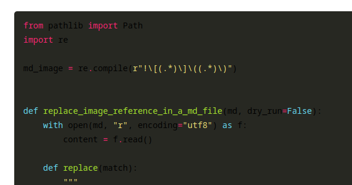

这是一个船新的博客！

## 历史

在大二（2018）的时候，我萌生了搭建一个自己的独立博客的想法，于是就有了 [hexo搭建小记]()，当时我随手一找找到的基本都是 Hexo，于是我就用了。引用一段当时写的关于页面：

> ## 关于博客
>
> * 2021-02-08 迁移到 pelican, 打算自己写个主题, 待填坑
> * 2020-03-26 更新 Hexo 至 4.2.0，启用 hexo-generator-sitemap 插件
> * 2020-02-22 更改评论为 `disqusjs`，详见作者的[博文](https://blog.skk.moe/post/disqusjs/)；启用 [pjax](https://github.com/theme-next/theme-next-pjax)
> * 2019-12-24 启用新域名`blog.coherence.codes`
> * 2019-10-07 升级主题至 Next V7.4.1
> * 2018-09-24 第一篇博文。采用 Hexo + NexT 主题， 部署于 Github Pages。搭建过程见

Next 就是一个非常大众的主题，有几种变体，我用的是一个叫 `pisces` 的变体，长这样（原博客图已经找不到了，只能用官方 Demo 凑数了）：



这一时期的博客位于 [source 分支](https://github.com/cjc7373/cjc7373.github.io/tree/source/source)，最后更新于 2020-04-16。

由于这个主题实在是太大众了，中途（2019-10 左右）我也想过换一个主题（[hexo-theme-indigo](https://github.com/yscoder/hexo-theme-indigo)，一个 Material Design 风格的主题），但是没有配置成功，[theme-indigo 分支](https://github.com/cjc7373/cjc7373.github.io/tree/theme-indigo)便是那次尝试。theme-indigo 的效果图长这样：



到了 21 年 2 月，我开始重新调研博客生成器，当时看到了一个 Python 写的 Pelican，而我又希望壮大一下 Python 生态，于是就用了。用了之后发现并没有什么合适的主题，恰巧 Pelican 用的模板引擎 Jinja 和 Django Template Engine 很像，我比较熟悉，于是我就想自己写一个主题，然而这一工作从没开始过.. 于是我现在的博客是这样的（~~极简主义~~）：



这段时间里我还写过一个[处理图片的 Pelican 插件](https://github.com/cjc7373/pelican-markdown-image)，虽然现在看起来挺蠢的..

再后来，我又对 Rust 产生了兴趣，于是又发现了 Zola，这时候我找到了 [hugo-theme-diary](https://github.com/AmazingRise/hugo-theme-diary) 这个主题，感觉非常不错，于是就想把它移植到 zola，在 port 了一个 head 之后，这个计划就被无限期搁置了。

终于，我感觉还是有必要有一个好看的博客的，于是我最终选择了 Hugo+hugo-theme-diary，加上一点点自己的魔改。

## 迁移

Hugo 对于资源文件的处理有[自己的一套规则](https://gohugo.io/content-management/image-processing/)，即博客文章位于 `posts/post_name/index.md`，这篇文章资源文件放在 `posts/post_name/` 这个路径下面。而我原来的文件结构为文章位于 `posts/post_name.md`，资源文件位于 `posts/post_name/`。所以我不得不写了一个脚本来迁移图片：

```python
from pathlib import Path
import re

md_image = re.compile(r"!\[(.*)\]\((.*)\)")


def replace_image_reference_in_a_md_file(md, dry_run=False):
    with open(md, "r", encoding="utf8") as f:
        content = f.read()

    def replace(match):
        """
        match[0]: all matched string
        match[1]: name
        match[2]: image path
        """
        rep = f"![{match[1]}](./{match[2].split('/')[-1]})"
        print(f"Replacing {match[0]} with {rep}")
        return rep

    content = md_image.sub(replace, content)
    if not dry_run:
        with open(md, "w", encoding="utf8") as f:
            f.write(content)


to_mig: list[Path] = []
working_dir = Path("./2022")
for f in working_dir.iterdir():
    if f.suffix == ".md":
        to_mig.append(f)

print(to_mig)
for f in to_mig:
    replace_image_reference_in_a_md_file(f)
    f.rename(working_dir / Path(f.stem) / "index.md")
    # print(f"Move {f} to {Path(f.stem) / 'index.md'}")
```

Hugo 用的模板引擎是 Go 标准库里的，这点好评，Helm 用的同样是这个模板引擎。

## 部署

现在的部署简单好多啊，只需一个配置文件，Github Actions 因为是自家产品的缘故连 token 都不需要了，自定义域名 CNAME 也只需在配置文件中增加一行，相比于三年之前的部署体验真的是天差地别..

## TODO

- Hugo 处理页面之间链接也有[自己的规则](https://gohugo.io/content-management/cross-references/)，目前好多跨页面链接是坏的

- 代码高亮的配色非常诡异..

  

  发现在本地的配色是正常的，检查发现本地是 Hugo extended version，于是在 actions 中也启用了 extended 后恢复正常，挺奇怪的..
