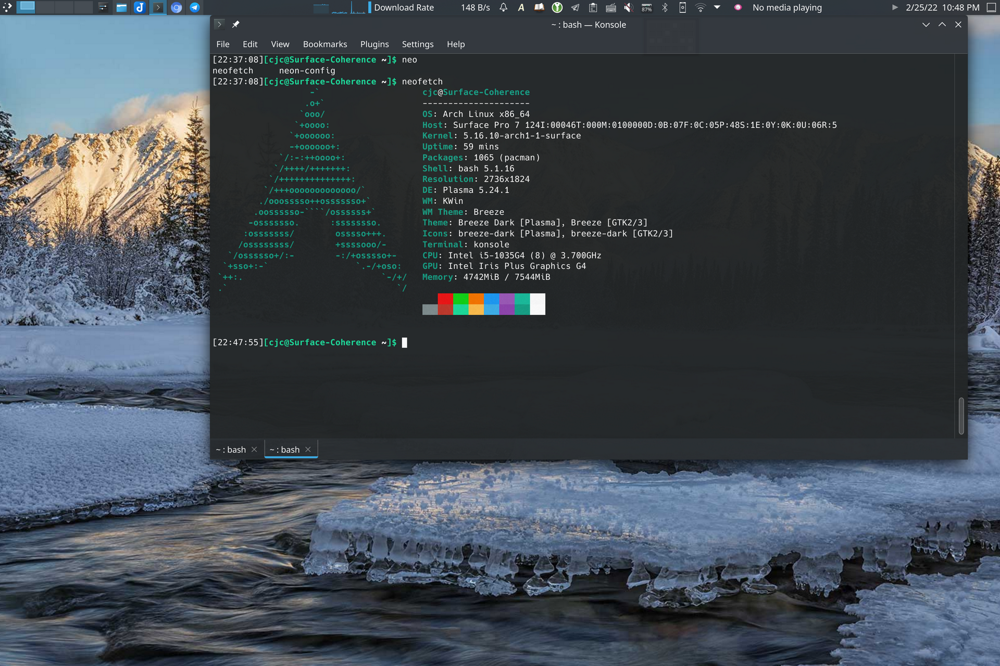
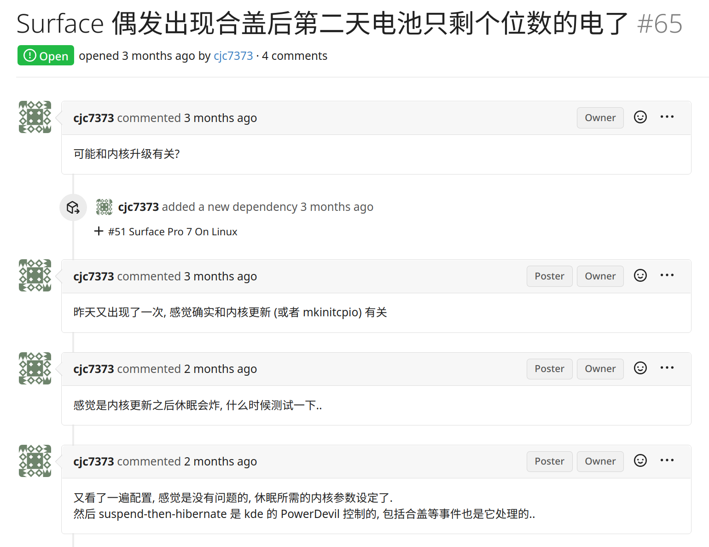

自从购置 Surface Pro 7 以来, 曾数次不满于 Windows 的包管理, 遥测, Windows Defender 等方面. 然更换了 Linux 之后并没有一个太好的使用体验. 本文记录了 Surface Pro 7 在 Archlinux 上的体验.

<!-- more -->

在 2021 年七月某日, 手贱尝试了一下 Windows 11 Preview (印象里是公开发布的第一版) 之后, 感叹于 Bug 之多, 奈何回滚需要重新安装 Windows, 于是一气之下装了 Archlinux.

(此处附使用截图一张)

在使用了近半年之后, 再次感叹, 微软自家的产品在 Linux 上体验真的不好.. 又萌生了换回 Windows 的想法.

具体而言, 有以下几个方面. 首先, Connected standby 在 Windows 下工作地很好, 然而在 Linux 下待机的耗电非常显著, 大概一晚上能掉一半电的那种. 于是后来发现了 suspend-then-hibernate 这个策略, 理论上还算可以接受. 然其有个非常严重的 Bug, 有时候其不能够成功地进入休眠状态, 导致第二天早上起来的时候 Surface 直接没电了. 而且这个问题出现频率比较高, 大概十次待机中有两三次, 非常影响使用体验. 在电量不足 10% 内核的频率调度会非常激进, 基本只能维持在 1.5G (即使电源已连接), 这时候系统会非常卡, 进一步导致了开机后仍有十多分钟的不可用状态. 这个 Bug 是我想换回 Windows 的直接原因.

(图为在个人 issue tracker 中的记录, 实际和内核更新无关)

其次, 由于主线内核的支持有限, 我选择了第三方的 [linux-surface](https://github.com/linux-surface/linux-surface) 内核, 然其支持仍然有限. 最主要为缺乏 Surface Pen 和多点触控的支持. 加之我使用的 KDE 桌面环境对于平板设备的支持几乎为零, 我的 Surface 事实上是当成笔记本电脑来使用的.

另外, 还有 KDE 对于触控板手势缺乏支持 (在 Wayland 中已实现了部分支持); 续航较之 Windows 差了很多; Xorg 不支持多显示器不同缩放; 无法使用摄像头/Windows Hello 等等问题.

更换 Windows 之后:
- 需要重新配置环境, 然包管理器选用 winget, dotfiles 使用 chezmoi 管理, 应该不会有太多麻烦
- Windows defender, 遥测等占用资源, 然应该可用组策略解决
- 失去了 krunner, 可以用其他软件替代, 或者开始菜单将就用..
- 还可以使用腾讯会议等 Windows 专有软件 (Linux 版的体验很不好)

综上, 我又反复横跳回来了..