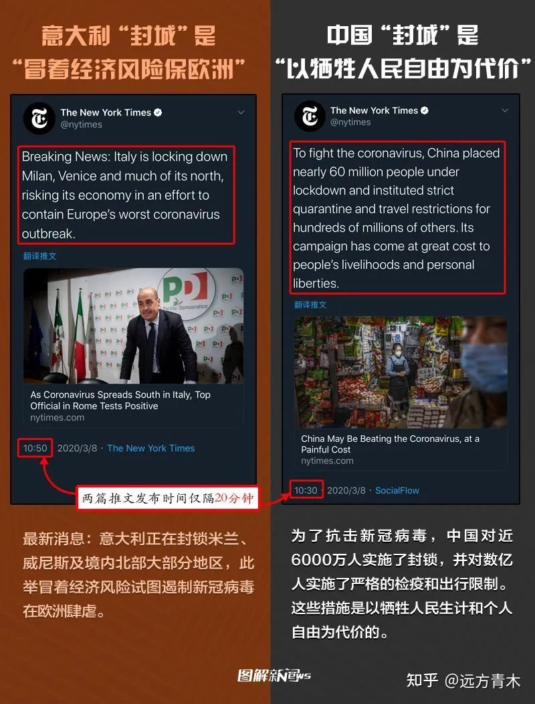

目前的中文互联网上存在着大量的鼓吹民族主义, 制造中西方对立的自媒体, 令人震惊的是, 他们中大部分不但充斥着情绪输出, 甚至连大部分事实都是错误的. 我偶然间读到了这样的一篇文章, 并对其中列出的事实进行了查证, 然后感觉我的智商受到了侮辱..

原文: [西方媒体是怎样给西方人洗脑的？ - 远方青木的回答 - 知乎](https://www.zhihu.com/question/428451991/answer/2431916538), [archive](http://web.archive.org/web/20220429053052/https://www.zhihu.com/question/428451991/answer/2431916538)

---

> 这几年欧美一直在向中国发动舆论战，我见过最离谱的一个理论甚至说什么“中国人每吃一口肉，亚马逊热带雨林就会冒出一缕白烟”。
>
> 我本以为这套歪理邪说就是欧美造谣生事的想象力极限，没想到欧美的底线可以永无止尽的被突破。

来源: [纽约时报 中国人会购买人造肉吗？](https://www.nytimes.com/2020/01/07/business/fake-pork-china.html), 另见[环球网报道](https://world.huanqiu.com/article/9CaKrnKoNzC)

评论: 虽然文章很有"反华"的倾向性, 但文章主要讲的是人造肉在中国难以推广. 肉类消费对于气候的影响是不争的事实. 所以"中国人每吃一口肉，亚马逊热带雨林就会冒出一缕白烟"这句话也不能算错, 但应该把主语换成全世界人.
要求中国牺牲国民营养而减少肉类消费是不合理的, 但是推广人造肉是合理的. 作者在这里显然有断章取义之嫌.

---

> 《[华盛顿邮报](https://web.archive.org/web/20220429053052mp_/https://www.zhihu.com/search?q=华盛顿邮报&search_source=Entity&hybrid_search_source=Entity&hybrid_search_extra={"sourceType"%3A"answer"%2C"sourceId"%3A2431916538})》在报道中声称**“中国每年强迫种植数亿棵新树”，这简直是在“犯罪”！**
>
> 
>
> 我捋一捋他们的思路，**大概意思就是说中国每年种数亿棵新树，但把这些新树种下去之前并没有征求这些树的同意，这数亿棵树是“不一定同意自己被种植”的，但全部被中国强迫种在地里了。**
>
> **因此，中国侵犯了树“自由被种植”的权力，强迫树木劳动，这属于犯罪，因此中国需要反思自己这种野蛮的行为。**
>
> 逻辑好像有那么一点点道理哦，但我怎么就觉得那么奇怪和荒谬呢。
>
> 中国人种树怎么了？
>
> 种树不是在保护环境吗？
>
> 怎么拐了一圈之后种树居然成犯罪行为了？

来源: 没有找到来源.

评论: 据 [checkyourfact](https://checkyourfact.com/2022/04/18/fact-check-washington-post-china-trees-article/), 该截图为杜撰, 最初流传于 Facebook 和 Twitter.

---

> 更荒谬的是，同一家西方媒体，前几年报道中国的标题是**《中国对一次性筷子的成瘾正在摧毁森林》。**
>
> 首先，一次性筷子不是用森林做出来的，一次性筷子的主要原料是一个月能长3米的竹子，以及速生经济林的边角废木料。
>
> 用森林里的好木头确实可以做一次性筷子，但没人这么做，因为成本太高商家会亏本，只有速生林边角废料和竹子的低廉价格才能让商家赚到钱。
>
> 其次，抛开筷子的真实原材料不谈，这家西方媒体的主要立场好像也是森林是宝贵的，森林对人类有益，并以此来指责中国。
>
> **既然如此，为什么中国种植森林也能被指责一番。是不是中国人干什么都不行，连呼吸都是错的？**

来源: [华盛顿邮报《中国对一次性筷子的成瘾正在摧毁森林》](https://www.washingtonpost.com/news/worldviews/wp/2013/03/14/chinas-disposable-chopstick-addiction-is-destroying-its-forests/)

评论: 华盛顿邮报 2013 年的报道, 主要援引的是时任吉林森工集团董事长柏广新的一句话: "我国每年生产800亿双一次性筷子，相当于要砍伐2000万棵生长20年的大树". [中国政府网](http://www.gov.cn/2013lh/content_2349497.htm)和[光明网](http://cpc.people.com.cn/pinglun/n/2013/0312/c78779-20759994.html)均能找到这句话以及相关对一次性筷子的批评. 报道中均指出了木头和竹子均是一次性筷子的原料.

----

> 几年前，欧美媒体报道说根据科学家的研究，中国人种植水稻会产生更多的温室气体，因此中国人吃大米正在毁灭全球气候，进而导致人类灭亡。

来源: 我都不知道怎么找.. 

评论: 类似的研究肯定有, 但我不觉得哪家媒体会报道吃大米导致人类灭亡...

---

> 2019年，国际顶级科学期刊《自然》杂志发表了一篇文章，说根据科学家的研究成果，中国政府治理沙漠，大力推进的荒漠绿化工程，种树过多，可能导致人类水资源枯竭，因此会对地球自然生态造成极大影响。
>
> 《自然》杂志本是人类最顶级的科学杂志，但写这篇文章的“科学家”逻辑推导却很简单，算一算中国政府要消灭荒漠需要种多少棵树，种这些树需要消耗多少水资源，**因此得出结论中国种树会破坏自然环境。**
>
> 别笑，这是真事。
>
> **中国人花费几代心血把沙漠变成了绿洲，对人类如此巨大的贡献居然招来西方期刊的指责？**
>
> **治理沙漠居然都能成为破坏环境的罪证。**

来源: [nature 文章 China's tree-planting drive could falter in a warming world](https://www.nature.com/articles/d41586-019-02789-w)

评论: 但凡看一下文章就会觉得文章的中立性是没问题的. 文章警告了非原产地树木对当地水资源的大量消耗, 可能会导致干旱地区的扩散. 也引用了多位中国科学家的意见.

---

> 巴西烧毁森林种地的时候，西方批判，说这样会造成水土流失，土地荒漠化，从而破坏人类环境。
>
> 中国种树消灭荒漠的时候，西方又批判，说这是在破坏人类环境，还不如让土地继续荒漠化。
>
> 澳大利亚和美国森林大火，烧毁无数森林，漫天黑烟，西方说这都是很正常的行为，对人类环境没有丝毫损害。

来源: 不知道怎么找.

评论: 因果倒置, 是气候变化导致了森林火灾的可能性增加

---

> 但没有西方人说那群在荒漠里植树造林的中国人有功劳，反而把一个从来不种树的嘴炮少女捧为“环保公主”。

评论: 讽刺 Greta Thunberg 也是传统艺能了, 不过我个人对她的评价还是比较积极的, 她组织了贯穿整个欧洲的学生罢课, 多次在 COP 上演讲. 她的[维基百科页面](https://en.wikipedia.org/wiki/Greta_Thunberg)也是比较正面的. 她频繁提到过 IPCC 的 [全球升温 1.5°C](https://www.ipcc.ch/site/assets/uploads/sites/2/2019/09/IPCC-Special-Report-1.5-SPM_zh.pdf), 我也推荐大家去读一读, 这算是为什么要应对气候变化的科学基础.

----

> 欧美人种一点点树就是天大的功劳，但中国不是，不仅无功，反而有罪。
>
> 类似的双标相当常见，当初意大利封城，那就是**“冒着经济风险保欧洲”**，而中国封城则是**“以牺牲人民自由为代价”**，两篇文章不仅在同一家媒体《纽约时报》发布，而且时间居然只差了20分钟。
>
> 
>

来源: https://twitter.com/nytimes/status/1236479276586807296, https://twitter.com/nytimes/status/1236484352965521408

评论: 单看这两条推特确实是西方媒体的偏见..

---

> 另一招，就是在报道中国正面的同时，再加上一句，就是鼎鼎大名的**“但代价是什么”。**
>
> 组合起来的效果给大家展示一下，比如说**“中国也许有效控制了疫情，但代价惨重”。**
>
> 比如说，**中国正在变得智能，但代价是什么？**
>
> 
>
> 这，就是欧美媒体对中国报道的常规格式。
>
> 把中国的好事变坏简直太简单了，**你这个好事似乎存在，但代价是什么？**

评论: 虚空打靶.. 别只看个标题啊, 你倒是具体说说西方媒体说了啥啊.

---

总结: 看这种自媒体真的降智商.. 以后要少看..
