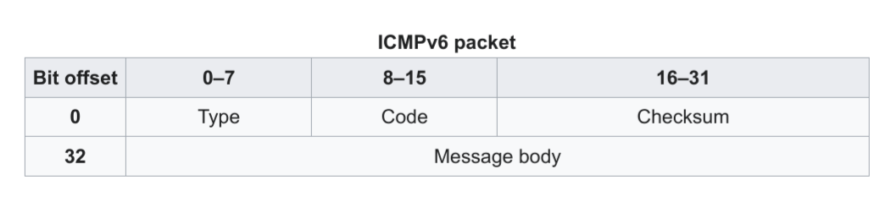
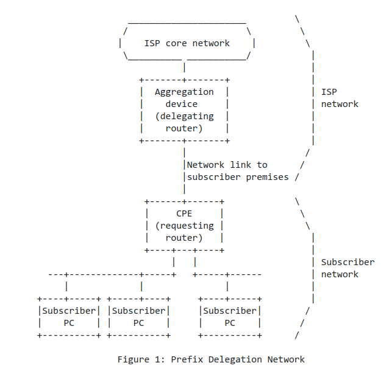
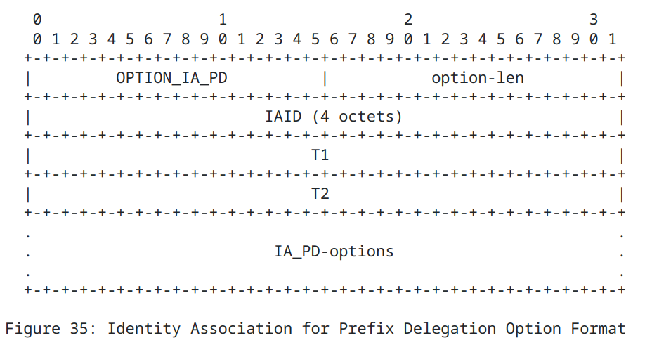
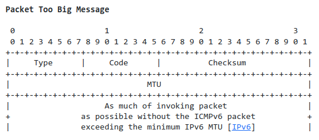
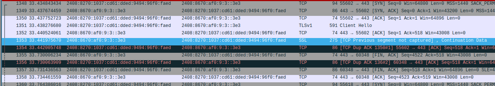
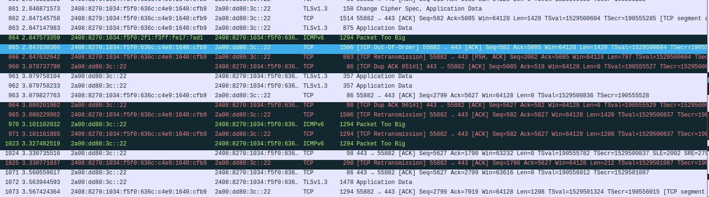
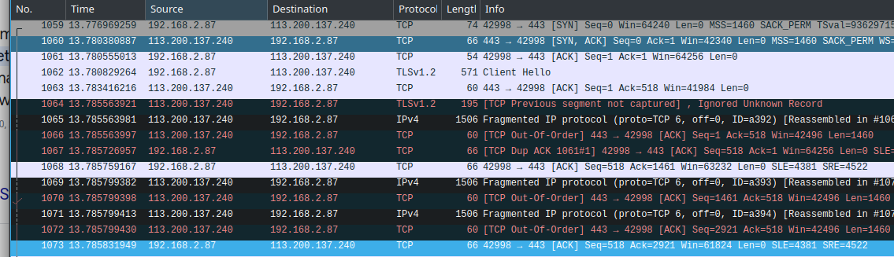
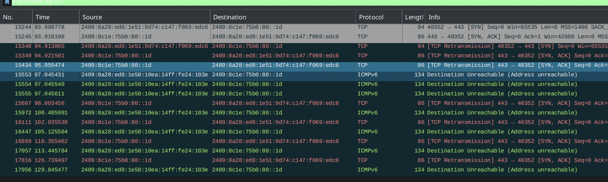

## 背景知识

[RFC 8200 (Internet Protocol, Version 6 (IPv6) Specification)](https://datatracker.ietf.org/doc/html/rfc8200) 为最新的 IPv6 标准. 主要描述了头部 (Header) 定义, 拓展头部和选项定义等.

[RFC 7084 (IPv6 CE Router Requirements)](https://datatracker.ietf.org/doc/html/rfc7084) 定义了家用或小型办公室路由器 (IPv6 Customer Edge Routers) 配置的基本要求. OpenWrt 的配置文档遵循了这一 RFC.

RFC 4861 (IPv6 Neighbor Discovery) 定义了一种网络发现机制, 等效与 IPv4 中的 ARP. 下述的两种机制均依赖于 ND.

[RFC 4862 (IPv6 Stateless Address Autoconfiguration, SLAAC)](https://datatracker.ietf.org/doc/html/rfc4862) 定义了一种无状态配置地址的机制. [RFC 8415 (Dynamic Host Configuration Protocol for IPv6 (DHCPv6))](https://datatracker.ietf.org/doc/html/rfc8415) 定义了一种配置 IP 地址和前缀的机制. DHCPv6 可以替代 SLAAC 或和 SLAAC 一起工作.

本文并不是一篇针对 IPv6 的详尽介绍, 而只是对家用 IPv6 配置过程中的一些机制作了阐述. 在最后分享了几个 IPv6 问题排查的例子.

## 术语
- 节点 (node): 一个实现了 IP 协议的设备

- 路由器 (router): 一个转发 (不是显式地发给它自己的) IP 包的设备

- 主机 (host): 不是路由器的节点

- 链路 (link): 一种通信介质, 使节点能够在链路层进行通信. 对于一个 link-only scope 的地址 (即下文中 link-local address), 其只能与在相同链路上的设备通信, 即所谓的在同一个子网内的设备. 这个地址也被称为工作在单链路 (single link) 上. 路由器无法路由这个地址.

  IPv6 CE 路由器是两个网络之间的分割点, 是一个组播域的边界.

## RFC 8200 (Internet Protocol, Version 6 (IPv6) Specification)

关于分片: 我之前一直以为 IPv6 不能够分片, 然而实际上是 IPv6 包在途中无法分片 (也就是说路由器只能够丢弃过大的包), 分片只发生在主机上.

## RFC 4291 (IP Version 6 Addressing Architecture)

RFC 4291 定义了 IPv6 中的地址空间以及不同的层级. IPv6 必须支持组播, 这样做的好处是主机可以使用一个众所周知的组播地址来和 DHCP 服务器通信. 同时, 在 IPv6 中不存在广播, IPv4 中广播的功能都能够由组播实现.

一个典型的 IPv6 地址:


对于单播和组播地址，它们之间可由不同的网络前缀所辨认:

| 地址类型             | 英文名称               | 二进制       | 16进制    | 备注                 |
| :------------------- | :--------------------- | :----------- | :-------- | :------------------- |
| 链路本地地址 | Link-local address     | 1111 1110 10 | fe80::/10 | 单链路通信, 中间 54 bits 为 0, 末尾 64 bits 为 interface ID. |
| 唯一本地地址 | Unique local address, ULA   | 1111 1101    | fd00::/8  | 本地网络通信         |
| 全局单播地址         | Global unicast address, GUA | 001          | 2000::/3  | 互联网通信           |
| 组播地址             | Multicast address      | 1111 1111    | ff00::/8  |  |

> tips: ULA 在 [RFC 4193 (Unique Local IPv6 Unicast Addresses)](https://datatracker.ietf.org/doc/html/rfc4193) 中有详细描述, 其与 link-local address 的主要区别在于 link-local 用于无路由器情况下的链路配置, 以及同一链路下的通信.
> ULA 的作用与 IPv4 时代的 10.0.0.0/8 等私有地址类似, 可以用于内网中的服务访问, 其能够被路由, 只是不存在于互联网上, 
> ULA 用于替代已经 deprecated 的 site-local address.

> Note: RFC 4291 似乎规定了一种 Interface Identifiers 的生成方式 Modified EUI-64, 但是我没有细看

一个典型的全局单播地址结构:


一些预定义的 IPv6 组播地址: 

- 本地网段所有节点 (All Nodes Addresses) — ff02::1
- 本地网段所有路由器 (All Routers Addresses) — ff02::2
  > tips: 这两个地址均为 link-local, interface-local 和 site-local 在这里不作讨论
- 本地请求节点地址 (Solicited-Node Address) — ff02::1:ffxx:xxxx
  这个地址由接口的低 24 bits 地址计算得到, 设备必须加入接口相关联的请求节点地址 (无论是自动或手动配置的地址)

## RFC 4861 (IPv6 Neighbor Discovery)

RFC 4861 定义了一种网络发现机制 (Neighbor Discovery Protocol, NDP), 等效与 IPv4 中的 ARP.  NDP 定义了五种 ICMPv6 (RFC 4443) 消息类型：

1. 路由器请求 (Router Solicitation，简称 RS)
2. 路由器通告 (Router Advertisement，简称 RA)
3. 邻居请求 (Neighbor Solicitation)
4. 邻居通告 (Neighbor Advertisement)
5. 重定向 (Redirect)

所有 NDP 协议的包实际上是封装在 ICMPv6 协议的包里的. 这里插播一下 ICMPv6 的包结构, 非常简单:



IPv6 下的 ping 命令和 IPv4 下类似, 也是使用 ICMP 协议实现的. ICMPv6 定义了 Echo Request (Type 128) 和 Echo Reply (Type 129) 类型来给 ping 使用.

下文所述的 SLAAC 即使用 NDP 协议通信.

## RFC 4862 (IPv6 Stateless Address Autoconfiguration)

RFC 4862 定义了一种 IPv6 接口的自动配置机制 (即 SLAAC), 包括生成一个链路本地地址和全局地址, 和一种重复地址检测 (Duplicate address detection) 机制来验证一条链路上地址的唯一性.

自动配置过程将首先生成链路本地地址. 其由一个链路本地前缀 (RFC 4291 中定义的)+一个接口的标识符 (interface identifier), 当这个地址被分配到一个接口之前, 它是一个暂定地址 (tentative address). 一个节点必须验证它在链路上的唯一性. 具体来说, 节点会发送一个邻居请求报文, 将这个暂定地址作为目标地址. 如果另一个节点正在使用这个地址, 它会返回一个邻居通告来拒绝这个请求. 在验证成功后, 这个地址会成为首选地址 (preferred address).

接下来主机会广播路由器请求 (RS), 以便敦促路由器发送路由器通告 (RA). 主机根据路由器通告中的的前缀信息 (Prefix-Infromation) 选项来构造全局地址.

> Note: 由于 RA 总是会广播给所有主机, 所以 SLAAC 无法做到不给某些主机分配 IP 地址

一个地址的生命周期: 首选地址在首选期限 (preferred lifetime) 过期之后会成为不推荐地址 (deprecated address). 不推荐地址能够继续被用于已经建立的连接中, 但不应该被用于建立新连接. 一个地址在有效期限 (valid lifetime) 过期之后会变为无效地址 (invalid address). 无效地址不能够被用作向外连接的源地址.

RFC 4862 中并没有规定 interface identifier 是如何产生的, 只说了很多情况下其由接口的链路层地址 (即 MAC 地址) 产生. 这种生成方式会带来一些隐私上的顾虑, 因而在 SLAAC 隐私扩展 (RFC 4941) 中, 主机会生成一个临时地址 (temporary address) 来负责对外通信. 另一种方式是生成一个不变的, 与 MAC 地址无关的 interface identifier, 这种方式在 RFC 7217 中定义.

## RFC 8415 (Dynamic Host Configuration Protocol for IPv6)

RFC 8415 定义了一个 C/S 协议 DHCPv6, 其功能包括向一个设备提供地址或其他配置, 自动委派 IPv6 前缀等. 当 DHCP 只被用于提供除地址和前缀之外的其他配置 (如 DNS) 时, 它不必维护任何状态, 因此, 这种模式被称为无状态 DHCPv6 (stateless DHCPv6). 与之相对的是有状态 DHCPv6 (stateful DHCPv6). RFC 8415 是一个庞大的 RFC, 废弃了许多之前的 DHCPv6 标准, 如 RFC 3315 (原始的 DHCPv6 标准), RFC 3633 (prefix delegation), RFC 3736 (Stateless Dynamic Host Configuration Protocol (DHCP) Service for IPv6) 等.

DHCP 消息类型 (部分):

- Solicit: 客户端发送, 用于定位服务器
- Advertise: 服务器发送, 对于 solicit 的回复
- Request: 客户端发送: 用于请求配置
- Reply: 服务器发送, 包含租约和其他配置, 是对于 Solicit, Request, Renew, 或 Rebind 的回复

### IPV6-PD

前缀委派 (Prefix Delegation) 用于一个委派路由器 (delegating router) (作为 DHCP 服务器) 向一个请求路由器 (requesting routers) (作为 DHCP 客户端) 委派前缀. 这一机制通常被用于 ISP 向用户委派 (delegate) 一个前缀, 这个前缀将被用于用户网络中的设备. 比如用于 SLAAC 中路由器通告的前缀部分.



PD 是通过 DHCPv6 中的 `IA_PD` 选项来工作的. 为了方便抓包分析, 这里描述一下这个选项的字段.



- DHCPv6 的 option 有固定的 option-code 和 option-len 字段, 分别占 2 字节. 对于 `IA_PD`, option-code 为 `OPTION_IA_PD` (25)
- IAID: 一个唯一的标识符
- T1: 在多久之后客户端应该向获取前缀的 delegating router 刷新前缀的有效时间
- T2: 在多久之后客户端应该向任何可用的 delegating router 刷新前缀的有效时间
- IA_PD-options: 包含了前缀的具体信息. 请求和响应都会采用同样的 option 格式, 只不过响应会在这个字段中附上前缀信息

## PMTU 问题

在配置 IPv6 的过程中一个常见的问题是 PMTU 问题. Path MTU Discovery (PMTUD) 是确定 MTU 的一种标准方式, 在 [RFC 8201 (Path MTU Discovery for IP version 6)](https://datatracker.ietf.org/doc/html/rfc8201) 中定义. RFC 中这样描述:

> 
> Nodes not implementing Path MTU Discovery must use the IPv6 minimum link MTU defined in [RFC8200] as the maximum packet size.
>

从中我们可以推测 PMTUD 在 (几乎) 所有节点上无需配置默认启用.

PMTUD 工作方式为源节点首先选择下一跳的 MTU (已知) 作为 PMTU. 如果传输路径上的某个节点因为包过大而无法转发一个包, 它就会丢弃这个包并返回一条 ICMPv6 Packet Too Big 消息.



(图源 [RFC 4443](https://datatracker.ietf.org/doc/html/rfc4443#section-3.2), 最小的 IPv6 MTU 即 1280 字节)

收到消息后源节点根据 ICMPv6 消息中的 MTU 字段减少 PMTU. 这一过程会重复直到源节点估计的 PMTU 小于真正的 PMTU.

这一机制带来的问题是, 如果某个路由器没有发送 ICMPv6 消息或是 ICMPv6 消息被路由器的防火墙 block 了, 那么实现了 PMTUD 的节点可能会遇到连接问题. 比如 TCP 的三次握手成功, 但在数据传输的时候 hang 住了. 这种情况被称为黑洞连接.

一个 PMTUD 的扩展在 [RFC 4821 (Packetization Layer Path MTU Discovery)](https://datatracker.ietf.org/doc/html/rfc4821) 中定义, 其不依赖 ICMPv6 消息.

个人猜测在 IPv4 下这个问题比较少见的原因是 IPv4 支持在路由器上进行分片.

### 一个例子

在访问淘宝时, 淘宝会访问 `g.alicdn.com` 这一域名, 即 `2408:8670:af0:9:3::3e3` 这个 IP. 在 TCP 握手的时候 MSS Option 被设置成了 1440 Bytes, 即 MTU 为以太网的 MTU 1500 (1440 + TCP Header 20 + IPv6 Header 40). 可以看到在第 1353 个包的时候 Wireshark 指示了 "TCP Previous Segment Not Captured", 猜测序号 1352 和 1353 之间的某些服务器发送的包被丢了.



下面来看正确处理的情况, 访问 [Test IPv6](https://test-ipv6.com/) 时, 有一项测试为 "Test IPv6 large packet", 测试内容为访问一个 MTU 为 1280 的服务器. 通过抓包发现 TCP 握手时的 MSS 仍为 1440, 但在第 862 个包的时候我发送了一个过大的包, 于是在第 864 个包我的路由器 (由于运行了 PPPOE, MTU 为 1492) 返回了一个 ICMPv6 报文, 于是在第 865 个包我重传了这个包, 把 MTU 减少到了 1492, 这一过程不断重复直到 MTU 被设置为 1280.



> Note: 这里需要[关闭 TCP Segmentation Offload](https://wiki.wireshark.org/CaptureSetup/Offloading), 否则包长度会显示为超过 MTU, 这是因为 TCP 包的分片被 Offload 到了网卡以减轻主机 CPU 的负担.

在仅 IPv4 的情况下访问 `g.alicdn.com`, 可以发现服务端发送的几个包发生了分片:



## 其他一些问题

### PD 过早失效的问题

我现在的移动网是光猫拨号, 用一个软路由装了 OpenWRT 当主路由. 发现 IPv6 会在一天之后停止工作.. 抓 wan 口 DHCPv6 包发现 PD 的有效期写的是两天.. 怀疑和这个有关.. 待调查.

（2024/11/07 更新）把光猫改成桥接模式之后这个问题没有出现了..

### NDP 不工作的问题

某日, 突然发现我的手机在 WiFi 下某些 App 加载非常慢, 而使用移动数据则正常, 直觉告诉我是 IPv6 的锅, 然而检查 OpenWRT 发现已经开启 TCP MSS Clamping, MTU 设置的 1420 也比较小了, 遂在路由器 eth0 接口 (wan 口) 抓包查看.

抓包发现手机的 v6 地址不可达.. 图中 `103e` 结尾的地址是路由器, `edc6` 结尾的地址是手机, 可见手机发起 TCP 握手之后, 对方的 SYN 并没有发到我手机 (因为手机发起了重传), 之后路由器给对方发送了网络不可达报文..



在路由器上用 `ip neighbour` 检查发现:

```bash
root@FriendlyWrt:~# ip neighbour
...
fd00:ab:cd:0:9d74:c147:f069:edc6 dev br-lan FAILED 
2409:8a28:ed8:1e51:9d74:c147:f069:edc6 dev br-lan INCOMPLETE 
...
```

查询 man 可知这是 NDP 发现未能成功:

```bash
 incomplete
        the neighbour entry has not (yet) been validated/resolved.

 failed max number of probes exceeded without success, neighbor validation has ultimately failed.
```

之后继续观察 Wireshark, 发现手机确实不响应 NDP Neighbor Solicitation, 这种情况闻所未闻..

根据重启重装重买定律, 重启手机, 问题解决.. 尚不清楚真正的问题是什么.. (我觉得一加大概率背锅)

### mavlan 的问题

见 [OpenWrt 搭建透明代理]()

## 其他

- 一个典型的 IPv4 路由器会使用 NAT, 因此默认阻止所有入站连接, 其通常使用 UPnP 来开放某一端口. 而 IPv6 不使用 NAT, 因此正确配置防火墙是必要的.
- [RFC 4389 (Neighbor Discovery Proxies (ND Proxy))](https://datatracker.ietf.org/doc/html/rfc4389), 可以作为一种在 ISP 不支持 DHCPv6-PD 情况下使用 IPv6 的一种方式. 虽然该 RFC 的分类是 experimental, 但其已经被广泛实现了.

## 参见

- [OpenWrt IPv6 configuration](https://openwrt.org/docs/guide-user/network/ipv6/configuration)
- [IPv6动态地址分配机制详解](https://www.packetmania.net/2020/12/01/IPv6-Addressing/)
- [ArchWiki IPv6](https://wiki.archlinux.org/title/IPv6)
- [Fragmenting IPv6](https://blog.apnic.net/2016/05/19/fragmenting-ipv6/) 讨论了和分片有关的问题, 包括 UDP 下的处理
- [开启 IPv6 后网速变得很慢？可能是 PMTU 黑洞的问题 - V2EX](https://www.v2ex.com/t/800024)
