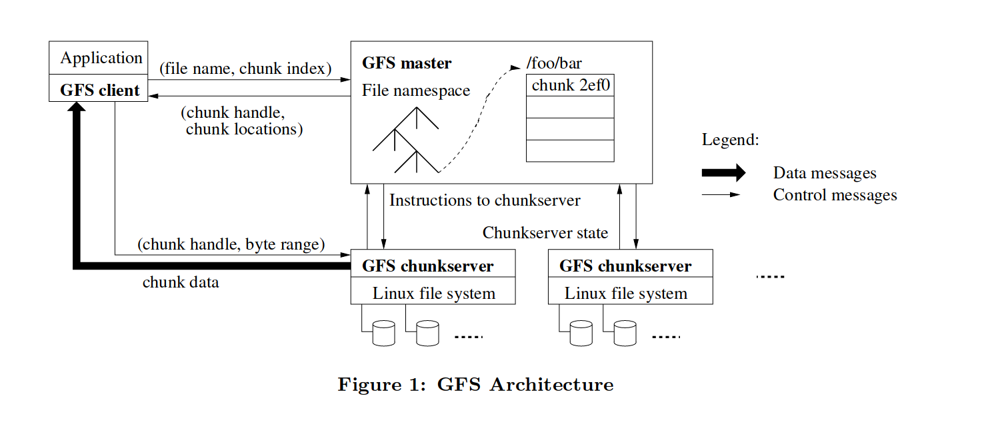
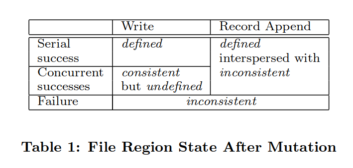
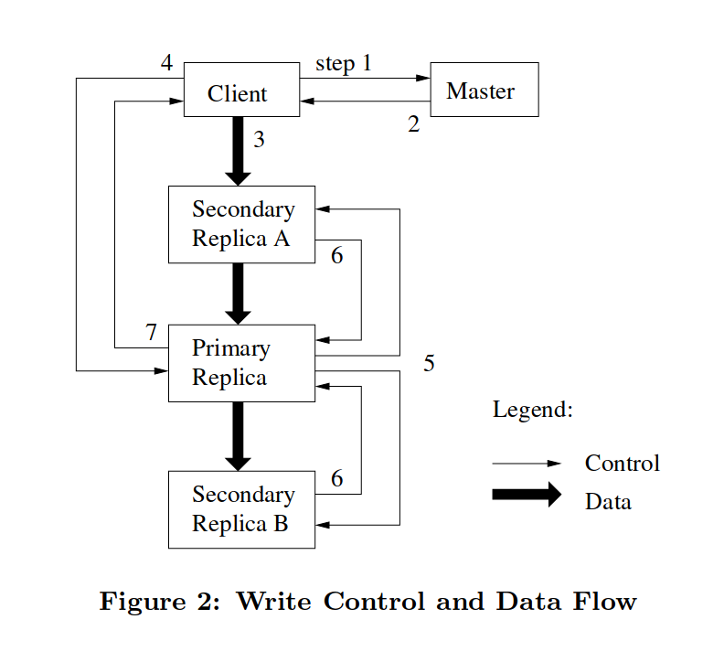

存储系统通常是一个分布式系统的基石，通常应用可以是无状态的，而所有状态便由存储系统来管理。

Google 文件系统（The Google File System, GFS）在 2003 年于一篇同名论文中被提出，发表在系统领域顶会 SOSP 上，是 Google 大数据三驾马车之一[^1]。GFS 是一个成功的系统，在 00 年代早期，人们对于分布式文件系统已经有很好的理解了，但是尚未有一个可以扩展到上千个节点的系统被实现出来。很多 GFS 的设计被 HDFS 等后来的分布式文件系统上。

[^1]: 另外两篇论文是 MapReduce: Simplified Data Processing on Large Clusters 和 Bigtable: A Distributed Storage System for Structured Data

GFS 基于以下几个方面的观察：

- 节点故障是常见的，因为其运行在大量普通机器（commodity components）上
- 存储的文件以大文件（数百 MB 到数 GB）为主，小文件应当被支持，但不应对其优化
- 对文件的大多数写入操作是追加 （append）而不是覆盖/随机写，大多数读取操作是顺序读 （1 MB 或更多）
  - 所以系统必须有良好的并发追加操作的语义
  - 工作负载通常是批处理任务，所以高吞吐量比低延时重要
- 同时设计应用和文件系统 API 有利于整个系统的灵活性

## 架构



GFS 采用 Master/Slave 架构，集群中存在一个 master 和多个 chunkservers，并且被多个 clients 访问。（由于单 master 的存在，GFS 存在单点故障的可能性，虽然 master 同样有备份，但恢复可能需要人工干预）一个文件将被分割成多个 chunk。chunk 的特性如下：

- 固定大小，Google 的选择是 64 MB，这么大的 chunk 将有如下好处：
  - 减少 client 和 master 的通信，因为在获取到 chunk 的信息后，client 只需要和 chunkserver 交互进行读写
  - 减少 metadata 的尺寸，以便所有 metadata 可以保存在内存中
- 作为一个普通的 Linux 文件存储在 chunkserver 上
- 每个 chunk 由一个不可变的、唯一的 64 位 chunk handle 标记，其由 master 在 chunk 创建时指定
  - chunkserver 根据 chunk handle 和偏移（byte range）来读写 chunk
- 为了可靠性，每个 chunk 会被复制到多个 chunkservers 上 （通常为三个）

master 管理了所有的元数据，用 Go 代码大概表示为：

```go
type ChunkHandle struct {
    Handle int64
    ChunkServers []ChuckServer
    ReplicaNum int
    Version int // 为了区分数据是否是最新的
    Primary ChuckServer
    LeaseExpiration time.Time
}
type Master struct {
    Files map[Filename][]ChunkHandle
}
```

除此之外，还需要 log 和 checkpoint 机制来持久化元数据。元数据中 Handle, ReplicaNum 和 Version 应该是非易失的（non-volatile)。没有持久化 ChunkServers 字段可能是因为 chunkserver 会经常变动。

## 一致性模型

GFS 采用了一种宽松的一致性模型，不同于 Raft 等强一致性协议，其允许不一致的情况出现。不一致的情况将由应用处理。这实际上是为了性能而牺牲了一些一致性。



对于一个文件区域，GFS 定义了几种状态：

- 一致的（consistent）：无论从哪个 replica 读，所有 clients 都会看到同样的数据
- 确定的（defined）：在一次写入之后，数据是一致的，并且 clients 都能完整看到这次写入写了什么。
- 不一致的（inconsistent）：不同的 client 能够读到不一样的结果

这三种状态发生于以下情况：

- 当没有并发写的写入成功后，这块区域就是确定的
- 当若干写入操作并发成功后，这块文件区域是不确定但一致的：所有 clients 都能看到同样的数据，但这块可能不能反映出其中任何一次写入的结果（通常是这几次写入的结果交织在一起）
- 失败的写入使得这块区域不一致

GFS 中的写入（mutation）分为指定偏移量的写入（Write）和记录末尾追加（Record Append），record append 能够保证原子的至少一次（at least once）追加，但是有小概率会出现 padding 或者重复数据。GFS 的应用可以通过在每条记录后加入校验来处理不完整的记录，还可以通过加入唯一的标识符来处理重复记录。GFS 的客户端库中包含了这些通用的处理不一致的功能。

## 实现

GFS 使用租约（lease）来维护一个一致的写入顺序（consistent mutation order）。租约就是在一段时间内，master 让某一 replica 成为 primary，master 将保证在这段时间内不会分配另一个 primary，而 primary 将保证在租约过期后不再履行 primary 的职责。primary 将指定一个 chunk 的写入顺序，其他的 replica 则跟随 primary 的顺序。

### 写入



client 首先向 master 请求 primary 和其他 replicas 的位置。如果尚未有一个 primary，master 会首先增大版本号并通知所有 replicas，然后选定一个 primary 并向其分配租约。client 会缓存这些元数据，以减少 master 的负载。

client 随后向所有 replica 推送数据，数据被存储在 chunkserver 的本地缓存中等待被使用。数据流和控制流是分离的，这是为了更有效地利用网络。数据流采用了一种流水线的形式，首先 client 向距离其最近的 chunkserver 推送数据，这个 chunkserver 再向其最近的 chunkserver 转发，链式地发送数据，转发不会等待 chunk 传输完而是立即开始的。

当所有 repicas 都 ACK 收到了数据之后，client 向 primary 请求写入。由于可能存在并发，primary 为所有写入分配一个序列号，在本地应用这些写入，并转发写入请求到其他 replicas。所有 replicas 都 ACK 之后，primary 向 client 回复。如果任何一个 replica 出错，那么被修改的区域就处于不一致的状态，此时由 client 来负责重试失败的写入。（如果在 primary 就出错的话，那么它不会转发写入请求，此时数据应该仍然处于一致的状态）

当应用写入的区域很大时，GFS client 会将其切分成一个一个 chunk，并分为多个写入操作来执行，此时如果有并发操作，则会出现一致但不确定的状态。

### 记录追加（Record Append）

此操作中 client 只指定文件而不指定偏移，GFS 保证该操作在 GFS 指定的偏移处原子地完成至少一次，并向客户端返回这个偏移。GFS 的应用中有很多是多生产者/单消费者模型，很适合使用记录追加操作。

记录追加操作和写入大致相同，惟 primary 会检查要追加的数据是否会超出当前 chunk，如果会的话，它将 pad 这个 chunk 到 64MB，指示其他 replicas 也这么操作，并指示客户端重试。（记录追加操作限制最大数据大小为四分之一个 最大 chunk size 以便控制碎片的大小）如果没有超出，则按写入的流程进行，此时 primary 会选择一个 offset （即它所认为的文件末尾）告知其他 replicas 进行写入。如果任何一个 replica 失败，客户端会重试操作。这种情况下部分 replica 将会出现重复的记录，但是数据肯定以某一偏移写入了所有 replicas。

## 问题

- 如果 chunk 的版本号只在分配租约是增加的话，假设一个 replica （非 primary）在某一时刻挂了，因此错过了几个写入，如果版本号此时不改变的话，在那个 replica 恢复之后，client 就会读到过时数据了。论文里好像也没提这种情况怎么处理..

## 总结

以上并未包含论文的完整内容。GFS 我早在去年夏天就开始学了，然后就一直搁置在一旁，直到这两天才重新拿起来...

## 参考

本文的内容来源于：

- GFS 论文
- [6.824 Lecture 3: GFS](https://www.youtube.com/watch?v=EpIgvowZr00&t=1935s)
- [Google File System 总结](https://mr-dai.github.io/gfs/)