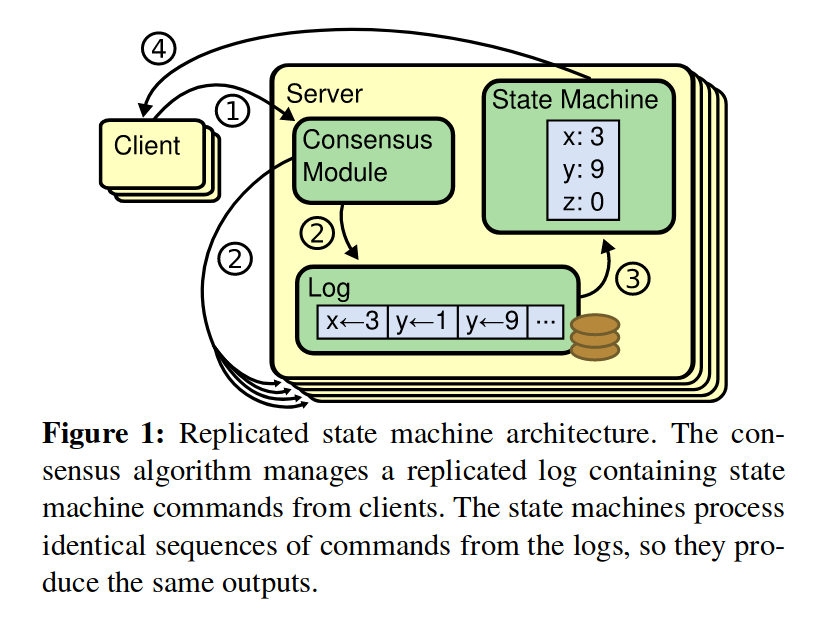
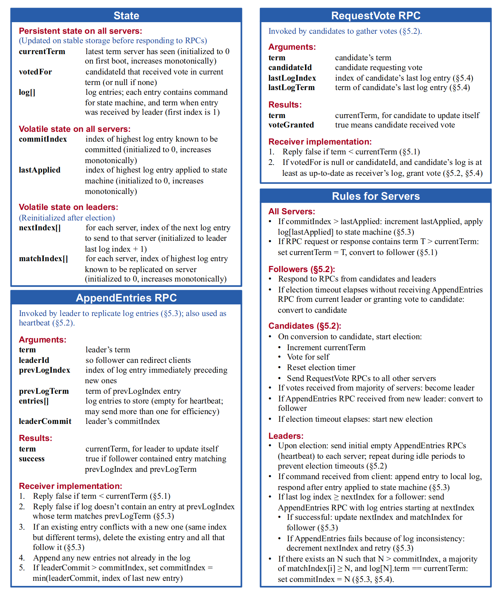
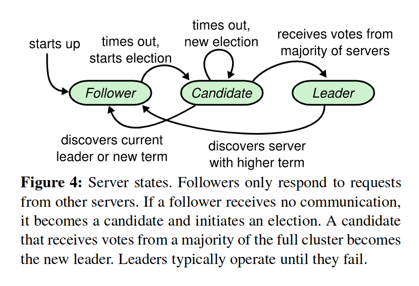
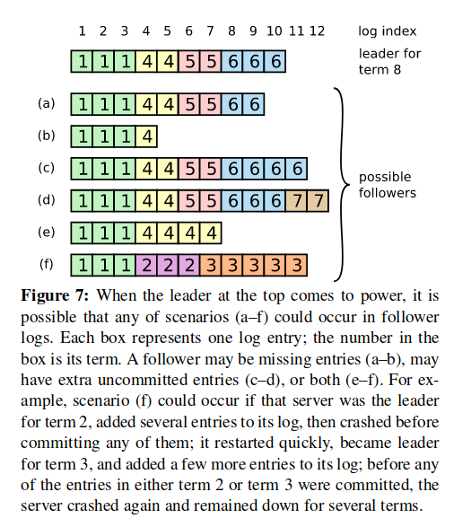
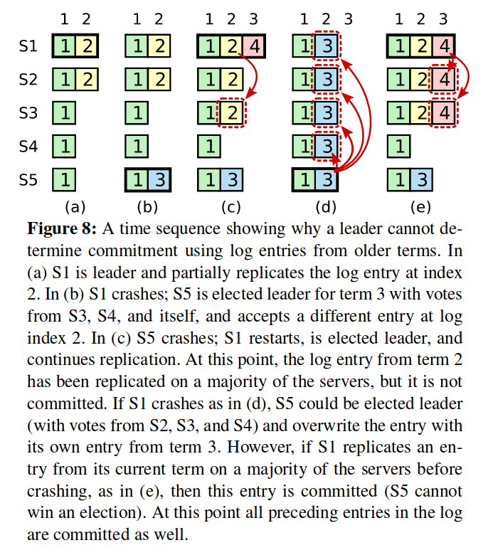
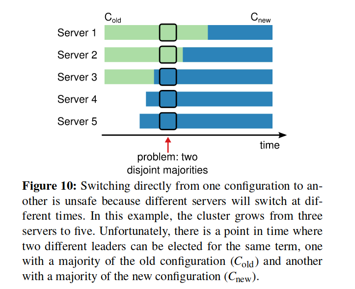
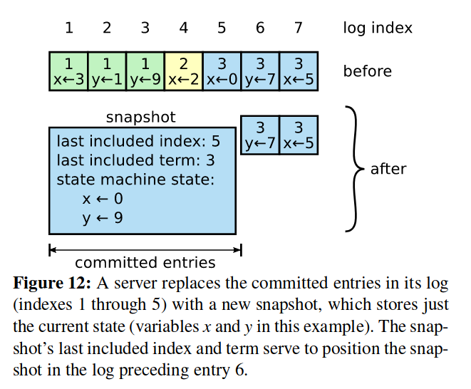
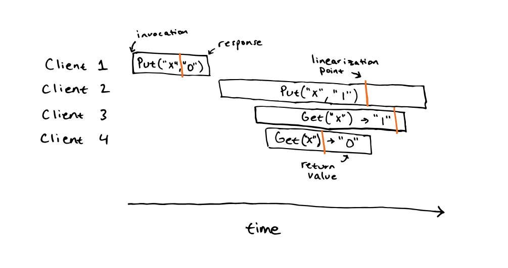
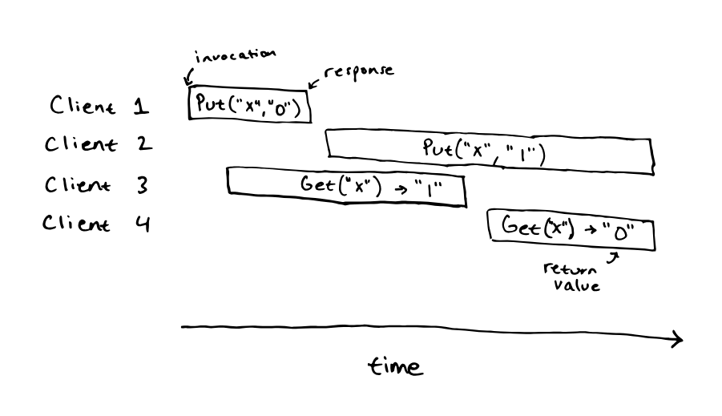

> Note: 为了保持准确性，我会尽量使用英文术语。

## Introduction

在过去十年, Leslie Lamport 的 Paxos 几乎成了共识的同义词.. Paxos 首先定义了一种协议来对单个决定达成共识, 比如一条单个的 log entry, 这被称为 single-decree Paxos. 其支持多个决定的版本 (比如 log) 被称为 muti-Paxos。然而，Paxos 的缺点是难以理解，并且没有提供一个良好的基础来构建可行的实现。

相较于 Paxos，Raft 的目标是易于理解且符合直觉。为了使 Raft 易于理解，作者采取了解耦 (Raft 将共识问题分解成几个子问题 leader election, log replication, safety, and membership changes) 和缩减状态空间的方式。

Raft 和已有的共识算法类似（尤其是 Viewstamped Replication），但它有一些新特性。Raft 采取了强 leader 的设计，例如 log entry 只会从 leader 向其他节点分发。这可能是为了性能考虑（比无 leader 要更快，RPC 也更少）Raft 采用基于随机计时器的 leader 选举, 从而用一种简单的方法来解决冲突。另外还有处理成员变更方面的改进。

为了解决单点故障问题，Raft 采用了 Majority Vote，基本上任何操作都需要得到多数确认才能够执行。为了避免 tie，Raft 的节点数量必须为奇数。因此在一个 2f+1 个节点的系统中，最多允许 f 个节点故障，f+1 即为法定人数（quorum）。

如果 server 不出错，网络也很稳定，共识算法是很简单的，比如在 Raft 中，leader 被选举出来，client 的请求由 leader 处理并转发给 followers，所有 server 都和 leader 保持一致，这个过程是很简单并且直观的。这些算法真正处理的、细节繁杂的地方是 server 出错、RPC 受网络影响（包括包的延迟，重复，顺序改变，丢失，网络分区）的时候。

## Replicated state machines (复制状态机)

通常实现主从复制有两种方法：

- 状态转移（State trasnsfer），主服务器将存储的所有状态都发送给从服务器
- 复制状态机（Replicated State Machine），将服务器视为确定性的状态机，主服务器将所有输入发送给从服务器，那么他们在任意时刻的状态都是相同的

Replicated state machines 通常使用 replicated log 实现. 每个节点存储一份 log (一系列指令), 其状态机按顺序执行它们. 每个状态机获得的 log 都是完全一致的, 所以它们是确定性的, 存储有完全相同的状态. Replicated log 的一致性由共识算法保证, 一个节点上的共识模块从 client 接收指令, 并把它们加到 log 中, 它和其他节点的共识模块通信以保证 log 存储了相同顺序的指令。在 Raft 中，状态机由上层应用负责处理。

共识算法需要具有以下属性:

- 在非拜占庭错误 (包括 network delays, partitions, and packet loss, duplication, and reordering) 下保证安全性 (safety), 即不会返回不正确的结果
- 只要多数 (即超过一半) 节点工作, 服务就是可用的
- 不依赖时间来确保一致性, 错误的时间或是极端情况下的延迟只会导致可用性问题
- 只要多数节点回应, 一条命令就能够完成, 少数 slow servers 不会影响整个系统的性能

## Raft 共识算法

这张图（论文中的 Figure 2）总结了 Raft 协议（除了成员变更和 log 压缩），我们在实现 Raft 协议时会反复看这张图。

Raft 主要由两个 RPC 构成：

- `RequestVote RPC`，由 candidate 请求，用于收集投票
- `AppendEntries RPC`，由 leader 请求，用于心跳和复制 log entries

Raft 首先将选举一个 leader, leader 的存在能够简化对 replicated log 的管理，比如 leader 能够独自决定把新的 entry 放在哪里，数据自然地由 leader 流向其他 servers。leader 拥有完全管理 replicated log 的权力，leader 从 clients 接受 log entries, 分发给其他节点, 并告诉它们何时能应用这些 log entries 到它们自己的状态机。

关键性质:

- Election Safety: 一个任期中只有一个 leader
- Leader Append-Only: leader 不会覆盖或删除自己的 log entry, 只会 append
- Log Matching: 如果两份 log 中某一个 entry 的 index 和 term 相同, 那么两份 log 从头开始直到该 entry 都是相同的
- Leader Completeness: 如果一个 log entry 在某一 term 中 commit 了, 这个 entry 会存在于任何更高任期的 leader 的 log 中
- State Machine Safety: 如果一个 server 将一个指定 index 的 log entry 应用到了 state machine 中（i.e. commit 了这个 entry）, 没有其他 server 会在那个 index 上会应用其他的 entry

这些性质看起来比较抽象，然而是保证 Raft 的安全性所必须的，下文会详细解释。

### leader 选举

任何一个节点处于以下三种状态: leader, follower, candidate

上图描述了 server 所有的状态变化，下面描述几个关键的步骤：

- Follower -> Candidate：开始选举，follower 递增 term 并进入 candidate 状态，它接着给自己投票并向其他 server 发送 RequestVote RPC。每个 server 在一个 term 只能给一个 candidate 投票，基于先来先得的原则
- Candidate -> Leader：当 candidate 接收到了多数票（majority）之后将赢得选举，接着它会马上发送心跳包宣告自己的权威并阻止新的选举。leader 会一直保持 leader 状态，除非 a). 它 fail 了 b). 由于丢包等原因导致某个 follower 的选举计时器超时了
- Candidate -> Follower：如果 candidate 收到其他 server 的 AppendEntries RPC 宣称是 leader，并且其 term 不小于 candidate 的当前 term，则该 leader 合法，candidate 回退到 follower 状态
- Candidate -> Candidate：如果没有产生多数票，在超时后选举将重复进行，为了打破僵局 Raft 使用随机的选举超时时间
- 无论何时，candidate 和 leader 只要收到一个 term 比自己大的 RPC，它必须转变为 follower

由于在任何一个 term 中，一个 server 只能够投一次票，而只有得到多数票才能成为 leader，所以 Election Safety（一个任期中只有一个 leader）得以满足。

### log 复制 (replication)

log 由 entry 组成，每个 entry 都有一个唯一递增的 log index（可以理解为在数组中的 index）。entry 中包含 term 和给状态机的指令。

当一个 log entry 能够被应用到状态机上时 (i.e. 当 leader 知道这个 entry 已经被 replicate 到多数 server 上时，但下文会说明一种例外情况), 我们称这个 entry 为 committed. leader 决定哪些 entry 能够 commit，并在下一次 AppendEntries RPC 中将这个状态告知 followers. Raft 保证了 commited entries 是持久的并**最终**会应用到所有 servers 上。

leader 维护 `commitIndex`，即最高的 committed entry index，并且会将这个 index 包含在 AppendEntries RPC 中。

Raft 协议中的 Log Matching 性质实际上由两部分组成：

- 如果两份 log 中某一个 entry 的 index 和 term 相同, 那么这两个 entry 相同
  - 这是因为一个 term 只有一个 leader，而一个 leader 对于给定 log index 只能创建最多一个 entry，并且 log entry 从不改变它们在 log 中的位置
- 如果两份 log 中某一个 entry 的 index 和 term 相同, 它们之前的 entries 都是相同的
  - 这个性质由 AppendEntries 的一个一致性检查保证。leader 会把新 entries 的前一个 entry 的 index 和 term 包含在 AppendEntries RPC 中（`prevLogIndex` 和 `prevLogTerm`），这样如果 follower 找不到这样一个 entry，它就会拒绝新的 entries

正常情况下所有 server 的 log 会保持一致，然而当 leader crash 时便会产生不一致。follower 可能会缺一些 entries，也可能多一些，也可能两者都有。leader 通过强制 follower 的 log 和自己同步来解决不一致。leader 为每个 follower 维护一个 `nextIndex`，即下一个将会被发给 follower 的 log entry。在一开始 leader 会初始化 `nextIndex` 为它最新一个 log entry 的下一个位置，当某个 follower 拒绝了一次 AppendEntries 之后，leader 递减 `nextIndex` 并重试 AppendEntries RPC。最终 `nextIndex` 会到达一个 leader 和 follower 都一致的位置，follower 在那个位置之后的所有 entries 都会被 leader 的覆盖。上述描述同时也符合了 Leader Append-Only（leader 只会追加自己的 log） 这个性质。

### 安全性

如果 Figure 7 中的 (f) 被选举为了下一个 leader，那么 term 4 及之后的更改岂不是都丢失了？因此 Raft 限制了谁能够被选为 leader，以便满足 Leader Completeness 性质（committed entry 会存在于任何更高任期的 leader 的 log 中）。首先给出 log 新旧的定义：如果 candidate 的 log 至少和多数 log 一样新（at least as up-to-date as any other log in the majority）那么它包含了所有 committed entries；如果 log 的最后一个 entry term 更大，那么它就更新。如果 term 相同，那么更长的 log 更新。在 RequestVote RPC 中，candidate 会包含 `lastLogIndex` 和 `lastLogTerm`，只有当 candidate 的 log 更新时一个 server 才会投票给它。

当 leader commit 一个来自它之前 term 的 entry 时，可能会遭遇上图的问题，在 (c) 中，来自 term 2 的 entry 已经被复制到多数 server 上了，然而如果 (d) 发生了，它仍然会被来自 term 3 的 entry 覆盖。因此 Raft 将 commit 定义为只有来时当前 term 的 entry 才能够通过 replica 计数来 commit，而来自之前任期的 entry 只能够通过在它之后的 entry 被 commit 来间接 commit（Log Matching 性质）。

我们可以用反证法来证明这么做的安全性（非严格证明），假设节点数量为 2f+1，log index m 已经被 commit 了，并且位于 f+1 个 server 上。此时一个不包含 m 的 server x 想要竞选 leader。为了得到多数票，至少有一个包含 m 的 server y需要投票给 x，此时需要 x 比 y 更新。根据 up-to-date 的定义，可能有以下两种情况：

- x 和 y 的最后一个 log entry term 相同，且 x 的 log 至少和 y 一样长。此时根据 Log Matching 性质，x 必然包含 m，故产生矛盾。
- x 的最后一个 log entry（设为 p）term 更大。那么 p 的 term 必然大于 m 的 term。既然 m 已经 commit 了，创建了 p 的那一任 leader 必然在 log 中包含了 m，所以 x 也必然包含 m，产生矛盾。

### 时机和可用性

在 leader 选举中，时机（Timing）是很关键的，如果 RPC 用时过长，那么 candidate 在超时之前将无法赢得选举。Raft 需要满足以下时机约束：$broadcastTime ≪ electionTimeout ≪ MTBF$，broadcastTime 是平均一次 RPC 的时间，electionTimeout 是选举超时时间，MTBF（Mean Time Between Failures）是发生两次 server 故障的平均间隔时间。

## 集群成员变更

这里指的是增减 server。虽然我们总是能够通过下线整个集群、更新配置、上线集群的方式来增减 server，但这样就减少了可用性。为了使配置变更是安全的，必须保证同一 term 不可能有两个 leader 被选举出来。然而，任何直接由旧配置转变为新配置的做法都是不安全的，如下图所示：

为了保证安全性，Raft 采取了一种两阶段的策略，集群会切换到一个过渡的配置，称为 joint consensus。论文没有给出这个过程的具体实现，我对这部分也理解得不是很清楚。

## log 压缩（compaction）

如果没有压缩，log 的大小会无限增长，并且在 server 故障重启后重新应用 log 的时间会非常长，这显然是不划算的。

快照（snapshot）是最简单的压缩方式。在一次快照中，当前的系统状态被写入到非易失存储中，然后到这个时刻的所有 log 将被丢弃。

然而，快照带来了新的复杂度。如果一个 leader 的 log 如上图所示，在一次快照之后 log 中的第一个 entry 为 6，但是如果一个 follower 的 log 还停留在最后一个 entry 为 4，那么这个 follower 永远无法获得 entry 5 了。Raft 的做法是引入了一个新的 InstallSnapshot RPC，用于把 leader 的当前 snapshot 发送给 follower。

snapshot 的创建过程依赖于上层应用，因为 Raft 对于状态机里的状态知之甚少。但是何时创建 snapshot 由 Raft 决定，一个简单的策略是当 log 达到固定大小时创建。

每个 server 能够独立创建 snapshots，因而其偏离了 Raft 的强 leader 原则，但是由于在创建 snapshot 时共识已经达成了，所以这不会有问题。如果只有 leader 能创建 snapshot，那么有两个缺点 a) 每次发送 snapshot 都会浪费网络带宽 b) leader 的实现会变得复杂，因为它必须同时发送 snapshot 和新的 entries。

## 客户端交互

client 只会和 leader 交互，在 client 刚启动时，它可能会连接到一个随机的 server，若该 server 不为 leader，则 server 会拒绝这个请求并提供 leader 的信息。

Raft 的目标是提供可线性化（linearizable）的语义，即每个操作会在调用和回复之间的某个时间立刻执行执行一次（exactly once）。然而，Raft 可能会执行一个操作多次，如果 leader 在 commit log entry 之后回复 client 之前崩溃了，client 会重试请求，导致一个操作执行了两次。这个问题的解决方案是对每个操作分配一个独特的序列号，如果 leader 收到了一个请求包含已经被执行的序列号，那么它就不会再次执行这个请求。

如果没有额外的措施，读请求可能会读到过时的（stale）数据，如由于网络分区当前 leader 已经被新的 leader 取代了，但是当前 leader 并不知道这一点。为了保证不会读到过时的数据，在 leader 刚当选时它必须发送一个 no-op entry，以便找出哪些 entry 已经 commit 了。其次 leader 必须检查它是否被新的 leader 取代了，这可以通过发送心跳包来检查是否有多数 server 回应来实现。

## Notes

- Raft 是强一致性的协议，因为 commit 过的 log 总是一致的，如果出现网络分区则只有多数区能够达成共识，所以其符合了 CAP 原则中的 CP。另一种应对 split-brain 的方式是允许 split-brain，在网络恢复之后通过一些机制来调谐分叉的状态（reconcile the diverging state），通常这被称为最终一致性。

- Q：一个 Raft 集群通常位于一个物理位置还是说可以部署在地理上不同的数据中心里？

  A：典型的部署方式是一个数据中心。我们会在之后看到一些运行 Paxos 的系统（如 Spanner）能够跨数据中心，其通常是一种无 leader 的设计，以便一个 client 能够同一个本地 server 通信。

  Google 的 Chubby 论文报告了它们的 Chubby 部署通常是在一个数据中心里，除了 root Chubby 是跨数据中心的（chubby 并未使用 raft，而是用了基于 Paxos 的一个内部库）

## 可线性化（Linearizability）

并发和不确定性的存在，导致分布式系统很容易存在一些微妙的 bug。除非使用形式化方法，否则我们只能依赖测试来验证系统的正确性。

通过 Linearizability 这样一种一致性模型，我们可以基于一种顺序的规格形式地确定并发操作的正确性。在一个 linearizable 的系统中，每个操作看起来是在调用和回复之间的某个时间点原子、瞬间执行。可线性化可以被视作强一致性的同义词。

> Definition of linearizability:
>
> Execution history is linearizable if there exists a total order of the operations in the history that matches real time for non-concurrent requests. Each read sees the value of the most recent write in order. 

下图所示的执行历史是可线性化的：

而下图则不是：

## 

## 参考

- Raft 论文
- [6.824 Raft FAQ](https://pdos.csail.mit.edu/6.824/papers/raft-faq.txt)