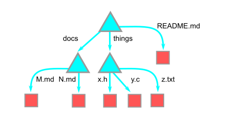
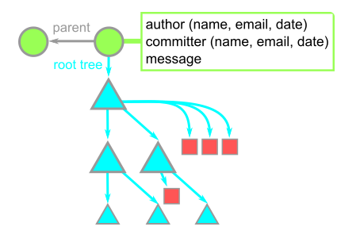

本文的大部分内容来自于 [Pro Git](https://git-scm.com/book/en/v2) 这本书。

## Objects

git 中最基础的元素是 object，每个 object 由一个 object ID (OID) 唯一标识，OID 是一个 160 bits （用 hex 字符串表示为四十个字符） 的 SHA-1 哈希。具体而言，git 中主要存在三种 objects：

- `blobs`: 存储文件内容，OID 即为文件内容的哈希

- `trees`: 一个文件名（path entries）的有序列表，OID 为这个列表的哈希。子目录同样是 trees。项目的根目录即为 root tree。所有的 trees 构成了一棵 Merkle tree，~~所以 git 就是区块链（即答~~。下图中三角代表 trees，方块为 blobs

  

- `commits`: 一个**快照**（snapshot），每个 commit 包含了一个到根 tree 的引用，和一个（或多个）到 parent 的引用。parent 就是上一个 commit 的 OID。在一个 merge commit 中会包含多个 parents。下图中圆形代表 commits

  

objects 的特性决定了它们是不可变的，一旦修改了某个 object 中的内容，哈希将会改变，因而会生成一个新的 object.

可以使用 `git cat-file -t`  来检查一个 object 的类型，用 `git cat-file -p` 来打印其内容，以本博客的 git 仓库为例：

```bash
$ git log
...
commit 10142e0fb1f636288c7f5a6a164e67c1efc13ef4
Author: Harold Cheng <niuchangcun@gmail.com>
Date:   Tue Sep 5 17:30:57 2023 +0800

    The Google File System
...
$ git cat-file -t 10142e0fb1f636288c7f5a6a164e67c1efc13ef4
commit
$ git cat-file -p 10142e0fb1f636288c7f5a6a164e67c1efc13ef4
tree f1f161d92d0c7341ed35e76a66855383334005ab
parent 0e72a3f169a8bbc80904ab7750d3c37853a31dc7
author Harold Cheng <niuchangcun@gmail.com> 1693906257 +0800
committer Harold Cheng <niuchangcun@gmail.com> 1693906257 +0800
gpgsig -----BEGIN PGP SIGNATURE-----
 <omitted>
 -----END PGP SIGNATURE-----

The Google File System
$ git cat-file -p f1f161d92d0c7341ed35e76a66855383334005ab
040000 tree 9a76f18c0bca57de0ecf8b9bf15e0e9b7adf5621    .github
100644 blob 1fc4aa8f76027dd0fb8f9b533810770236d5c234    .gitignore
100644 blob 0b47f42f9ec57c58c474dc1f335e14163dd7a549    .gitmodules
040000 tree f5b1aa13654d360771df3da98296ac958d537d88    archetypes
100644 blob 8c082a36fd3b90a9e77ec19b17deceb47665e4c7    config.toml
040000 tree 81200165da89a43766f03762e4a8d8443357f1ed    content
040000 tree 336e0cfa73193fc3f76ba2b2de182e82b010f599    themes
```

这些 objects 都被存在项目的 `.git/objects` 目录下，由 SHA-1 的前两个字符作为子目录的文件名，后 38 个字符为 object 的文件名。这些 objects 使用 zlib 压缩，根据 [stackoverflow 上的魔法](https://unix.stackexchange.com/questions/22834/how-to-uncompress-zlib-data-in-unix)，可以用 gzip 来解压这些文件：

```bash
$ ll .git/objects/10/142e0fb1f636288c7f5a6a164e67c1efc13ef4 
-r--r--r-- 1 cjc cjc 833 Sep  5 17:30 .git/objects/10/142e0fb1f636288c7f5a6a164e67c1efc13ef4
$ printf "\x1f\x8b\x08\x00\x00\x00\x00\x00" | cat - .git/objects/10/142e0fb1f636288c7f5a6a164e67c1efc13ef4 | gzip -dc
commit 1098tree f1f161d92d0c7341ed35e76a66855383334005ab
parent 0e72a3f169a8bbc80904ab7750d3c37853a31dc7
author Harold Cheng <niuchangcun@gmail.com> 1693906257 +0800
committer Harold Cheng <niuchangcun@gmail.com> 1693906257 +0800
gpgsig -----BEGIN PGP SIGNATURE-----
<omitted>
 -----END PGP SIGNATURE-----

The Google File System

gzip: stdin: unexpected end of file
$ printf "\x1f\x8b\x08\x00\x00\x00\x00\x00" | cat - .git/objects/10/142e0fb1f636288c7f5a6a164e67c1efc13ef4 | gzip -dc > test.txt

gzip: stdin: unexpected end of file
$ sha1sum test.txt 
10142e0fb1f636288c7f5a6a164e67c1efc13ef4  test.txt
```

SHA-1 与 commit 的 OID 一致。

## References

objects 虽然简洁明了，但是它的名字太不好记了。所以 git 引入了 references (或 refs) 作为对某个 object 的引用，它们被存储在 `.git/refs` 中，这就是分支。我们可以通过 `git update-ref refs/heads/xxxx hash` 来更新/新建一个 ref，`git branch` 命令基本等同于使用 `update-ref` 创建一个指向当前分支最后一个 commit 的 ref。

git 通过一个特殊的 HEAD 文件来获得当前分支最后一个 commit 的信息，通常情况下 HEAD 是对某个 ref 的引用：

```bash
$ cat .git/HEAD
ref: refs/heads/source_hugo
```

但是当我们 checkout 一个 tag/commit/远程分支时，我们就会进入到所谓的 "detached HEAD" 状态：

```bash
$ git checkout f25ea89160baa34af6587ebc4399cba9b82152ab
Note: switching to 'f25ea89160baa34af6587ebc4399cba9b82152ab'.

You are in 'detached HEAD' state. You can look around, make experimental
changes and commit them, and you can discard any commits you make in this
state without impacting any branches by switching back to a branch.

If you want to create a new branch to retain commits you create, you may
do so (now or later) by using -c with the switch command. Example:

  git switch -c <new-branch-name>

Or undo this operation with:

  git switch -

Turn off this advice by setting config variable advice.detachedHead to false

HEAD is now at f25ea8916 fix: Add CHANGELOG link
```

在这种状态作出的 commits 将成为 dangleing commits，因为没有 refs 能够间接引用到它们。我们可以在 `git reflog` 中看到它们，但它们在一段时间后可能会被 git 垃圾回收掉。如果因为误操作“丢失”了一些 commit，大部分情况下只是没有 ref 能够间接引用它们了，所以我们能在 reflog 中找到并恢复它们。

除了分支之外，另一种 ref 是 tag。tag 被存储在 `.git/refs/tags` 中，和 branch 不同的是，tag 是不可变的。git 中有两种类型的 tag：

- lightweight tag: 使用 `git tag` 创建，其 ref 直接指向一个 commit

- annotated tag: 使用 `git tag -a` 创建，需要像 commit 一样写一段 tag message，其 ref 指向 git 中的第四种 object 类型，tag。

  ```bash
  $ git tag -a v1.2.3
  $ cat .git/refs/tags/v1.2.3 
  295e429586c0dc7764077b7ec3b15402b9299532
  $ git cat-file -t 295e429586c0dc7764077b7ec3b15402b9299532
  tag
  $ git cat-file -p 295e429586c0dc7764077b7ec3b15402b9299532
  object 0996cddadea886287fd606b4102304814eb3785c
  type commit
  tag v1.2.3
  tagger Harold Cheng <niuchangcun@gmail.com> 1695018502 +0800
  
  xxxxx
  $ # object 字段就是对 commit 的引用
  $ git cat-file -t 0996cddadea886287fd606b4102304814eb3785c
  commit
  ```

  但是 tag 并不是必须指向一个 commit，tag 任何 object 都是可以的。

  ```bash
  $ git tag -a tree-tag 9ff1e32671b9ac918dd665020c8da93c44787e33
  $ cat .git/refs/tags/tree-tag 
  3b94c91c60f92b16336050aa445c7a293e61ec2e
  $ git cat-file -p 3b94c91c60f92b16336050aa445c7a293e61ec2e
  object 9ff1e32671b9ac918dd665020c8da93c44787e33
  type tree
  tag tree-tag
  tagger Harold Cheng <niuchangcun@gmail.com> 1695018786 +0800
  
  a tag for tree
  ```

## Merge and Rebase

最简单的 merge 类型是 fast-forward，git 简单地移动 ref 来完成 merge。另一种常见的 merge 如图所示：


我们想要在 master 分支上执行 `git merge iss53`，git 会找到三个 commits，C5、C4 和它们的共同祖先 C2，然后执行[三方合并](https://stackoverflow.com/questions/4129049/why-is-a-3-way-merge-advantageous-over-a-2-way-merge) (three-way merge)，high-level 地看，git 需要把每个 commit 的 tree 划分成一个一个 chunk，chunk 可以是文件，或文件的一块，或行，这由具体的 merge 策略决定。git 会比较这些 chunks，对于某一个 chunk：

- 如果在 C2、C4、C5 中都相等，则不作更改
- 如果 C2、C4 相等，但和 C5 不等，取 C5 的版本，反之同理
- 如果 C4、C5 相等，和 C2 不等，那么两个分支作了同样的更改，取任何一个版本
- 如果三者都不相等，则发生 merge 冲突，需要手动处理

如果我们不寻找 C2，只比较 C4、C5，这就是所谓的 two-way merge，由于失去了祖先的信息，我们无法处理第二种情况。实际进行 merge 时，我们可能会看到如下信息：

```bash
$ git merge b1
Auto-merging 1.txt
Merge made by the 'ort' strategy.
 1.txt | 1 +
 1 file changed, 1 insertion(+)
```

这个过程中，git 会创建一棵新 tree，把两个分支作为 parent 创建一个新的 commit，这就是 merge commit。

rabase 则是完全不同的方式。如果 cherry-pick 一个 commit：

```bash
$ git cherry-pick 2f6c412
[master 2aa02d0] 2
 Date: Tue Sep 19 16:32:32 2023 +0800
 1 file changed, 1 insertion(+)
```

本质上是 diff 2f6c412 和 2f6c412 的 parent，然后在当前分支重新应用这个 diff。rebase 本质上是自动的 cherry-pick。


在 experiment 分支执行 `git rebase master` 则会找到 experiment 和 master 的共同祖先 C2，然后发现 experiment 分支有一个新的 commit C4，git 会在 master 重做这个 commit。

## 一个 fsck 导致的问题

某日我在检查软件更新时，发现 KeePassDX f-droid 版没有随着上游更新，进而发现了[这个 issue](https://github.com/Kunzisoft/KeePassDX/issues/1333)，问题的原因是 KeePassDX 的仓库中有几个 tree object 不合法，运行 `git fsck` 会报错 `error in tree b7a0b493966f9077f6fcd7de37244699bb73615e: duplicateEntries: contains duplicate file entries`。

git 不允许一个 tree 中含有两个相同的文件名，但是不知为何这个错误发生了（包含这个 tree 的 commit 可以追溯到 2009 年，可能是由于 Windows 不区分文件名大小写且在上古时期 git 处理这个的逻辑有问题）。而 f-droid 在几个月前启用了 git clone 时的 fsck 检查（`transfer.fsckObjects` 等配置），导致 build 时 clone 仓库失败。顺便一提 Github push 现在也有 git fsck 检查，所以把这个仓库往另一个仓库 push 也会失败。

fsck 失败的问题在多个仓库出现过，包括[highlight.js](https://github.com/highlightjs/highlight.js/issues/1733), [Behat](https://github.com/Behat/Behat), [requests](https://github.com/psf/requests/issues/2690)，无一例外都能追溯到某些上古 commit，目前看来除了重写所有 commits 并没有什么办法来修复这些错误。我尝试了 [replace 的魔法](https://stackoverflow.com/questions/10931954/git-tree-contains-duplicate-file-entries)发现并不能够使其通过 git fsck（毕竟出错的 tree 还在）。

回到 KeePassDX 的问题只能让 f-droid 在 clone 的时候做一些 workaround 来绕过了...
