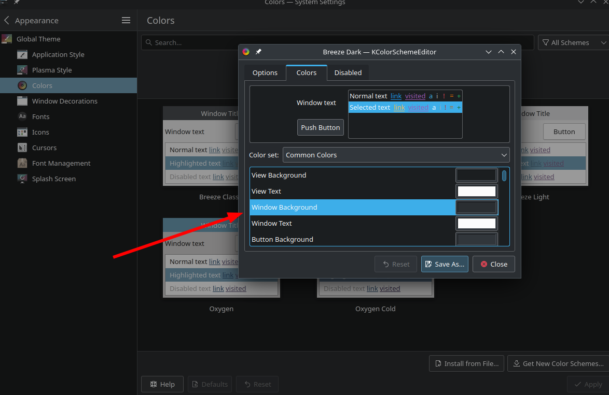
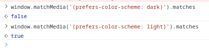

## 问题

从前两年开始深色模式大行其道，以至于现在几乎找不到一个不支持深色模式的网站了。各大主流浏览器几乎都在两三年前就支持了 CSS 的 `prefers-color-scheme` 媒体查询，从而根据系统/浏览器的主题来自动切换浅/深色模式。在浏览器控制台中使用 `window.matchMedia('(prefers-color-scheme: dark)').matches` 即可测试这一 feature。

我在系统中（KDE, Archlinux）使用深色模式，但我又并不喜欢大多数网站的深色模式，但是许多网站都使用了上述媒体查询来自动切换，导致很多情况下我进入一个网站后第一件事就是把浅色模式给切回来。在 Firefox/Edge 中浏览器设置便提供了深/浅色主题的切换选项，这一选项也是和上述媒体查询绑定的，然而不幸的是，chromium 并没有提供这一选项。

## 尝试

根据[这个问题](https://superuser.com/questions/1430098/force-light-mode-in-google-chrome)，我尝试安装了一个浅色主题，或者把 theme color 改成浅色，都没有作用。

那 flags 呢？`#enable-force-dark` 提供了强制开启深色模式的选项，但是我在 `chrome://flags` 中将其设置为 disabled 之后，并没有发生什么。[Issue 1046660: Allow users to force web content light/dark mode independent of system setting](https://bugs.chromium.org/p/chromium/issues/detail?id=1046660) 中同样提到设置 `#enable-force-dark` 为 disabled 将会被忽略。这个 Issue 应该是最贴近我的需求的一个 issue，然而目前还是 open 状态，距离实现遥遥无期。

另有一个 command line options `--disable-features=WebUIDarkMode`，然而遗憾的是这个 option 仅针对 chromium UI, 对 web page 没有作用。

就在不久之前，chromium 还不支持随系统的深色模式来切换自己的深色模式（见 [Issue 998903: XDG Desktop Portal "Prefer dark appearance" does not affect prefers-color-scheme media query](https://bugs.chromium.org/p/chromium/issues/detail?id=998903)），这一 feature 是在四月份实现的，并在 114 中发布。从相应的 [revision](https://chromium-review.googlesource.com/c/chromium/src/+/4375982) 中，我们可以发现 chromium 首先会通过 dbus 和 xdg-desktop-portal 交互，读取 `org.freedesktop.appearance` namespace 下的 `color-scheme` 字段。根据 [portal 的定义](https://flatpak.github.io/xdg-desktop-portal/#gdbus-org.freedesktop.portal.Settings) 返回值是 1 则偏好深色外观，返回值是 2 则偏好浅色外观。并且这一 revision 中说：

> ```
> * The portal preference takes precedence over the toolkit preference
> ```

我并没有找到这里的 toolkit 指的是什么，但我猜测是 chromium 自身的主题。这可能就是主题设置无效的原因。KDE 的 portal 由 xdg-desktop-portal-kde 这个包实现，[搜索源码发现](https://invent.kde.org/plasma/xdg-desktop-portal-kde/-/blob/863d369156c85c67f96a23d87564f196532372ce/src/settings.cpp#L216)它只是简单的判断了窗口背景颜色的灰度：

```c++
const int windowBackgroundGray = qGray(palette.window().color().rgb());

uint result = 0; // no preference

if (windowBackgroundGray < 192) {
    result = 1; // prefer dark
} else {
    result = 2; // prefer light
}
```

就感觉很随意... 所以我在 KDE 设置中更改 Colors 选项中主题的 Window Background 到一个比较浅的背景，就能更改 portal 中的这个值了，试了一下确实是有效的，但是我的其他应用也会变成浅色背景了，这显然不是我想要的。



我想到了以下几种办法：

- hook dbus 请求，给 chromium 返回另一个值，Google 了下没找到什么方法
- 让 chromium 的 dbus 请求失败，这样它就会 fallback 到自身的主题设置，同样我并没有找到针对特定应用禁用 dbus 的方法
- patch chromium 源码，这应该是最简单的（显然正确的做法并不简单，只是 hack 的做法简单）
- 写一个油猴脚本，在每个网站加载时修改 `prefers-color-scheme` 这个媒体查询的返回值，但我没有找到能够在 JS 中修改媒体查询的办法

最可行的看起来是第三条路了。代价就是长达四个小时的编译时间，以及每次 chromium 更新后都需要重新编译。

## 如何 patch

如果只是改一个版本的话，直接修改源文件后使用 `makepkg -e` 在不重新解压源码的情况下 rebuild 即可。但是版本更新后源码会重新下载，所以还是需要一个 patch 的。我遵循了[这个 ArchWiki](https://wiki.archlinux.org/title/Patching_packages) 来创建一个 patch，但是把源码复制一份实在是太大了，所以我使用 `cp --parent` 单独复制了一个文件，然后再 diff：

```patch
--- chromium-114.0.5735.45/chrome/browser/ui/views/dark_mode_manager_linux.cc   2023-05-25 08:41:45.780152800 +0800
+++ new/chrome/browser/ui/views/dark_mode_manager_linux.cc      2023-05-31 12:40:12.308506988 +0800
@@ -25,7 +25,7 @@
 constexpr char kReadMethod[] = "Read";
 constexpr char kSettingsNamespace[] = "org.freedesktop.appearance";
 constexpr char kColorSchemeKey[] = "color-scheme";
-constexpr int kFreedesktopColorSchemeDark = 1;
+constexpr int kFreedesktopColorSchemeDark = 2;
 
 scoped_refptr<dbus::Bus> CreateBus() {
   dbus::Bus::Options options;

```

这里改动的是 chromium 从 xdg-desktop-portal 获取到 `color-scheme` 之后，判断是否为深色模式的常量，这一改动即可反转 chromium 对于浅/深色模式的判断。

patch 中第一个文件夹的名字，也就是 `chromium-114.0.5735.45` 和 `new` 并不重要，因为在 PKGBUILD 中我们会使用 `-p1` 来忽略第一个文件夹：

> **-p**num  or  **--strip=**num 
>       Strip the smallest prefix containing num leading slashes from each file name found in the patch file. 

然后就是编译了，在等待了四个小时之后我终于成功切换回了浅色模式！



最后还是希望 [Issue 1046660](https://bugs.chromium.org/p/chromium/issues/detail?id=1046660) 能够被尽快解决，让我能够在设置中直接切换浅/暗色模式。
