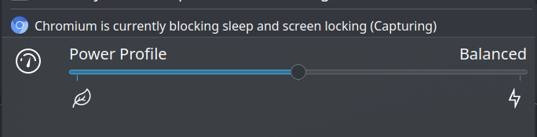

## 问题

我的桌面环境为 KDE/X11，我在 KDE 的 Power Management 设置中设置了 `Screen Energy Saving: Switch off after 5 min`，这个选项时不时地出问题，表现为刚开机时能够正常工作，在闲置五分钟后关闭显示器，但在一段时间过后就不行了，这个一段时间可长可短。重启电脑又能重新工作，而锁屏后也能够正常工作。这个问题从我用 KDE 开始就一直困扰着我，时至今日。

## 排查

KDE 的电源管理由 powerdevil 控制，其作为 `plasma-powerdevil.service` 用户服务运行，查询日志发现有一些神秘的 `org_kde_powerdevil[1310]: QObject::disconnect: Unexpected nullptr parameter` 报错，之后证实该报错与本问题无关。

查看该 `.service` 文件发现其使用 `Type=dbus` 的启动类型，并且获得了一个叫 `org.kde.Solid.PowerManagement` 的 bus name。用 QBBusViewer 可以看到 powerdevil 还提供了 `org.freedesktop.PowerManagement` 这一服务。

查阅 powerdevil 源码以 `Switch off after` 为关键词进行搜索可发现相关逻辑位于 `daemon/actions/bundled/dpms.cpp` 文件下，根据名字猜测 dpms 即 Display Power Management Signaling 的缩写。简单看了一下 dpms，这是一个古老的协议，在 1993 年发布，定义了四种模式，但 [archwiki 上](https://wiki.archlinux.org/title/Display_Power_Management_Signaling)指出：

> Note that DPMS was developed for CRT monitors, and on LCD displays, there is normally no difference between the standby, suspend and off modes.

顺便插一句，流传甚广的关闭显示器的命令 `xset dpms force off` 即强制 dpms 进入 off 模式。

在 [dpms.cpp#L108](https://invent.kde.org/plasma/powerdevil/-/blob/master/daemon/actions/bundled/dpms.cpp#L108) 发现在一定条件下空闲超时关闭显示器的函数会直接返回，猜测这个 inhibit 的条件是由上述的两个 dbus 服务来控制的。

尝试调用上述 dbus 服务：

```bash
$ qdbus --literal org.kde.Solid.PowerManagement /org/kde/Solid/PowerManagement/PolicyAgent org.kde.Solid.PowerManagement.PolicyAgent.ListInhibitions 
[Argument: a(ss) {[Argument: (ss) "/usr/lib/chromium/chromium", "Capturing"], [Argument: (ss) "/usr/lib/chromium/chromium", "Capturing"]}]
$ qdbus --literal org.kde.Solid.PowerManagement /org/freedesktop/PowerManagement org.freedesktop.PowerManagement.Inhibit.HasInhibit
true
```

发现疑似是 chromium 在 Inhibit，结合阻止理由，很容易想到是我用的[音量插件](https://chrome.google.com/webstore/detail/imhcgcnjkibjikdbdgnhclihigkooeaf)导致的，其原理就是 Capture 当前页面而获得一个相关的音频 API。在关闭了相应标签页之后问题解决。

## 疑问

- `org.freedesktop.PowerManagement` API 似乎并没有成为标准，虽然似乎主流的桌面环境都实现了。用 Google 搜索只能搜索到[这个页面](https://www.freedesktop.org/wiki/Specifications/power-management-spec/)，提示：

  > This spec is considered obsolete.

  并且页面中 `The Spec` 下的链接全都 404 了，另有一个相关的 dbus API `org.freedesktop.ScreenSaver`，不知道他们之间的关系是什么。

- 通常在任务栏的 Power Management 选项卡下会提示哪个应用程序在阻止锁屏，如图所示：

  

  但是这个提示有时候会不工作...

## Workaround

根据上述描述，这根本不是 bug 而是 feature，但我又时常会使用 chromium 的音量插件，有没有办法绕过呢？

我尝试手动设置 `xset dpms 20 20 20` 并禁用 `plasma-powerdevil.service`, 发现在 chromium 没有进行 capture 时 20s 后显示器关闭，而进行 capture 时则不行，怀疑 chromium 除了 `org.freedesktop.PowerManagement` dbus API 之外还有其他手段来控制电源管理。

目前就先不管这个问题了...