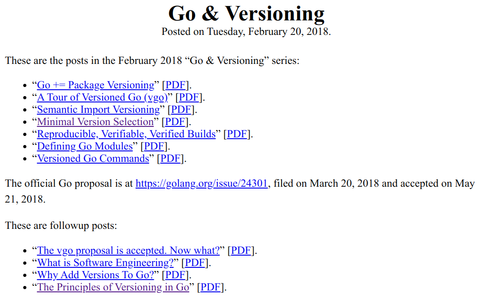
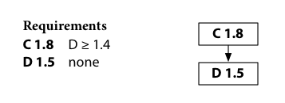
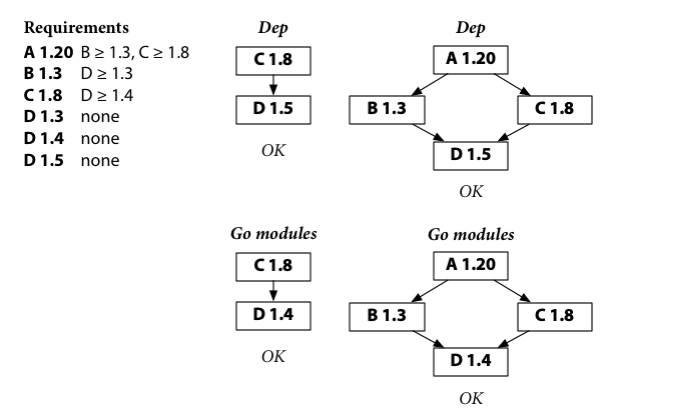
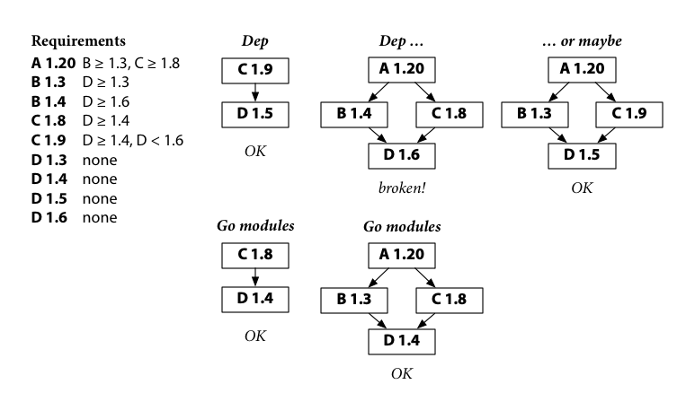

在我初学 Go 的时候，曾被网上的过时教程和各种对 `$GOPATH` 的操作搞得云里雾里，而现在我们已经基本用不到 `$GOPATH` 了，因为在 2023 年， Go Modules 已经一统天下了。但是在这之前，是群魔乱舞的时代，对这段历史感兴趣的同学可以参考[这篇博客](https://blog.wolfogre.com/posts/golang-package-history/)。

顺便提一下，GOPATH 时代包没有“版本”的概念，这可能是因为 Google 内部采用 monorepo 的方式（即所有代码都放在一个仓库中）管理代码，所有人都基于 HEAD 来 build，所以当有人的改动 break 了其他人的代码时，很容易在 build 时反映出来。Go 作者之一 Rob Pike 的文章 [What We Got Right, What We Got Wrong](https://commandcenter.blogspot.com/2024/01/what-we-got-right-what-we-got-wrong.html) 中提到了这一点。 

Go 包管理的转折来源于 2018 年 2 月 Go 作者之一 Russ Cox 在其博客上连发数篇文章进行了 Go Modules 的设计：



并最终在 Go 1.11 (2018/8) 中发布。

按照 [GOPATH wiki](https://go.dev/wiki/GOPATH) 所述，从 Go 1.16 (2021/2) 开始，`GO111MODULE=on` 变量被默认设置，除非显式修改该变量，否则 Go Modules 会默认启用。当使用 Go Modules 时，`GOPATH` 将不再用于解析导入路径。但它仍然被用于存储下载的包（`$GOPATH/pkg/mod`）和二进制命令（`$GOPATH/bin`）。比如 Go 的 language server `gopls` 通常会被安装到 `$GOPATH/bin` 下，所以这个目录通常会加入到 `$PATH` 中。

以下内容皆以 Go Modules 启用为前提。

## 组织代码

Go 程序被组织成包（packages）。一个包是一组在**同一文件夹**下的源代码文件的集合。在同一文件中定义的函数、类型、变量、常量在同一个包的所有其他文件中可见。

一个文件夹下无法拥有多个包。编译器会报错 `found packages a (a.go) and b (b.go) in xxx`。

一个仓库（repository，这里指 VCS，如 git 的仓库）包含一个或多个模块（modules）。一个**模块**是一组相关的、一起发布的**包**的集合。一个 Go 仓库通常只有一个模块，位于仓库的根目录。一个名为 `go.mod` 的文件声明了*模块路径*：模块中所有包的导入路径（import path）前缀。包含 `go.mod` 文件的目录是模块的根目录，这个模块包含了根目录及其所有子目录下的包，直到另一个包含 `go.mod` 文件的目录为止（如果有的话）。举个例子，下面的目录中根目录是一个模块，而 `pkg/api` 目录是另一个。

```
├── go.mod
├── pkg
│   ├── api
│   |  └── go.mod
|   └── other_pkg
```

每个模块的路径不仅用于其包的导入路径前缀，也指示了 `go` 命令应该到哪里去下载它。举例来说，为了下载 `golang.org/x/tools` 模块，`go` 命令会去 `https://golang.org/x/tools` 寻找仓库。

如果只是在本地测试，模块路径可以随便起，比如 `example.com/what` 这种。当然如果你未来想要发布它，那就得遵循 Go 的规则，比如 `github.com/your-username/your-repo-name`。

*导入路径*是一个用于导入一个包的字符串。一个包的导入路径是模块路径加上它在模块中的子目录。标准库中的包没有模块路径前缀。例如，模块 `github.com/google/go-cmp` 在路径 `cmp/` 下包含了一个包，这个包的导入路径为 `github.com/google/go-cmp/cmp`。这个规则也适用于项目本身的包，如果 `go-cmp` 项目在 `foo/` 路径下的代码同样也导入了上述包，导入路径同样为 `github.com/google/go-cmp/cmp`。

通俗理解一下，导入路径就是文件夹路径。当一个包导入之后，我们就可以用包名来引用它了。一般而言，包名就是文件夹名，但这只是惯例，而非规定，如果确有需要可以不一致。所以下面的写法是合法的：

```go
import "example.com/xxx/pkga" // actually it's package name is pkgb

func main() {
    pkgb.Func()
}
```

Go 项目的 layout 可以参考[这里](https://github.com/golang-standards/project-layout)，简而言之：

- `/cmd` 程序的入口放在这里，每个二进制文件一个包，包名为 `main`

- 所有在 `internal/` 文件夹下的包只能被它的子包或者兄弟包引用。比如 `.../a/b/c/internal/d/e/f` 这个包能够被 `.../a/b/c` 路径下的包导入，而无法被 `.../a/b/g` 路径下的包导入

  在项目根目录下的 `/internel` 文件夹就意味着它们只能被项目本身引用

- `/pkg` 库的代码，并且允许其他项目使用的，放在这里

一个典型的项目结构如下：

```bash
├── cmd
│   └── bc_node
│       └── main.go
├── docs
│   └── designs.md
├── go.mod
├── go.sum
├── pkg
│   └── block
│       └── block.go
├── internal
│   ├── block
│   │   ├── block.go
│   ├── db
│   │   └── db.go
│   └── network
│       ├── rpc_client
│       │   └── rpc_client.go
│       ├── rpc_server
│       │   └── rpc_server.go
│       ├── rpc_test.go
│       └── state.go
├── Makefile
└── README.md
```

## 包管理

Go 模块的版本采用[语义化版本](https://semver.org/)（semantic versioning, semver），想必大家都很熟悉了。

大版本的更新会导致导入路径的变化，v0/v1 版本的模块名没有版本后缀，如 `github.com/xx/xxxx`。从 v2 开始需要版本后缀，如 `github.com/xx/xxxx/v2`，这个后缀需要在 `go.mod` 中声明。如果一个模块发布了 v2，但是没有在 `go.mod` 中加入 `/v2` 的后缀，其他包将无法 import v2 版本：

```bash
$ go get -u github.com/cjc7373/go-module-test/c@v2.0.0
go: github.com/cjc7373/go-module-test/c@v2.0.0: invalid version: module contains a go.mod file, so module path must match major version ("github.com/cjc7373/go-module-test/c/v2")
```

如果一个模块没有使用 Go Modules（即没有 `go.mod` 文件），并且发布了一个 v2 及以上的版本，那么它作为一个依赖被引入时，我们会看到 `github.com/xx/xxxx v4.1.0+incompatible` 这样的版本号。

模块的发布依赖于 VCS 的 tagging 功能。发布一个包就是打一个 tag。如果一个仓库有多个模块，则需要在 tagging 中加上模块路径的前缀，如果仓库位于 `example.com/mymodules/`，模块路径为 `example.com/mymodules/module1`，则打的 tag 应该为 `module1/v1.2.3` 这种形式。（这里猜测模块路径是和文件夹路径对应的，但我没有实验过）

## `go.mod`

`go.mod` 文件中，除了最常用的 `require` 指令之外，还能够包括其他一些指令，例如：

- `exclude`，用于阻止一个模块版本被载入。这一指令仅对当前的 main 模块生效（也就是说，如果一个依赖的 `go.mod` 文件中包含了 `exclude` 指令，该指令将不会生效）。

- `replace`，用于替换一个模块指定版本（或是所有版本）的内容，替换的路径可以是模块的另一个版本，另一个模块，或是一个相对路径。例如：

  ```go.mod
  replace (
      golang.org/x/net v1.2.3 => example.com/fork/net v1.4.5
      golang.org/x/net => example.com/fork/net v1.4.5
      golang.org/x/net => ./fork/net
  )
  ```

  这一指令同样仅对当前的 main 模块生效。

详细的文档可见[这里](https://go.dev/ref/mod#go-mod-file)。

## 设计原则

所有的包管理都是为了解决依赖地狱问题（[Dependency hell](https://en.wikipedia.org/wiki/Dependency_hell)），即一些包拥有同样的共享的包，但它们依赖与这些包的不同的、互不兼容的版本。

Russ Cox 在[他的博客](https://research.swtch.com/vgo-principles)中回顾了 Go Modules 的设计原则。总结一下就是：

- 导入兼容性原则：如果旧包和新包的导入路径相同，则新包必须兼容旧包。
- 最小版本选择（Minimal Version Selection, MVS）原则：使用满足需求的最旧版本，而不是最新版本。

为什么要这么设计呢？

### 兼容性

Go 非常重视向后兼容。

>遵循 Go 1 规范编写的软件应该能够在规范的生命周期之内继续正确地编译和运行，并无需更改。在现在能够工作 Go 程序应该能够在未来的 Go 1 版本中继续工作。
>
>— [*golang.org/doc/go1compat*](https://golang.org/doc/go1compat)

Go 的[一篇博客](https://go.dev/blog/publishing-go-modules)中有一个例子，标准库中的 `strings` 包有两个函数：

- `Split` 把一个字符串分割成由参数中的分隔符分割的一些子串
- `SplitN` 能够控制分割的子串的数量

但是又存在 `Replace` 函数来替换字符串中的某个子串 n 次，`ReplaceAll` 函数来替换所有出现的子串。我们肯定觉得，为什么不使用 `Split` 的命名规则，把它们命名成 `Replace` 和 `ReplaceN` 呢？但是为了向后兼容，Go 没有这么做。

所以 Go Modules 选择了 semver。semver 保证了只有 major version 的变化才会有 breaking changes，在此情况下，模块的导入路径会发生变化（即带上大版本后缀）。否则，新版本的模块必须向后兼容旧版本。

这么做的另一个好处是大型项目可以逐渐更新一个依赖，因为上述做法允许了一个模块的两个大版本同时存在。

### 可重复性

最小版本选择原则是为了可重复性。从依赖的约束中得到依赖的具体版本被称为依赖解析（Dependency Resolution）。对于其他的包管理器（如 pip, cargo, npm）来说，一般都会选择满足约束的最新版本，并且有一个 lock 文件来保证构建的可重复性。即第一次构建（依赖解析时）会生成 lock 文件，之后的构建都会从 lock 文件里取得和第一次一样的依赖版本。然而，lock 文件只对当前项目生效。现在假设如下情况：



C 1.8 指定了 D >= 1.4 的约束，并且在 lock file 中选择了 D 1.5 作为依赖。现在 A 指定了 C 1.8 作为依赖，A 在构建时会重新进行依赖解析，假设这时 D 1.5 是最新的，那么 A 就会选择 D 1.5 作为依赖。过了几个月之后，D 发布了 1.6，它 break 了 C 1.8，这时候 C 因为有 lock file 仍然能正常构建。但是如果另一个项目 B 新依赖了 C 1.8，那么依赖解析时就会选择到 D 1.6，这就 break 了 B。依赖解析到的版本和时间有关，破坏了可重复性。 

版本选择问题是一个 NP 完全问题，本质上在解决一个可满足性问题。对于给定约束，可能存在多个结果，依赖解析中选择哪一种结果是不确定的。考虑如下情况：



图中以 Dep 和 Go Modules 为例说明了依赖解析的过程，这里虽然两者选择的 D 版本不同，但都能够成功构建。现在假设 D 发布了有 bug 的 1.6 版本，break 了 C 1.8。C 的开发者为了绕过 bug 添加了 D < 1.6 的约束，并发布了 1.9 版本。这时让 Dep 重新进行依赖解析：



会产生不止一种满足约束的结果。此时 Dep 首先会尝试使用最新的 B 1.4 和 C 1.9，但是这并不能满足约束。如果 Dep 接着尝试使用下一个 B 版本 1.3（右图），那么会解析到 D 1.5，构建成功；如果 Dep 尝试用下一个 C 版本 1.8（左图），那么会解析到 D 1.6，构建失败。Dep 选择哪种结果完全取决于它的内部实现，并不确定。而 Go Modules 则具备可重复性。

MVS 的设计使得 go 的依赖解析是确定性的，所以 go 并不需要一个 lock 文件。`go.sum` 仅仅起了存储校验信息的作用，并不起 lock 文件的作用。

## // indirect

等一下，按照上面对于 MVS 的理解，我们只需要记录当前模块的所有直接依赖，但是为什么在 `go.mod` 文件中还能看见大量的 `require example.com/foo // indirect` 的语句呢？这里 indirect 指的就是模块的间接依赖。答案是在 1.16 之前，除非需要一个和 MVS 解析到的版本不同的版本，才需要给间接依赖加上 `require` 指令。但是在 1.17 及之后，需要它来提供一些额外信息。

这便是[懒模块加载](https://go.googlesource.com/proposal/+/master/design/36460-lazy-module-loading.md)，

## 尾巴

在下一篇博客中，我们会讨论模块镜像（Proxy）、校验数据库和工作区。

## See also

- [How to Write Go Code](https://go.dev/doc/code) 是 Go 代码组织的简明指南
- [Managing module source](https://go.dev/doc/modules/managing-source) 中说明了一个仓库中管理多个模块的方式
- [What does 'incompatible' in go.mod mean, will it cause harm?](https://stackoverflow.com/questions/57355929/what-does-incompatible-in-go-mod-mean-will-it-cause-harm) 虽然问的是 incompatible 的含义，但是最高赞答案实际解释了 Go Modules 的大部分概念
