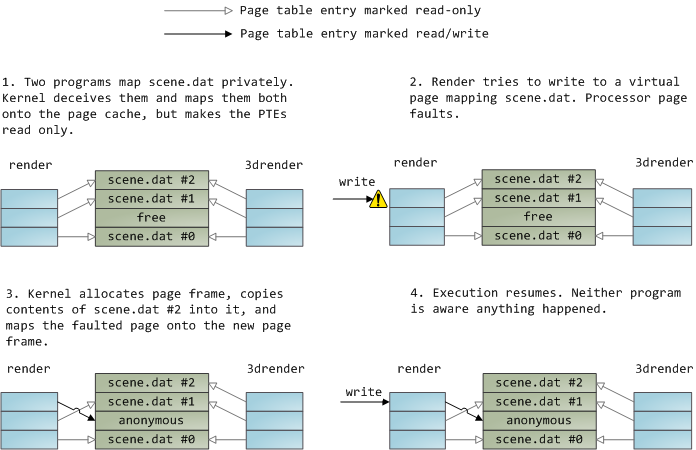

本文试图解释两个简单的问题：`free` 命令中的 used/free/available 等字段究竟代表了什么？而 `ps` 命令中的 VSZ/RSS 又代表了什么？

```bash
$ free -h
               total        used        free      shared  buff/cache   available
Mem:            38Gi        15Gi       834Mi       3.3Gi        25Gi        22Gi
Swap:           19Gi       5.3Gi        14Gi

$ ps aux --sort=-rss | head -5
USER         PID %CPU %MEM    VSZ   RSS TTY      STAT START   TIME COMMAND
cjc         3354  2.3  4.6 97222056 1917888 ?    Ssl  Oct07  37:42 /usr/bin/qbittorrent
cjc       354324  1.3  2.7 2772076 1137784 ?     Ssl  12:05   1:59 /usr/bin/telegram-desktop
cjc         2806  6.6  2.3 4141220 941484 ?      Sl   Oct07 109:17 /usr/bin/kwin_wayland ...
cjc         3390  1.5  1.9 3994932 792364 ?      Sl   Oct07  26:10 /usr/lib/zotero/zotero-bin ...
```

本文假定读者具有虚拟内存的基础知识，文中的代码将以 C 语言为例。

## 从虚拟内存开始说起

我们先来复习一下虚拟内存地址转换的流程。


（图源：CSAPP)

当程序访问一个虚拟地址时，在汇编层面体现为一条读指令（`mov` 之类的），由 CPU 中的 MMU 处理地址转换。MMU（Memory Management Unit）首先根据页表基址寄存器（Page Table Base Register, PTBR）的地址加上虚拟地址的页面偏移（也就是虚拟地址的前 x 位）找到页表条目（Page Table Entry, PTE）的地址（这里省略了 TLB 的部分），这个地址当然是物理地址。PTE 中存储了这一页的物理地址，以及标记该页是否在内存中的有效位。如果该页存在内存，那么 CPU 直接访问内存进行读取。如果不存在，则进入缺页异常（page fault）程序，程序由用户态进入内核态。此时程序可能会被阻塞并换出，直到页被读入内存。

这里我们就要问了，为什么一个页会不在内存呢？在 Linux 中，存在两种情况：

- 这一页是匿名内存（anonymous memory），它们通常是程序运行时动态分配的内存（比如 C 中的 `malloc` 函数）。它们没有文件后备，但如果系统中启用了 swap 交换文件，那么它们也能被换出到 swap 中。

- 这一页是 page cache，也就是文件内存（file memory），它们可能是代码（比如 `.text` 段）或缓存的数据（比如通过 mmap 映射的文件，mmap 是个非常重要的系统调用，下面还会提到）。它们是文件后备的（backed by file），所以能够被换出，或者也被称为回收（reclaim）。

  这里其实还能再细分一下，如果这一页是未修改过的（clean），那么可以直接修改页表有效位，不需要其他操作。如果是修改过的页面（dirty），则需要先将变更写入磁盘后才能回收。（为什么会存在脏页？请看下文）

## Page Cache

回到什么是 Page Cache，[Page Cache, the Affair Between Memory and Files](https://web.archive.org/web/20221222014954/https://manybutfinite.com/post/page-cache-the-affair-between-memory-and-files/) 这篇非常精彩的文章讲述了 Page Cache。当操作系统开始处理文件时，会碰到两个问题：

- 读写磁盘相比于读写内存慢了好几个数量级
- 对于一些文件（比如共享库），需要只载入一次，而在多个进程之间共享

而这两个问题都能被 page cache 解决。正如其名，page cache 就是内核存储的按页大小分割的文件。操作系统将文件缓存在内存中，解决了第一个问题。对于能够共享的文件，操作系统在内存中只存储一份副本，解决了第二个问题。常规的文件读写都会通过 page cache 进行。

按照上面的分类，文件内存应该都属于 page cache，匿名内存则不是。但是再想一想，当我们读取一个文件时，需要：

- 使用 `malloc()` 分配一块堆内存作为缓冲区，假设为 4K。这块内存是匿名内存。
- 使用 `open()` 打开一个文件获取文件描述符，使用 `read()` 读取文件到缓冲区。此时内核将读取一个页大小的文件内容存放到 page cache 中，再把 page cache 的内容复制到程序的堆内存上。	

看到问题了吗？一份数据在内存中存了两份！解决这个问题的方式是内存映射文件（Memory-mapped files）。在 Linux 上也就是 `mmap` 系统调用。mmap 的流程如下：

- 使用 `mmap()` 将一个文件映射到虚拟地址空间中的某一段地址，长度为用户给定。
- 直接读取这段地址中的某一个。
- 触发常规访存流程。也就是说，如果这个地址所在的页不在内存中，则触发缺页中断把这个页读进内存。

因为 page cache 的存在，对文件的写入（`write()` 系统调用）不会马上写入到磁盘。内核会把修改写入到 page cache 中，同时把该页标记为脏（dirty），因此文件写入不会阻塞。

由于脏页的存在，Linux 需要处理文件（在内存/磁盘中）的一致性。存在两种实现文件一致性的方法：

- Write Through（直写/写穿）：对文件的写入会直接写到磁盘。这是通过 `fsync`, `fdatasync` 等系统调用实现的。
- Write back（写回）：对文件的写入暂存在内存。系统中存在定期任务（表现形式为内核线程），周期性地同步文件系统中文件脏数据块。这是 Linux 的默认行为。

我们能做个小实验验证这个行为：

```bash
$ cat /proc/meminfo | grep Dirty # 查看当前脏页大小
Dirty:               828 kB
$ dd if=/dev/zero of=testfile.txt bs=1M count=10
10+0 records in
10+0 records out
10485760 bytes (10 MB, 10 MiB) copied, 0.00600495 s, 1.7 GB/s
$ cat /proc/meminfo | grep Dirty # 此时对文件的写入只存在 page cache 中
Dirty:             10596 kB
$ sync # 刷脏
$ cat /proc/meminfo | grep Dirty
Dirty:               364 kB
```

最后，上文提到了“常规”的文件读写是通过 page cache 进行的，通过在 `open()` 时使用 `O_DIRECT` 选项等方法能够绕过 page cache。这就是所谓的 Direct IO，一些数据库会采取这种方法进行 IO，以获取更高的性能。

一个文件映射可以是私有（private）或者共享（shared）的。
- 更新一个共享的文件映射对其他进程可见，同时也会更新到其映射的文件上。
- 更新一个私有的文件映射同理，不对其他进程可见，也不会更新到其映射的文件上。

那如果有两个进程同时映射了一个文件，并且使用了私有映射，这个文件是不是就要在内存中存两份了？当然不会。内核使用了 CoW（copy on write，写时复制）来解决这一问题。


（图源：[Page Cache, the Affair Between Memory and Files](https://web.archive.org/web/20221222014954/https://manybutfinite.com/post/page-cache-the-affair-between-memory-and-files/)）

`render` 和 `render3d` 两个进程私有地 map 了相同的文件，这些页被内核标记成只读（事实上，只读标记并不意味着它们是**只读**的，只是为了区分它们和非 CoW 的页）。`render` 进程随后修改了一部分文件，由于只读标记的存在，程序访存时将触发 page fault，内核将该页复制一份成为匿名页（因为私有的文件映射并不会实际更新到文件中），并修改页表将原先的虚拟地址指向新的匿名页。随后对该匿名页进行写入。这一机制对应用程序完全透明。

这一技术也被用在 fork 一个进程时。

## VSZ/RSS

有了上面的基础知识，就可以说说 VSZ/RSS 了。查询 `man top` （top 的手册解释得比 ps 更详细）可知：

- VSZ（virtual memory size，虚拟内存大小），或 VIRT（virtual），程序所申请的内存大小。
- RSS （resident set size，常驻集大小？我也不知道怎么翻译），或 RES（resident memory size）进程实际占用的物理内存，也就是那些未被换出的页的大小。

我们有时候能够见到 VSZ 远大于 RSS，比如这堆申请了几十G内存的 chromium：


这是因为内核使用了惰性分配（lazy allocation），也就是程序请求内存分配的时候，只分配虚拟地址。程序第一次访问虚拟地址的时候，才分配物理内存。这种做法进一步提高了系统的内存利用率。

更进一步，Linux 采取了超额分配（overcommit）的方式，也就是程序申请的内存可以大于物理内存+swap 的总数。与之相对，Windows 则并不允许 overcommit，所有程序申请的总内存必须小于物理内存+swap 的总数。

需要注意的是，RSS 并不能代表程序“需要”的内存，RSS 很大可能仅仅是系统的内存水位不高，不需要的页尚未被回收。比如设想一下一个程序 mmap 了一个 40G 大小的文件，全部读取并进行了一些操作。由于程序之后可能还会用到这个文件，这段内存并没有被 munmap。此时程序的 RSS 为 40G，但是程序可能很久都不会用到这 40G。

另一个能够反映程序内存占用的指标是 WSS（working set size，工作集大小），也就是一段时间内（比如 10min）程序使用的内存大小。Linux 并没有提供一个很简单的方式读取进程的 WSS，但是使用一些工具能做到这一点，参照[这篇文章](https://www.brendangregg.com/blog/2018-01-17/measure-working-set-size.html)。

上面说到 fork 时内核使用了 CoW，我们可以做一个小实验观察这一点：

```c
#include <stdio.h>
#include <stdlib.h>
#include <unistd.h>
#include <string.h>

int main() {
    void *ptr;
    size_t size = 10 * 1024 * 1024 * (size_t)1024; // 10G 
    ptr = malloc(size);
    // use 10G memory
    memset(ptr, 0, size);
    for (int i = 0; i < 10; i++) {
        int pid = fork();
        if (pid == 0) {
            // do not fork again
            break;
        }
    }
    sleep(100);
}
```


可以看到每个 fork 出来的进程的 RSS 都是 10G，而我的系统并没有 100G 内存。这也从侧面说明了简单将 RSS 相加统计系统的内存用量是不可靠的。

## free

那么 free 里的内存占用是怎么计算出来的呢？简单查阅 `man free` 可知，其数据来源于 `/proc/meminfo`（[内核文档](https://github.com/torvalds/linux/blob/master/Documentation/filesystems/proc.rst#meminfo)），含义如下：

- total：物理内存/swap 的总数

- used：total - available

- free：未使用的内存

- cache/buffer：page cache

  - > As of the 2.4 kernel, these two caches have been combined. Today, there is only one cache, the Page Cache
    > https://www.thomas-krenn.com/en/wiki/Linux_Page_Cache_Basics

- available：对还有多少可用内存的估计。这个字段考虑了系统需要部分 page cache 来工作，并且不是所有可回收的 slab 是可回收的（由于正在被使用的项目）

这里就是一个反直觉的地方了。内核对可用内存的计算仅仅是一个**估计**，内核并不知道确切的“可用”内存的数量。

在深究之前我们先来说一说内存的水位（watermark）和[回收](https://docs.kernel.org/admin-guide/mm/concepts.html#reclaim)。内核把物理内存空间分成多个 Zone，Zone 之间的区别在这里并不重要，可以简单理解为物理内存是所有 Zone 相加。一个 Zone 内的页面除了已用内存页，剩下的就是空闲页（free pages）。空闲页范围中有三个水位线（watermark ）评估当前内存压力情况，分别是高位（high）、低位（low）、最小位（min）。

如果空闲页面在 low 水位之上，内核什么也不会干。当空闲页低于 low 水位后，内核会唤醒 `kswapd` 线程。它会异步扫描内存页进行内存回收，直到水位达到 high。如果内存用量进一步升高，空闲页面低于 min 水位，此时内存分配将进入直接回收（direct reclaim）。回收操作将变为同步的，内存分配操作将阻塞直到足够多的页面被回收。


（图源：[Linux内存变低会发生什么问题-腾讯技术工程](https://mp.weixin.qq.com/s?__biz=MjM5ODYwMjI2MA==&mid=2649785631&idx=1&sn=4ff0a18db034174b5dec2455c759e3d8))

内核的内存回收采取 LRU 算法 TODO。当然，有时候程序会比内核有更多的信息，知道哪些页不应该被换出，这时程序可以使用 `mlock` 等系统调用阻止某些页被换出。

实践上，内核的内存水位设定非常保守。我们可以通过 `/proc/zoneinfo` 计算得到。在我的 40G 内存的机器上面：

```bash
$ cat /proc/zoneinfo
Node 0, zone      DMA
  pages free     262
        boost    0
        min      6
        low      9
        high     12
        spanned  4095
        present  3998
        managed  3840
Node 0, zone    DMA32
  pages free     212504
        boost    0
        min      621
        low      996
        high     1371
        spanned  1044480
        present  395943
        managed  379492
Node 0, zone   Normal
  pages free     1503321
        boost    0
        min      16267
        low      26089
        high     35911
        spanned  10024960
        present  10024960
        managed  9824396
```

将三个 Zone 的水位相加（单位为页，大小 4KB）：

- min = 6+621+16267 = 66 MB
- low = 9+996+26089 = 106 MB
- high = 12+1371+35911 = 145 MB

可以看到相比于内存总数几乎可以忽略不计。回到可用内存，我们来看一眼[计算 available 的代码](https://elixir.bootlin.com/linux/v6.11.3/source/mm/show_mem.c#L32)：

```c
long available;
unsigned long pagecache;
unsigned long wmark_low = 0;
unsigned long reclaimable;
struct zone *zone;

// 这里就是上文的计算
for_each_zone(zone)
    wmark_low += low_wmark_pages(zone);

/*
 * Estimate the amount of memory available for userspace allocations,
 * without causing swapping or OOM.
 */
// 空闲的页
available = global_zone_page_state(NR_FREE_PAGES) - totalreserve_pages;

/*
 * Not all the page cache can be freed, otherwise the system will
 * start swapping or thrashing. Assume at least half of the page
 * cache, or the low watermark worth of cache, needs to stay.
 */
pagecache = global_node_page_state(NR_ACTIVE_FILE) +
    global_node_page_state(NR_INACTIVE_FILE);
// 加上 page cache, 减去 low 水位的预留
pagecache -= min(pagecache / 2, wmark_low);
available += pagecache;

/*
 * Part of the reclaimable slab and other kernel memory consists of
 * items that are in use, and cannot be freed. Cap this estimate at the
 * low watermark.
 */
// 再加上内核中的可回收页
reclaimable = global_node_page_state_pages(NR_SLAB_RECLAIMABLE_B) +
    global_node_page_state(NR_KERNEL_MISC_RECLAIMABLE);
reclaimable -= min(reclaimable / 2, wmark_low);
available += reclaimable;

if (available < 0)
    available = 0;
return available;
```

对于大内存的机器，由于 low 水位几乎可以忽略，所以 available 约等于空闲的页 + page cache。

## swap

swap 并不是所谓的“紧急”内存，只有在物理内存不够时才会使用。如上文所说，swap 的意义在于让匿名内存可以被回收。操作系统总是倾向于用满物理内存，可能有的匿名页很久都不会被使用（比最久的 page cache 还久），那么它们就应当被换出到 swap 中。

内核参数中的 `vm.swappiness` 控制在内存回收的时候，是优先回收匿名页面， 还是优先回收文件页面。这个值越高, 回收回收匿名页面的倾向越高。

## Windows

Linux 已经讲得够多了，那么 Windows 又是怎样的呢？其实[大差不差](https://www.zhihu.com/question/43714216/answer/1164044678)。只是 Windows 中没有 overcommit，进程申请的内存总和不能超过物理内存+swap。

另外扯一下 WSL。由于 WSL 2 是虚拟机，而 Linux 内核又倾向于使用尽量多的内存，导致分配给 WSL 的内存会被吃满，空闲的内存（page cache 占据的部分）没法返还给 Windows。终于在 2023 年的某次更新中，WSL 引入了[autoReclaimMemory](https://devblogs.microsoft.com/commandline/windows-subsystem-for-linux-september-2023-update/#automatic-memory-reclaim)，在 WSL 认为系统空闲后，会通过 cgroup 的 memory.reclaim 功能回收内存。

## 小故事

- 在高速网络下，网络协议栈占用的内存可能会很可观。我同学碰到过在一个只有 500M 内存的机器上搭梯子，然后一跑测速梯子就会被 OOM Kill，最后排查出来是 tcp 的发送/接受缓存占用的内存太多。调了一下 `net.ipv4.tcp_wmem` 和 `net.ipv4.tcp_rmem` 就好了。

## ref

- fc 老师的两篇关于 [swap](https://farseerfc.me/zhs/in-defence-of-swap.html) 的[文章](https://farseerfc.me/zhs/followup-about-swap.html)是我的内存管理启蒙
