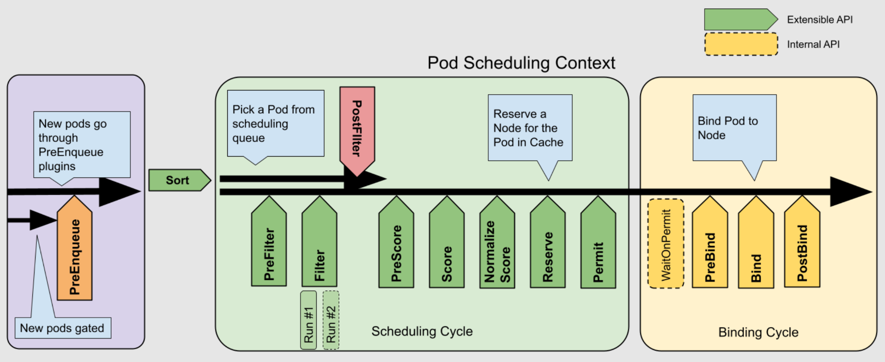
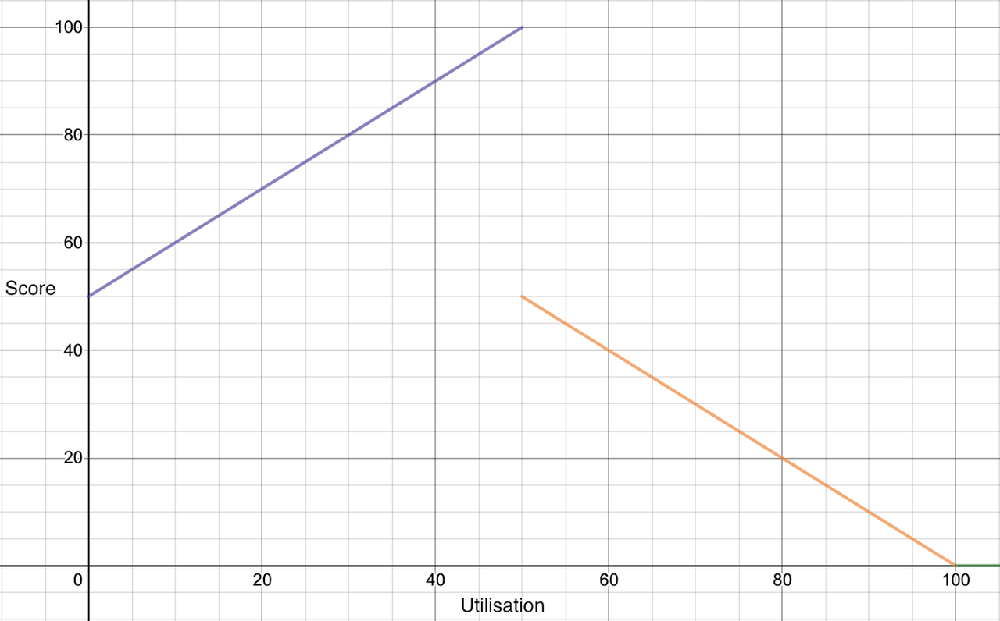

本文将会覆盖 Kubernetes 中许多和调度有关的内容，包括亲和性、污点、topologySpreadConstraints，以及调度器的内部实现等等。

## 概览

调度器（Scheduler）决定了一个 Pod 将在哪个 Node 上运行。大致的过程分为两步：

- 过滤（filtering），这一步会排除不符合 Pod 要求的节点
- 打分（scoring），这一步会根据分数对节点排序，最终选择一个分数最高的节点

## 控制调度行为

k8s 原生提供了一些控制调度行为的方法，文档见[这里](https://kubernetes.io/docs/concepts/scheduling-eviction/assign-pod-node/)。下面所述的字段皆存在于 Pod Spec 中。

### nodeName

如果 `nodeName` 被设置了，那么调度器会忽略这个 Pod。事实上，调度器最终的行为就是设置 Pod 的 `nodeName` 字段，再由对应节点上的 kubelet 实际运行 Pod。也因为这个原因，设置 `nodeName` 会覆盖 `nodeSelector` 和亲和性/反亲和性规则。

### nodeSelector

根据 Node Label 过滤节点。

### Node Affinity

和 `nodeSelector` 类似，但是有更强的表达能力（可以认为是它的超集？）。

- affinity
  - required/preferred 和 nodeSelector 类似, 但格式更灵活
  - tricky! 当用于普通的 affinity 时, 使用 nodeAffinity 字段, matchExpressions 匹配的是 node. 当用于 Inter-pod affinity/anti-affinity 时, 使用 podAffinity/podAntiAffinity 字段, matchExpressions 匹配的是 pod

- Inter-pod affinity and anti-affinity
  - 有性能问题
  - topologyKey 用来指定 topology domain

- topologySpreadConstraints

## Scheduling Framework

doc:

- [Scheduling Framework](https://kubernetes.io/docs/concepts/scheduling-eviction/scheduling-framework/)
- [Scheduler Configuration](https://kubernetes.io/docs/reference/scheduling/config)
- More docs on [sig-scheduling](https://github.com/kubernetes/community/tree/master/contributors/devel/sig-scheduling)

See also: [Gödel Scheduler 性能优化: 算法设计思想与数据结构应用](https://mp.weixin.qq.com/s/xEYR_vC9LDaka9-EwalqcA)

- Scheduling cycle: selects a node for the pod
  
  - QueueSort: sort pods in the scheduling queue. Only one queue sork plugin may be endabled at a time.
  
  - Filter, for **each** node, the scheduler will call filter plugins in their configured order.
  
  - PostFilter, when no feasible nodes were found to the pod, these plugins are called. e.g. preempting. If any PostFilter plugin marks the node as Schedulable, the remaining plugins will not be called.
  
  - Score, the scheduler will call each score plugin for **each** node
  
  - Reserve, those "stateful plugins" should use this phase to be notified by the scheduler when resources on a node are being reserved and unreserved for a given pod.
  
    *Caution: The implementation of the Unreserve method in Reserve plugins must be idempotent and may not fail.* 
  
  - Permit?
  
- Binding cycle: the scheduler communicates the node placement decision to the Kubernetes API server. This operation bounds the Pod to the selected node.

调度器将待调度的 Pod 存储在[三个队列](https://github.com/kubernetes/community/blob/master/contributors/devel/sig-scheduling/scheduler_queues.md)中： 

- ActiveQ：新创建的 Pod 或是可以进行重试的 Pod
- BackOffQ：调度失败，等待指数退避重试的 Pod
- UnschedulableQ: for parking pods which are waiting for certain condition(s) to happen
  - every 30s, pods in this Q will be moved to be retried

### 插件

Notable in-tree plugins (in k/k pkg/scheduler/framework/plugins):

| 插件                            | 描述                                                         | 拓展点                             |
| :------------------------------ | :----------------------------------------------------------- | :--------------------------------- |
| ImageLocality                   | 偏好已有对应镜像的节点                                       | score                              |
| TaintTolaration                 |                                                              | filter, preScore, score            |
| NodeName                        |                                                              | filter                             |
| NodeAffinity                    | node selector 和 affinity 的筛选和打分插件                   | filter, score                      |
| PodTopologySpead                |                                                              | preFilter, filter, preScore, score |
| NodeUnschedulable               |                                                              | filter                             |
| NodeResourcesFit                 | 根据 Pod Resource Request 和 Node Allocatable Resouce 来打分。默认策略为 LeastAllocated，偏好资源占用更少的节点（即更空闲的节点） | preFilter, filter, score           |
| NodeResourcesBalancedAllocation |                                                              | score                              |

out-of-tree scheduling plugins are in the [scheduler-plugins](https://github.com/kubernetes-sigs/scheduler-plugins) repo. Though they are out of tree, they are packed into kube-schduler binary. We can create a new scheduling profile to use them.

| 插件         | 描述                                                         | 拓展点                                   |
| :----------- | :----------------------------------------------------------- | :--------------------------------------- |
| Trimaran     | 根据节点实际负载进行调度，是一个插件集合。其中包括：TargetLoadPacking, 当节点未达到目标水位时采用 best fit，达到之后采用 least fit。当目标水位为 50% 时，该算法打分的示意图如下： | score                                    |
| Coshceduling | 确保一组 Pod 同时被调度                                      | queueSort, preFilter, postFilter, permit |
|              |                                                              |                                          |

Notes:

- QueueSort 在何时调用？
- Snapshot: 在一次调度开始时会记录 node/pod 等信息的 snapshot, 以便所以插件都能看到相同的集群状态
- QueueingHint？https://kubernetes.io/blog/2024/12/12/scheduler-queueinghint/