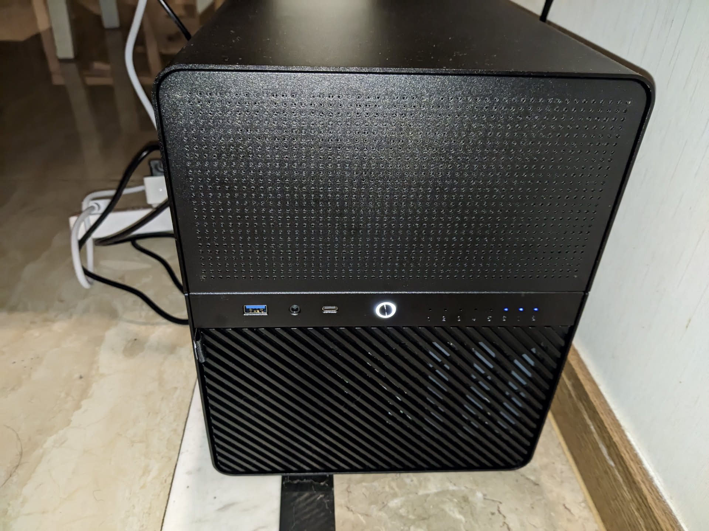
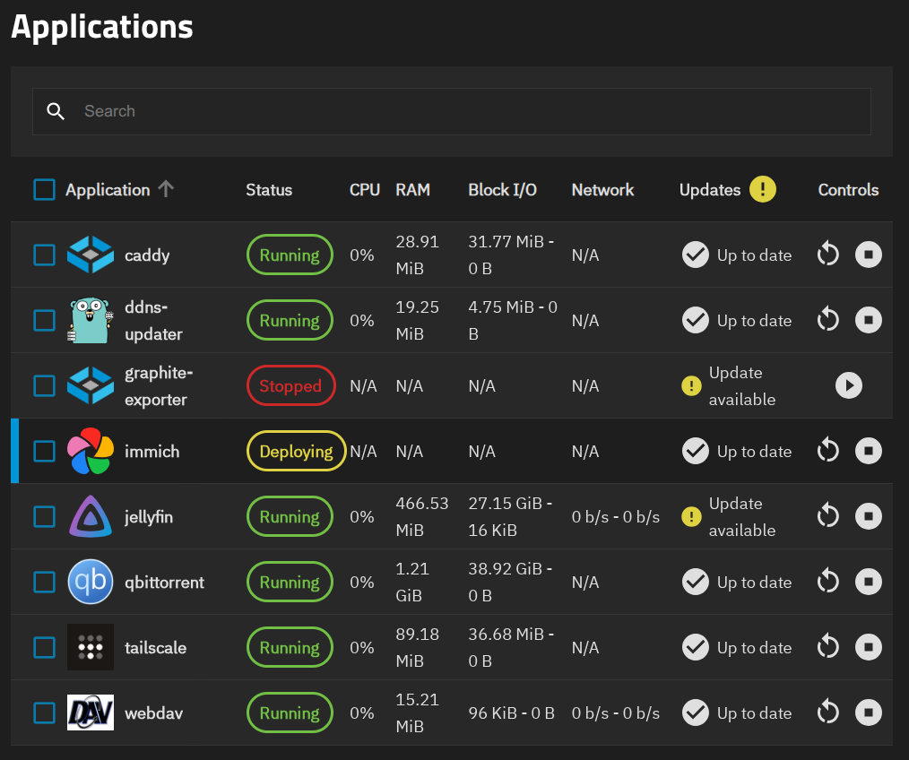
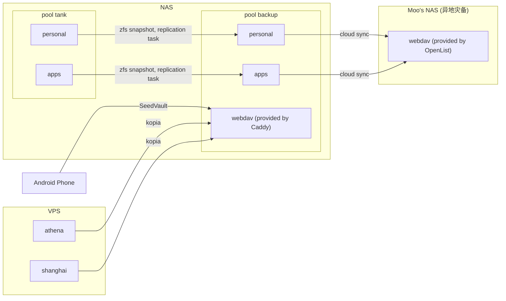

很久之前，我就有组一个 NAS 的想法，直到今年才得以实现。

## 选型

首先就是选择成品 NAS 还是 DIY。我并没有 NAS 的刚需，只是想在折腾中学习，所以自然是选择 DIY。基于战未来的考虑，直接选了个八盘位的机箱，而 CPU 方面目前看来没什么吃性能的应用，所以选了 n100。最终的配置如下：

- 板U 云星 n100 550
- m2 转 sata 拓展卡 75
- 机箱 乔思伯 n3 740
- 内存 拆机 8G 0
- 电源 Thermaltake 450W 钢影 SFX 420
- 系统盘 宏碁 128g 70

合计 1850。这其中电源感觉严重冗余了，因为后面实测待机功率才 30w 左右。但是机箱只支持 SFX 电源，而低功率的 SFX 电源似乎比较少，350w 的 SFX 都挺垃圾的。说句题外话，在很久之前我的 nas 配置单上选的还是 i3-10100，那时候 12 代还没出..

软件同样有成品 NAS 系统和 DIY 可选，DIY 系统（比如装一个普通的 Linux 发行版）太费时费力了，所以还是选择成品的 NAS 系统。网上流行的 NAS 系统大概有：

- unraid，正如其名字所说的，没有 raid。整体是 JBOD（Just a Bunch of Disks）的思路，有单独的 parity disk。由于 data disk 的容量并不要求一致，所以 parity disk 要求大于等于最大的 data disk 容量。parity 用的也是奇偶校验。非开源，需付费购买授权，当然也有学习版。
- 黑群晖，优势是能使用群晖生态系统中的软件，但是由于是逆向出来的，难免有各种兼容性问题。使用 btrfs 作为文件系统，mdadm 管理阵列。
- TrueNAS，基于 zfs，开源。开发商 ixsystems 本身也赞助了一些 zfs feature 的开发。卖企业版，也卖类似一体机的硬件。
- 飞牛，国产的 NAS 系统。非开源，免费使用。面向小白用户，基本能够开箱即用。似乎也是 btrfs+mdadm 的组合。后面应该会卖硬件。
- ~~（混沌邪恶）~~ Windows Server
- OpenMediaVault，相对知名度没那么高的 NAS 系统，是从 FreeNAS（TrueNAS 的前身）fork 出来的。据维基百科介绍，这是因为 OMV 的开发者想要基于 Linux 来开发 FreeNAS。略显讽刺的是，truenas 在 2023 年宣布将全面转向 Linux，原先的 FreeBSD 版本（TrueNAS Core）将只会收到安全更新并被逐渐取代。

在这之上，还可以先安装 PVE 作为虚拟化平台，然后在虚拟机里安装 NAS 系统。由于我很早的时候就看到过很多“鼓吹” zfs 的文章，所以文件系统的选型在一开始就定下了：zfs。并且我比较偏好开源系统，所以最终选择了 truenas。

## 装机过程

装机过程没碰到什么问题，有一个小问题是机箱附带的两个硬盘风扇感觉声音太大了，但是这两个风扇是 3pin 接口，没法调速（即使是 4 pin，由于这两个接口在硬盘背板，而不在主板上，估计也没法调速）。于是我只好又买了两根减速线插上。

另一个问题是我明明有一块 SSD 了，为什么还要额外买块系统盘呢？因为 truenas 的系统盘存不了数据（官方不支持这种用法）。装系统时碰到一个小问题是我本来是把 truenas 的 iso 放到一个装了 ventoy 的 U 盘上的，没想到居然没法引导。去搜了下 ventoy 的 issue 也有别人碰到这个问题。没办法只能换一个 U 盘直接 dd 写入 iso。


（装完后的效果图）

硬盘方面，我本来有块 4T 的西数红盘，这次打算再添置两块 4T 组 raid-z1。原来的一块 2t ssd 作为备份盘使用。于是购置了一块希捷 ST4000VX015，和一块二手的希捷企业盘。买回来才发现企业盘炒豆子的声音居然这么大（因为 NAS 是放在客厅角落的，所以整个客厅都能听到。并且这个机箱为了通风一点隔音都没有），于是退了又买了一块 VX015，顺便测试了一下 zfs 的阵列重建。重建步骤其实很简单，truenas 中提供了图形界面。如果在命令行下操作，也就是 zpool offline 和 zpool replcae 两个命令。由于数据没存满，重建大概花了 3 个小时就完成了。

未来如果要升级的话，可以直接买 4T 的扩容 pool，也可以买更大的硬盘建新 pool。

## 系统

truenas 本质上是个 debian 系统，用了一个定制的内核，跑了一个自己的 web 服务（名字叫 middleware），还把 apt 给 ban 了。这个 middleware 其实就是 truenas 本体，提供 web ui，操作 zfs，操作 docker 什么都是它干的。

```
root@truenas[~]# uname -a
Linux truenas 6.12.15-production+truenas #1 SMP PREEMPT_DYNAMIC Mon May 26 13:44:31 UTC 2025 x86_64 GNU/Linux
root@truenas[~]# cat /etc/os-release 
PRETTY_NAME="Debian GNU/Linux 12 (bookworm)"
NAME="Debian GNU/Linux"
VERSION_ID="12"
VERSION="12 (bookworm)"
VERSION_CODENAME=bookworm
ID=debian
HOME_URL="https://www.debian.org/"
SUPPORT_URL="https://www.debian.org/support"
BUG_REPORT_URL="https://bugs.debian.org/"
root@truenas[~]# ps aux | grep middleware 
root        1087  5.5  4.9 3598760 1614628 ?     Ssl  May28 3728:31 middlewared
root        1139  0.0  0.4 1670448 147044 ?      Sl   May28   3:06 middlewared (zettarepl)
root     1769577  0.0  0.2 828484 68128 ?        Sl   15:33   0:00 middlewared (worker)
root     1771402  0.1  0.2 901012 67516 ?        Sl   15:35   0:00 middlewared (worker)
root     1778131  0.1  0.2 826684 66088 ?        Sl   15:42   0:00 middlewared (worker)
root     1778135  0.1  0.2 826708 65920 ?        Sl   15:42   0:00 middlewared (worker)
root     1779127  0.2  0.2 827556 67532 ?        Sl   15:43   0:00 middlewared (worker)
root     1785026  0.0  0.0   3744  1464 pts/2    S+   15:48   0:00 grep middleware
root@truenas[~]# apt
Package management tools are disabled on TrueNAS appliances.

Attempting to update TrueNAS with apt or methods other than the TrueNAS web
interface can result in a nonfunctional system.
```

一个有趣的地方是这个系统是所谓的不可变系统，更新系统的实质是建一个新的 zfs dataset，然后从新的 dataset 启动。从 dataset 上看，配置应该是和系统分离的，存在一个叫 `.system` 的 dataset 下面：

```
root@truenas[~]# zfs list | grep boot                                                       
boot-pool                                                                                              7.85G   106G    96K  none
boot-pool/.system                                                                                      1.90G   106G  1.55G  legacy
boot-pool/.system/configs-ae32c386e13840b2bf9c0083275e7941                                             9.87M   106G  9.87M  legacy
boot-pool/.system/cores                                                                                  96K  1024M    96K  legacy
boot-pool/.system/netdata-ae32c386e13840b2bf9c0083275e7941                                              352M   106G   352M  legacy
boot-pool/.system/nfs                                                                                   124K   106G   124K  legacy
boot-pool/.system/samba4                                                                                560K   106G   312K  legacy
boot-pool/ROOT                                                                                         5.87G   106G    96K  none
boot-pool/ROOT/24.10.2.1                                                                               2.62G   106G   165M  legacy
boot-pool/ROOT/24.10.2.1/audit                                                                          848K   106G   848K  /audit
boot-pool/ROOT/24.10.2.1/conf                                                                          6.83M   106G  6.83M  /conf
boot-pool/ROOT/24.10.2.1/data                                                                           276K   106G   276K  /data
boot-pool/ROOT/24.10.2.1/etc                                                                           7.32M   106G  6.46M  /etc
boot-pool/ROOT/24.10.2.1/home                                                                           108K   106G   108K  /home
boot-pool/ROOT/24.10.2.1/mnt                                                                            112K   106G   112K  /mnt
boot-pool/ROOT/24.10.2.1/opt                                                                             96K   106G    96K  /opt
boot-pool/ROOT/24.10.2.1/root                                                                           152K   106G   152K  /root
boot-pool/ROOT/24.10.2.1/usr                                                                           2.40G   106G  2.40G  /usr
boot-pool/ROOT/24.10.2.1/var                                                                           41.2M   106G  31.3M  /var
boot-pool/ROOT/24.10.2.1/var/ca-certificates                                                             96K   106G    96K  /var/local/ca-certificates
boot-pool/ROOT/24.10.2.1/var/log                                                                       9.55M   106G  8.92M  /var/log
boot-pool/ROOT/24.10.2.1/var/log/journal                                                                644K   106G   644K  /var/log/journal
boot-pool/ROOT/25.04.1                                                                                 3.25G   106G   174M  legacy
boot-pool/ROOT/25.04.1/audit                                                                           1.55M   106G  1.55M  /audit
boot-pool/ROOT/25.04.1/conf                                                                            7.06M   106G  7.06M  /conf
boot-pool/ROOT/25.04.1/data                                                                             260K   106G   260K  /data
boot-pool/ROOT/25.04.1/etc                                                                             7.13M   106G  6.18M  /etc
boot-pool/ROOT/25.04.1/home                                                                             116K   106G   116K  /home
boot-pool/ROOT/25.04.1/mnt                                                                              112K   106G   112K  /mnt
boot-pool/ROOT/25.04.1/opt                                                                               96K   106G    96K  /opt
boot-pool/ROOT/25.04.1/root                                                                             500M   106G   500M  /root
boot-pool/ROOT/25.04.1/usr                                                                             2.53G   106G  2.53G  /usr
boot-pool/ROOT/25.04.1/var                                                                             52.5M   106G  4.28M  /var
boot-pool/ROOT/25.04.1/var/ca-certificates                                                               96K   106G    96K  /var/local/ca-certificates
boot-pool/ROOT/25.04.1/var/lib                                                                         30.5M   106G  27.9M  /var/lib
boot-pool/ROOT/25.04.1/var/lib/incus                                                                   2.18M   106G  2.18M  /var/lib/incus
boot-pool/ROOT/25.04.1/var/log                                                                         16.8M   106G  5.77M  /var/log
boot-pool/ROOT/25.04.1/var/log/journal                                                                 11.0M   106G  11.0M  /var/log/journal
boot-pool/grub                                                                                         8.42M   106G  8.42M  legacy
```

truenas 的功能还是很全的，我主要用到的有下面几个：

- Apps，也就是 docker，下面详述

- Instances，基于 incus 的虚拟机平台，25.04 版本新加的，替代了原来的自己的平台，目前还是试验性阶段。在我加了两个虚拟机（一个跑 clash, 一个跑 homeassistant）之后，不定时会出现 qemu 进程因为 OOM 被 kill，然后服务就挂了（看起来 incus 没有自动重启的策略）... 不得以加到了 32G 内存。

  - 为了简单起见，虚拟机设置了静态的 IP 地址。我一开始担心这会不会造成 IP 地址冲突，搜索后发现 DHCP 中包含了检查分配的 IP 地址是否已被使用的特性：

    > When allocating a new address, servers SHOULD check that the offered network address is not already in use; e.g., the server may probe the offered address with an ICMP Echo Request.
    >
    > ---- [RFC 2131](https://datatracker.ietf.org/doc/html/rfc2131#section-3.1)
  
- scrub task，定时执行 zfs scrub 操作，帮助发现硬盘中潜在的错误。这也是 zfs 相比于其他 raid 方案更安全的原因之一。

- replication task，实际上是 zfs snapshot 和 zfs send 的结合，用于备份一个 dataset。我把一些重要的数据备份到另一个 pool （ssd）里。

- 告警，配置了 SMTP 之后，在某些事件发生时（比如 zpool status 中出现了 error）会发邮件通知。

## 应用

一个 NAS 只有存储功能当然是不够的，应用才是核心。如今的 NAS 系统基本都围绕着 docker 来构建应用生态了，这也是合理的，毕竟 docker 的出现就是为了解决应用部署的问题。truenas 在几个版本之前选择了极为先进的 k3s+helm 的组合，据说因为使用难度被广受诟病，于是现在回归了 docker+docker compose 的组合。

官方有个 [apps 仓库](https://github.com/truenas/apps)，虽然说是社区维护的，但是大部分 commit message 都是无意义的 update xxx，也没有良好的文档。我大概看了一下，差不多是用一堆模板渲染出一个给 compose 用的 yaml，然后喂给 compose。不过作为用户来说，这些都无所谓，能用就行。官方支持的 app 数量还是很多的，常用的基本都有。可以用 `docker compose ls` 看到渲染出来的 yaml 长什么样。



应用配置里有许多 app specific 的问题，这里就不展开了。吐槽一下 jellyfin 的字幕真是万年难题，直至今日某些字幕在 jellyfin android tv 客户端上显示的依旧是[豆腐](https://en.wikipedia.org/wiki/Noto_fonts#Etymology)..

几个 turenas 导致的问题：

- 一开始我的 app 安装在 backup pool 中，因为我想让 tank pool 在空闲时休眠。但是几天观察下来 tank 并不会休眠，原因未知。休眠本身也没那么重要，于是我就又把 app 迁移到 tank pool 中。这一步需要手动完成, 参考论坛中的[这篇文章](https://forums.truenas.com/t/howto-copy-the-hidden-ix-apps-dataset-from-one-pool-to-another/24434)。
- TrueNAS 的 temporary storage 似乎会在重启容器时清空（[参考](https://github.com/truenas/apps/issues/2026)）。而 immich 的 ml-cache 用的这个类型的 storage，导致重启的时候会重下模型。但模型又很大，浪费流量.. 而且由于 huggingface 的限流策略，下载模型有五分之四的概率是失败的。truenas 页面上限制了把 storage 从 temporary 改成 ixVolume，于是我只能手动建了个 dataset 然后把 storage 改成 hostPath。

## 备份

为了不让 NAS 成为数据火葬场，备份当然是很重要的。同时，我的几个 VPS 上的数据之前也一直没有定时备份，在有了 NAS 之后正好统一规划一下备份方案。目前的备份方案如下图：



tank pool 中的数据实现了三份副本，一份异地。VPS 上的数据则实现了两份副本，一份异地。所有备份任务每天执行一次。一开始想的是每周执行一次，但是实验了之后发现，增量备份还是挺快的，所以改成了一天一次。Moo 老师提出了上传各自备份到对方 NAS 的方案，于是我就拥有了一份免费的异地备份。

选型方面，VPS 的备份一开始看了 borg/kopia/restic 三个工具，感觉它们之间的差别不是很大，就随便选了一个。NAS 的备份由于 TrueNAS 自带了工具，就直接用了。TrueNAS 的 cloud sync 实际调用的是 rclone, 严格来说并不是备份而是同步。目前 rclone 跑一次没有修改过文件的同步需要半个小时，不知道瓶颈在哪里，是否有优化的空间。

TrueNAS apps 中的 webdav 应用感觉性能非常差，看了下镜像是 httpd，也就是 apache，不知道是否是配置的问题，但我也不想学习它的配置。于是干脆换成 Caddy。Caddy 本身没有 webdav 的支持，但是社区有，只需自己 [build 一个镜像](https://github.com/cjc7373/ansible/commit/165480157e46a39ae3d2be9d508c0b8357e53875)就可以用了。

所有跨局域网的网络访问均通过 tailscale 进行，以减小攻击面。

## 总结

总体上我对我的 NAS 还是非常满意的，计划中的功能都实现了，在搭建 Immich 之后我甚至把我的 Google One 订阅取消了（每年省了 $20，这下电费出来了）。
