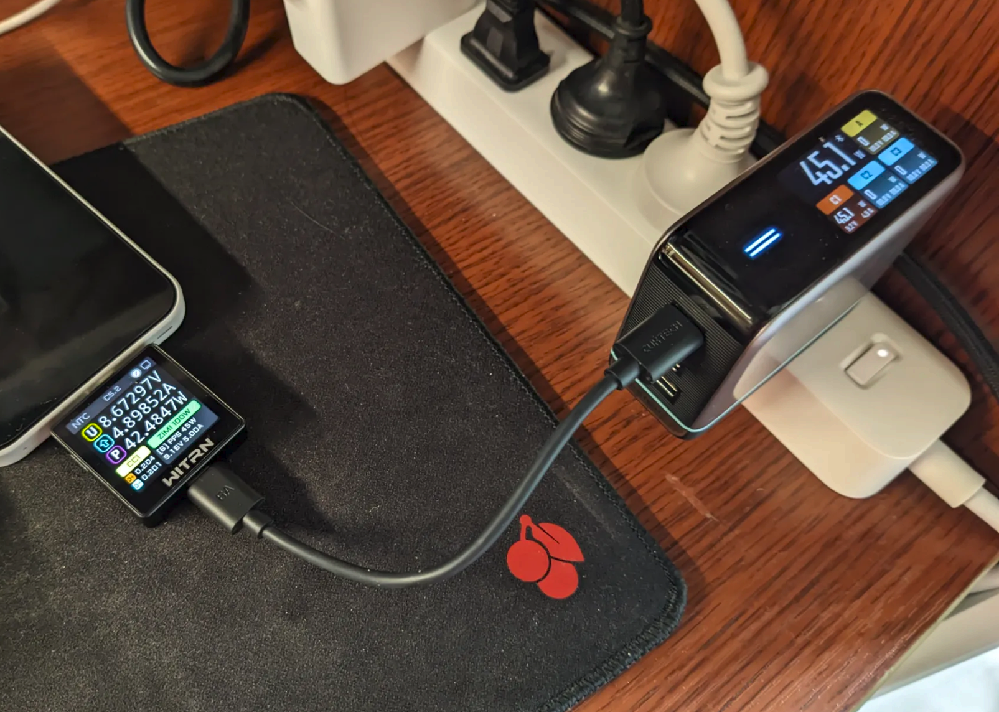
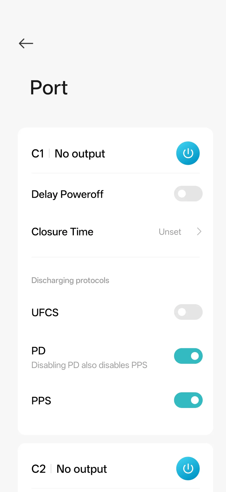
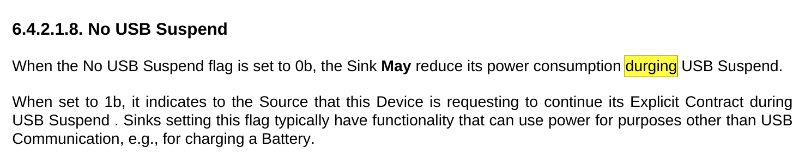
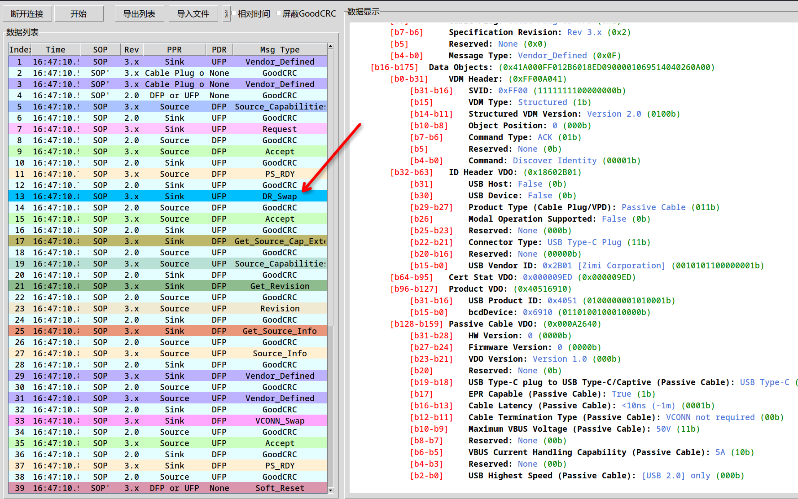

前段时间斥“巨资” 99 购入了一个 USB 功率计维简 K2，在使用过程中发现了不少奇妙的地方。

## 一些发现和吐槽

- 我的酷态科 10 号给一加 15t 充电，总是只有二十几瓦的功率，原来是用的线没有 e-marker 芯片，撞到了 3A 的电流上限。换了一条线之后，成功达到了 40w+。

  

  酷态科 10 号输出的功率比 K2 多了 3W，可能是充电头本身的损耗。

- 15t 附带的充电器（A 口）不支持 PD 协议，随后查到 PD 2.0 往上需要 C 口的 CC 引脚通信。PD 1.0 倒是基于 USB-A 的，只是不知道现在还有多少设备还支持 PD 1.0。

- 神奇的是五年前 8T 的充电器却是 C 口的，也支持 PD，这么看 15t 反而是一种倒退。

- 不是很懂国内为什么要搞一个 UFCS 协议，PD 不够用吗？据说在一些手机上 UFCS 的功率会小于 PD，但是手机又会优先使用 UFCS，导致不能发挥充电头最大的性能。这可能也是为什么酷态科 10 号会做一个单独关闭某个协议的功能。

  

- 维简的[官方说明书](https://www.witrn.com/?p=2105)写得和💩一样，搜到了一个[民间版本](https://github.com/JohnScotttt/WITRN-K2-Quick-Reference-Manual)，比官方的清晰多了

- K2 似乎有个 bug（V5.2 固件），它会显示 RDO 的 Maximum Operating Current 而非 Operating Current。于是在我的一个 30W 充电头上能看到 RDO 为 20V 3.6A (72W)，而实际 Operating Current 请求的是 1.5A。

- 阅读 PD 规范的时候发现了一个错别字

  

## PD 相关

看说明书时发现了 [witrn_pd_sniffer](https://github.com/JohnScotttt/witrn_pd_sniffer) 这个项目，原来除了官方的上位机之外，还有其他工具能读取 K2 的数据。于是下下来测试，这个项目只打包了 exe，但是 K2 本身通过 HID 协议通信，应该在 Linux 下也行得通。在这期间碰到了两个问题：

- 第一个是连接设备失败。一开始在我的 asahilinux 下就找不到 hid 设备，然后换了个 C 口就好了.. 可能是 asahi 的限制？	

  手动用 hidapi 库测试，报了下面的错：

  ```
  >>> import hid
  >>> hd = hid.device()
  >>> hd.open(1814, 20576) # 这是 K2 的 vendor_id 和 product_id
  Traceback (most recent call last):
    File "<python-input-5>", line 1, in <module>
      hd.open(1814, 20576)
      ~~~~~~~^^^^^^^^^^^^^
    File "hid.pyx", line 143, in hid.device.open
  OSError: open failed
  ```

  询问 GPT 后发现给 `/dev/bus/usb/00x/00y` （x/y 为 lsusb 输出的 `Bus 00x Device 00y`）加上所有用户的 rw 权限后可以 open 了。只是每次连接都需要这样加一下权限。似乎还能通过添加 udev 规则来“持久化”这个配置，不过我也用不到了。 

- 第二个是 K2 会发送 general 和 pd 两种类型的消息，general 是当前的电压、电流等数据，pd 是 pd 报文，但是只能收到 general 消息。debug 了半天后发现文档中写了需要“菜单开启PD联机开关”...

解决了之后顺利抓到了 PD 报文。目前 PD 的规范（r3.2 v1.2）足足有 416 页！只能让 GPT 老师来看了，不过其中基础的部分也不算复杂。下面我们就以以一次充电的 PD 协商为例，来入门一下 PD 协议。

### 历史

在 PD 之前，USB Battery Charging (BC) 最高支持 5V 1.5A（7.5W）的充电。PD（Power Delivery）1.0 在 2012 年发布，这比 USB-C（2014）要更早，这时候的 PD 已经支持六个 profile，最高 100W 的充电了。受限于 USB-A 接口，这时候的 PD 是用 VBUS 引脚通信的。PD 2.0 添加了 USB-C 的支持。3.0 加入了 Programmable Power Supply (PPS) 的支持，能够以 20 mV 的步进调节电压，50 mA 的步进调节电流。目前 PD 最高支持 48V 5A （240W）的充电。

### 开始协商

首先明确两个术语：

> [!NOTE]
>
> - Source/Sink，供电方/受电方，这两个是 Power roles，Source 通常也是 DFP
> - DFP (Downstream Facing Port)/UFP (Upstream Facing Port)，下行/上行端口，这两个是 Data roles。DFP 是数据角色协商的 Initiator，UFP 是 Responder。

在一开始，充电头就会作为 Source 和 DFP 发起协商。在第一条 PD 报文之前还有个初始连接的过程，不过那是 USB-C 标准定义的，不在 PD 的范畴之内。

### 物理层

PD 采用 USB-C 中的 CC (Configuration Channel) 引脚进行通信，根据接口正反插的情况，会挑选 CC1 和 CC2 中的一个进行通信。数据的比特流先经过 [4b5b 编码](https://en.wikipedia.org/wiki/4B5B)，把每 4 bit 原始数据，编码成 5 bit 码组。然后再通过 [BMC](https://en.wikipedia.org/wiki/Differential_Manchester_encoding) 编码输出成电压波形。


图源：https://en.wikipedia.org/wiki/USB-C

在协商完成后，Source 将电压输出到 USB-C 的 VBUS 引脚，进行供电。

PD 包的格式如下图所示。


图源：PD 规范

其中 Preamble、`SOP*`、CRC、EOP 是物理层加入的。Preamble 用于通知接收方开始接收消息，以太网帧中也有类似的东西。`SOP*` 为 SOP / SOP′ / SOP″ 三类 SOP (Start of Packet) 的统称，它们的区别是发给对端 Port Partner，也就是 Source/Sink 本体，还是发给线缆一端/另一端的 Cable Plug。

> [!NOTE]
>
> Cable Plug，线缆或插头里的 PD 通信能力电路，常见就是 e-marker。它可以告诉主机这根线支持多少电流、什么速率、是否支持 EPR 等。

CRC 字段是用 CRC-32 计算的校验值，用以校验消息的完整性。只有 Message header 和 payload 会被用于 CRC 计算。最后是 EOP (End-Of-Packet)。

### 消息头

每个 PD 报文首先会带一个 16 bits 的 header。header 中包含了消息的类型（Control Message, Data Message, Extended Message）、发送方的 Data Role、Specification Revision（协议版本）、发送方的 Power Role、MessageID、Data Objects 数量等信息。

Control Message 只有 header，没有 payload。Data Message 和 Extended Message 都带有 payload。前者是 word-oriented，也就是按 32-bit Data Object 组织；后者是 byte-oriented，按字节数据块组织。

Specification Revision 是一个 2 bits 的字段，只能够表达 1.0/2.0/3.x 这三种版本信息，剩下一个 Reserved，让我好奇如果又出了两个新版本那应该怎么新增 revision... 版本协商由 Source/Sink 最初的两条消息（Source_Capabilities/Request）决定，选出双方都支持的最高版本。如果要区分 3.x 的小版本，则需要后续的 Get_Revision 等消息来实现。

### 协商过程

下面终于进入到了我们的第一条报文：Source_Capabilities 报文，由 Source 广播它的 PDO。

> [!NOTE]
>
> PDO (Power Data Object)，电源数据对象，通常用来声明充电头的电压/电流档位

一个 PDO 由 32 bits 组成，以下面这个 PDO 为例：

```
[b128-b159] PDO 5: F 20.0V@1.5A (0x00064096)
    [b31-b30]   Supply Type: FPDO (00b)
    [b29-b22]   Reserved
    [b21-b20]   Peak Current: 00 (00b)
    [b19-b10]   Voltage: 20.0V (0110010000b)
    [b9-b0]     Maximum Current: 1.5A (0010010110b)
```

它的类型是 Fixed Supply，Peak Current 指示了不支持短时间过载，声明的电压/电流为 20V/1.5A。PPS 的情况下加入了最大/最小电压，其他类似。PPS 的最小电压只有 5V 一个档位，最大电压有 11V/16V/21V 三个档位，其余的档位都是 Invalid 的。

神秘的是在我的酷态科 10 号上，出现了下面的 PDO：

```
[b192-b223] PDO 7: P 5.0-20.0V@5.0A (0xC9903264)
    [b31-b30]   Supply Type: APDO (11b)
    [b29-b28]   APDO Type: SPR PPS (00b)
    [b27]       PPS Power Limited: True (1b)
    [b26-b17]   Maximum Voltage: 20.0V (0011001000b)
    [b16-b8]    Minimum Voltage: 5.0V (000110010b)
    [b7-b0]     Maximum Current: 5.0A (01100100b)
```

但是规范中并没有 20V 这个档位..

在每一个包被发送后，对端都需要返回一条 GoodCRC Control Message 来 ACK 消息已收到并且校验准确，其中的 MessageID 字段设置为 ACK 的那个消息的 MessageID。

接下来，Sink 发送 Request 报文，申请改变 VBUS 电压。报文中只能带有一个 RDO。

> [!NOTE]
>
> RDO (Request Data Object)，请求数据对象，标识 Sink 在申请哪一个 PDO

```
[b0-b31]    RDO: [1] F 5.0V@3.0A (0x1304B12C)
    [b31-b28]   Object Position: 1 (0001b)
    [b27]       Giveback: False (0b) (Deprecated)
    [b26]       Capability Mismatch: False (0b)
    [b25]       USB Communications Capable: True (1b)
    [b24]       No USB Suspend: True (1b)
    [b23]       Unchunked Extended Messages Supported: False (0b)
    [b22]       EPR Capable: False (0b)
    [b21-b20]   Reserved: None (00b)
    [b19-b10]   Operating Current: 3.0A (0100101100b)
    [b9-b0]     Maximum Operating Current: 3.0A (0100101100b) (Deprecated)
```

Object Position 指示了相应 PDO 的位置（居然不是从 0 开始的？）下面的字段都不是很重要，最关键的是 Operating Current，指示了 Sink 请求的最高电流。

然后，Source 发送 Accept Control Message，表示接受 Sink 的 RDO。

接着，Source 发送 PS_RDY（Power Supply Ready）Control Message，指示电源已经达到了期望状态，也就是说 VBUS 上的电压已经切换完成了。至此，PD 的协商完成。

### 其他报文

在一加 15t 上，PD 的协商到 PS_RDY 就结束了。但是在 Macbook Air M2 上，却还有更多消息。



这里可以看到在 DR_Swap（交换 data role）之后，Sink 发了很多请求。Source_Capabilities_Extended 好像没什么东西。Revision 里能看到酷态科 10 号的协议版本，居然还不支持 PD 3.2。

```
[b0-b31]    RMDO: (0x31180000)
    [b31-b28]   Revision.major: 3 (0011b)
    [b27-b24]   Revision.minor: 1 (0001b)
    [b23-b20]   Version.major: 1 (0001b)
    [b19-b16]   Version.minor: 8 (1000b)
    [b15-b0]    Reserved: None (0000000000000000b)
```

Source Info 里包含了功率信息。

```
[b0-b31]    SIDO: (0x80787878)
    [b31]       Port Type: Guaranteed Capability Port (1b)
    [b30-b24]   Reserved: None (0000000b)
    [b23-b16]   Port Maximum PDP: 120W (01111000b)
    [b15-b8]    Port Present PDP: 120W (01111000b)
    [b7-b0]     Port Reported PDP: 120W (01111000b)
```

> [!NOTE]
>
> - PD Power (PDP)，Source 输出的功率
> - Port Maximum PDP，该 Port 最大会提供的功率
> - Port Present PDP，当前能供应的功率，受线缆能力、温度、输入电压等影响
> - Port Reported PDP，当前在 `Source_Capabilities` 中汇报的最大功率

不过酷态科 10 号的实现似乎不太对，在我用一条没有 e-marker 的线时，Source_Capabilities 汇报的最高功率为 60W，但是 Port Present PDP 和 Port Reported PDP 还是 120W..

还会通过 Vendor_Defined 报文查询 Source Vendor 的信息。之后在 VCONN_Swap 之后还会去查线缆的信息。

## 尾巴

PD 确实是一个很复杂的协议啊.. 接下来 K2 就该开始吃灰了！
