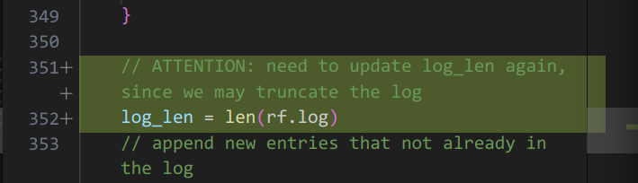

这篇文章主要关于 Lab 2-4 实现中的一些坑。Lab 2 实现了 Raft 协议，Lab 3 实现了 Raft 协议之上的应用——一个 KV 数据库（即状态机和对外的接口）

## 一些建议

这些建议来源于：
- [Lab guidance](https://pdos.csail.mit.edu/6.824/labs/guidance.html)
- [Raft Structure Advice](https://pdos.csail.mit.edu/6.824/labs/raft-structure.txt)
- [Students' Guide to Raft](https://thesquareplanet.com/blog/students-guide-to-raft/)

以下为建议：
- 使用 Go 的 race detector
  - 它基于 Google 的 ThreadSanitizer

  - 其原理是监控所有对内存的访问并找出没有同步的访问，所以它只能在 race condition 真正发生的时候发现它们

  - 其开销为 5-10x 内存使用和 2-20x 执行时间，所以文档的建议是只用于测试或在生产环境的某一个实例开启

  - data race/race condtion (竞争) 是指一次对内存区域的写入操作，同时并发地对相同区域读取/写入。但如果所有操作都是原子的，则不存在 race condition

  - （我本来想顺着文档的 link 看看 [The Go Memory Model](https://go.dev/ref/mem) 的，但它告诫我：

    > If you must read the rest of this document to understand the behavior of your program, you are being too clever.
    >
    > Don't be clever.

    我尝试看了一下确实看不懂，只能先放弃了）

    不过它的前两条建议倒是很有用：

    - 如果一个程序会修改被多个 goroutine 同时访问的数据，它必须串行化（serialize）这些访问
    - 为了串行化访问，用 channel 或其他同步原语 （如 `sync` 或 `sync/atomic` 包提供的）来保护这些数据

- [关于锁的建议](https://pdos.csail.mit.edu/6.824/labs/raft-locking.txt)

  - 只要有多个 goroutine 会使用一块数据且至少有一个 goroutine 会修改它，那么就需要锁来保护它

  - 使用锁而不是 channel 来共享数据更容易
  
  - 用一把锁来保护一大块数据，不要用细粒度的锁，因为性能并不是重点
  
  - 碰到阻塞操作时要释放锁
  
  - 锁释放之后 （包括在启动一个新的 goroutine 之后）状态（即 `type Raft struct` 定义的状态）**可能已经发生了变化**
  
- 关于如何组织代码

  - 每个活动使用单独的 goroutine（如 leader 发送心跳，server 启动选举的计时）
  - 用 `time.Sleep()` 来进行周期性检查，不要用 `time.Ticker` 和 `time.Timer`，它们比较 tricky
  - 用一个单独的 goroutine 来发送 committed log entries 到 applyCh，可以使用 `sync.Cond` 来同步
  - 直接在 rpc 的 goroutine 里处理 rpc 的返回，而不是用 channel 把返回发出去，会更简单

- [关于日志的建议](https://blog.josejg.com/debugging-pretty/)

  - 用环境变量 `VERBOSE` 来控制是否输出调试日志
  - 我们想要知道**谁**在打印日志，这行日志和**什么主题**相关
  - 用 Python 库 Rich 来打印好看的日志（好像也没什么问题，rich 确实好用）

- 在所有 goroutine 里用 `rf.killed()` 检查 instance 是否已经被 kill 了

- 在 RPC 中使用的字段必须导出

- 可以用 panic 来检查一些条件，以便发现 bug

- Raft 论文中的 Figure 2 应被视为正式的规范，我们应该**逐字**遵照这张图来实现 Raft 协议

## Lab 2A

实现选举。

- 原论文中给出了选举超时时间为 150～300 ms，这就要求 leader 发送心跳的间隔远小于 150 ms，而本 lab 的 tester 限制了 heartbeat 只能够一秒发 10 次，故我们选择了 600～1000 ms 的超时时间。

- 本 lab 中 RPC 的超时时间可能高达 7s，所以在选举过程中我们不能等待 RPC 全部完成（成功/超时）之后再统计得票数，只需得到多数票即可认为选举成功

- 用了一个状态机来在不正确的状态转变发生时 panic，以便发现潜在的 bug

- 如上文所述，在 candidate 进行选举等待 rpc 时，很可能这时收到了一个 term 更新的 RequestVote RPC，从而已经转变成 follower 了，所以在收到 rpc 之后要检查是否仍为 candidate

- 收到更新的 term 时要同时清除 `votedFor` 字段

## Lab 2B

实现 log 复制。

- Raft 中并没有单独把 leader server index 存成一个状态，只要 RPC 的 term >= 当前 term，就可以认为是合法的 leader 发送的
- 每个 server 在 commit 过后都需要发送 ApplyMsg
- 似乎每次获取锁之后都需要先检查是否仍为 leader？
- 最后一个测试用例因为在处理 AE 时忘了更新 log 的长度，调了一天（流汗黄豆.jpg

  
  
- 这个部分我并没有用到 `lastApplied`, 而是在更新 `commitIndex` 后马上向 `applyCh` 发送命令, 这可能会减慢 `AppendEntries` handler 的速度, 但是这么实现能够通过 lab2b/c 的测试..

- 我们还必须确保只 commit 当前 term 的 entry, 然而我并没有实现这一点就通过了测试..

- 有时候在 call rpc 的时候会发生 data race.. 这可能是由于 AE 中 entries 是 slice 类型，需要显式用 `slices.Clone` 复制一份

## Lab 2C

实现持久化。

- 持久化本身很简单，根据 Figure 2 只需在 `log`, `currentTerm`, `votedFor` 更改时调用 `persist()` 函数即可
- 然而 2C 的测试用例复杂了许多，包括 leader back up `nextIndex` 时不能一个一个 entry 减了，这么做测试用例会超时（报错 `failed to reach agreement`），lab 的页面也警告了我们这一点
- 这部分输出的 log 达到了惊人的五万多行...
- 把 AE 里 `args.XTerm` (follower 提供的额外关于 entry 冲突的信息) 写成了 `args.Term` (follwer 的 term) 调了半天

## Lab 2D

实现快照。

- 快照中包含的一定是 committed log?
- 在往 `rf.applyCh` 中发送 `ApplyMsg` 时必须释放锁，因为测试框架中读取 `applyCh` 时可能会调用 `rf.Snapshot` 进行快照，造成死锁
- 状态机是易失的，在前两个 lab 中我并没有注意到这一点因为初始化 `commitIndex` 和 `matchIndex` 为 0 之后，重新 apply 所有 log 的过程在处理 AE 和 commit 新 entry 的自然而然处理了，无需额外处理。而有了快照之后必须显式地恢复状态机
- 不用 `lastApplied` 看来还是不行，因为发送 `ApplyMsg` 释放锁之后，很可能马上就执行了另一个 AE，导致 apply 的顺序出错
- 因为 `rf.log` 这个 slice 的 index 和实际 log 的 index 不对应了，所有从 log 中取 entry 的地方都要重写，这里的边界条件比较多容易混..

## Lab 3A

实现一个不带快照的 KV 数据库。

我们先实现一个最简单的版本，同一时刻只有一个 RPC handler 能执行。

