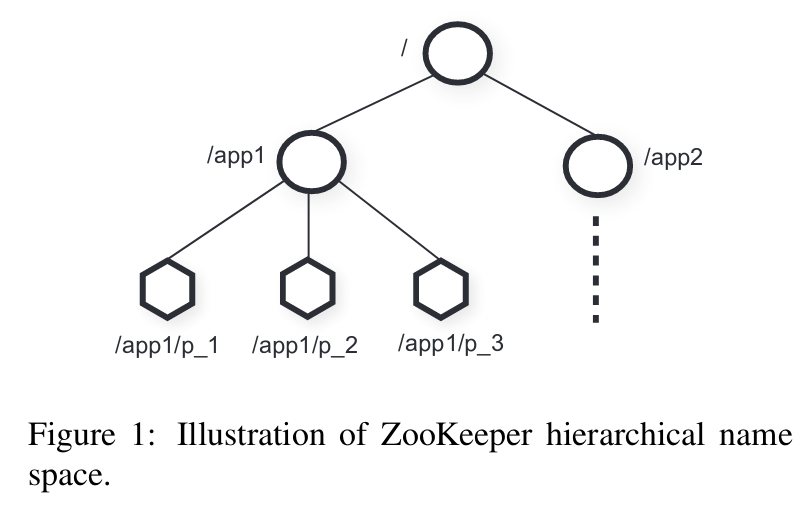

ZooKeeper（以下简称 ZK）是一个分布式系统的协调服务，常见的用途包括配置中心、消息队列、分布式锁等。etcd 是和 ZooKeeper 用途类似的一个系统。事实上 ZK 的出现要比 Raft 和 etcd 早得多。

ZK 中的基本单元是 znode，其以文件树的方式组织（层次结构）。

ZK 基于自己的共识协议 Zab，其也采用了 leader 选举和 quorum 来保证一致性。ZK 通过允许从 replicas 上读来提高性能，但是这样可能会读到 stale 的数据，因而 ZK 不是可线性化的。但是 ZK 提供了两点一致性保障：

- 写入都是可线性化的
- FIFO 的客户端顺序：一个特定客户端的请求会获得和请求顺序一样的执行顺行

为了保证客户端请求的 FIFO，每个读请求都会附带一个叫 zxid 的 tag，标记了这个 server 的最新事务。这样即使客户端在某一时刻请求了另一个 server，ZK 仍然能够根据 zxid 确保顺序。为了应对 stale data 的问题，ZK 提供了 sync 原语，其作用相当于写入一个空数据。

## issues

- 在 Raft 中由于需要保证 Linearizability，读写都只能在 leader 上进行。如果我们放松一点这个限制，比如假设心跳的间隔是 100ms，那么只要这个 server 的上次心跳时间距现在小于比如 300ms，我们就可以认为这个 server 是没有太多的 stale data，就可以允许在这个 server 上读

