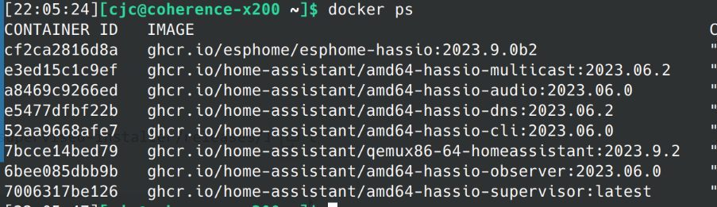

先说结论，智能家居目前来说没有什么实际的用处，它大约可以每天节约几秒到几十秒的时间，但我们真的缺这点时间吗？充其量是满足了我们“懒”的原罪而已。

Home Assistant 创建者 Paulus Schoutsen 在 [16 年的一篇博客中](https://www.home-assistant.io/blog/2016/01/19/perfect-home-automation/)表达了他对于智能家居的看法，大意是智能设备不能失去现有的控制逻辑（比如灯仍然能通过墙上的开关控制），自动化应该为所有家庭成员服务（比如父母可能并不喜欢看电影/看剧时灯变暗这个自动化），如果自动化失效后的设备应该还能正常使用，App 的操作其实很麻烦（语音操作可能更好，但 App 在不在家时很有用），控制系统应该运行在本地，而不是云端。

其中的有一句话我很认同：

> Honestly, there are hardly any valid use cases for being able to control lights from your phone except for showing off.

但是作为一名理工男，难道不觉得这很酷吗？所以折腾还是要折腾的。

## 如何安装

Home Assistant（下称 HA）可谓是事实上的行业标杆了，我印象里就没有一个 HA 的竞品。

通过 [HA 文档的安装方式对比](https://www.home-assistant.io/installation/#compare-installation-methods)可以看到，Container（通过 docker 运行）方式和 Core（通过 pip 安装）方式都是不支持 add-on 的，而我需要使用 ESPHome 作为 add-on 来运行（虽然 ESPHome 能够独立运行，但那样它的 WebUI 就无法集成到 HA 中，也没法通过 HA 自动更新了）。

我选择在一台老旧的 ThinkPad X200 （Intel P8600, 4GB RAM）上装 HA，其并不支持 UEFI 启动，而 HA OS 模式只支持 UEFI 模式，虽然我看到论坛上有些 hack，但谁知道那些 hack 到底能不能工作呢.. 另一个选择是在虚拟机里装 HA OS，但在一颗如此老旧的 CPU 上跑虚拟机感觉不太现实..（虽然这 CPU 甚至支持 VT-x）

那么就只好用 Supervised 模式了，虽然文档说得很吓人，其实并不麻烦。在 archlinux 下，AUR 中提供了 [homeassistant-supervised](https://aur.archlinux.org/packages/homeassistant-supervised) 包，再根据 [archwiki](https://wiki.archlinux.org/title/Home_Assistant_Supervised) 的指导配置 AppArmor 和禁用 cgroup v2，即可成功运行。虽然官方只支持 Debian 12 Bookworm，但实际跑下来并无问题。Supervised 模式实际上也是跑在容器里的，只是它能够通过 dbus 等 API 和系统/docker 交互，同时也提供了自动更新 HA 的能力。add-ons 也是跑在容器里的。

## 网络配置

唯一麻烦的地方是网络配置。由于众所周知的原因，docker 下载镜像，[HACS](https://hacs.xyz/) 下载插件等十分慢，时不时超时。由于 docker 的存在，HA 内部访问网络无法使用寻常的 clash 代理。要么使用 clash tun 模式，要么使用 clash 透明代理，而最简单的应该是 tailscale exit node 了。

[tailscale exit node](https://tailscale.com/kb/1103/exit-nodes/) 相当于一个经典的 VPN 模型，所有本机的流量（可以配置为局域网流量除外）都会经由 exit node 到达互联网。正好我所有的设备都使用了 tailscale 进行组网，很容易就能够把我的一台香港的服务器配置为 exit node 并使 x200 使用其作为 exit node。这里有个坑是服务器在 `tailscale up --advertise-exit-node` 之后只是请求作为 exit node，还需要去 admin console 上把 exit node 的开关打开。否则表现为指定了 exit node 后 `tailscale status` 一切正常，但就是连不了网。

另一个坑是配好之后发现 HA 中 git clone 仓库（HA 通过这种方式来获取 add-ons 的元数据）老是失败，提示 connection reset by peer，exec 进容器后发现容器内能 `curl -v https://github.com` 失败，在 client hello 之后就卡住，搜索一番后发现可能是 [MTU 问题](https://github.com/tailscale/tailscale/issues/3877#issuecomment-1271287451)，减少 docker 虚拟网卡的 mtu 后问题解决。

## 设备

HA 装好了，那设备呢？

我家里有很多小米的灯和插座，可以用 [hass-xiaomi-miot](https://github.com/al-one/hass-xiaomi-miot) 这个插件来接入，登录小米账号即可使用，控制开关灯不在话下。但是这个插件用轮询来获取设备的状态，所以不适用于运动传感器等设备，其他设备的更新也会有延迟。另外还有个美的冰箱，可以用 [midea_ac_lan](https://github.com/georgezhao2010/midea_ac_lan/) 来接入，不知道美的是怎么做鉴权的，不需要登录账号也无需获取 authkey。这个插件倒是能够实时感知事件，然而我家这个冰箱只能汇报个开关门状态和冷冻/冷藏温度，并没有什么大用。

折腾嘛，当然不能仅限于此，之前看过[张焕杰老师的智能家居演讲](https://ftp.lug.ustc.edu.cn/%E6%B4%BB%E5%8A%A8/2022.9.20_%E8%BD%AF%E4%BB%B6%E8%87%AA%E7%94%B1%E6%97%A5/video/2022-09-17%2014-21-43.mkv)，了解到使用 [ESPHome](https://esphome.io/index.html) 无需编程，使用 yaml 配置文件即可控制 esp32 板子。于是我花重金（45 元）购入一块 [ESP32-C6](https://www.espressif.com/zh-hans/products/socs/esp32-c6) 开发板，支持极为先进的 Wi-Fi 6 和 Thread 协议，能够构建 Matter 终端/Thread 边界路由器等支持下一代智能家居协议的设备。同时花 20 元购入一块海凌科 LD2410B 人体存在传感器，准备实践一下开关台灯的自动化。

然而 LD2410B 的效果并不理想，经常会有 false positive（人不在，灯却突然亮起，是不是挺恐怖的），最终我放弃了这个方案。