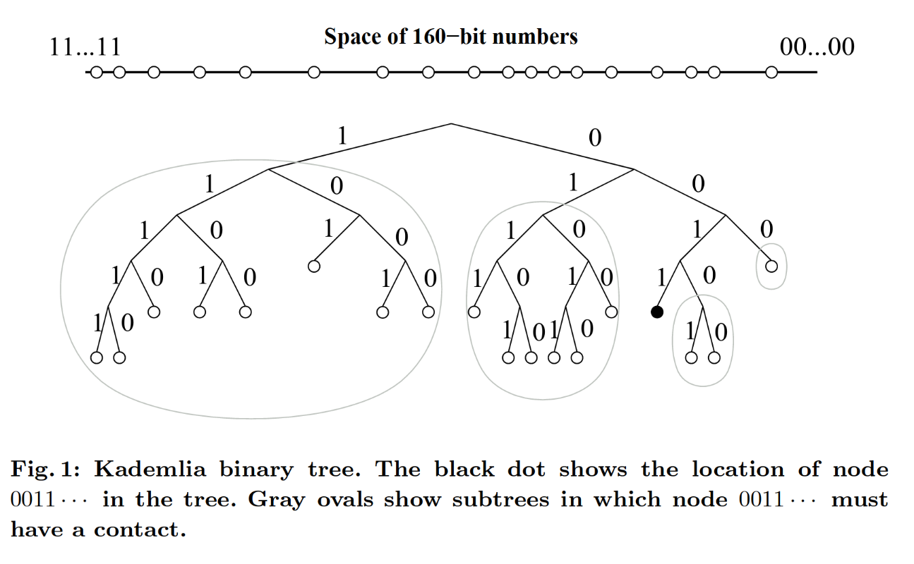

[Mainline DHT](https://en.wikipedia.org/wiki/Mainline_DHT) 指的是 BitTorrent 协议中使用的 DHT，基于大名鼎鼎的 [Kademlia](https://en.wikipedia.org/wiki/Kademlia) 论文。

## Kademlia

Kademlia 的每个节点有一个 160-bit 的 node ID，每个节点将存储一些键值对（key-value pairs），每个 key 是一个某些数据的 SHA-1 哈希，长度也是 160-bit。一个键值对将被存储在距离它较近的一些节点上。

那么什么是距离呢？由于 key 和 node id 都是 160-bit （这两者都可以称为一个 identifier），计算一个 key 到一个 node 的距离和计算两个 node 之间的距离使用的是同样的方法。Kademlia 定义两个 identifier 的距离是它们的异或，即 $d(x,y) = x \oplus y$。使用异或距离的好处在于它是*单向*的，给定任何一个点 $x$ 和距离 $\Delta > 0$，有且仅有一个点 $y$ 满足 $d(x,y) = \Delta$。从而无论一开始的节点在哪，对于给定 key 的查找总是会收敛到相同的路径。

下一个问题是如何寻找一个 key，也就是路由算法。对于每个 $0 \le i < 160$，每个 node 将维护一个到该 node 的距离为 $[2^i,2^{i+1})$ 的 `<IP address, UDP port, Node ID>` 三元组的列表。这个列表叫做 k-buckets （k-桶）。直观地看，如果将地址空间中的所有节点根据前缀画成一棵二叉树的话，那么共享前缀越多的节点之间距离越小。

图中以黑色节点为例，每个灰色椭圆代表了一个 k-bucket 中的能够包含的节点。当然 k-bucket 中不可能存下所有的节点，k 就代表了这个 bucket 的大小，k 的取值将根据经验决定。

## Mainline DHT

Mainline DHT 有以下约定：

- k=8
- 如果一个节点能够响应请求，那么它就是*好*节点，k-bucket 中只会存储好节点。每隔 15 分钟，需要向这个节点发送一次请求，以确定它是否仍然在线。

Mainline DHT 使用了一种叫 [Bencode](https://en.wikipedia.org/wiki/Bencode) 的序列化协议，非常奇怪，感觉不如 JSON，不过倒是挺简单的。Torrent 文件也是用 Bencode 编码的。其可以包括二进制数据，但使用了*纯文本*作为定界符。Bencode 支持下面四种值：

- 整数：`i<ASCII 编码的数字>e`，如 `i-42e`
- 字节数组：`<length>:<contents>`，如 `4:spam`
- 列表：`l<contents>e`，如 `["spam", 42]` 表示为 `l4:spami42ee`
- 字典：`d<contents>e`，每个 key 之后紧接着它的 value。如 `{"bar": "spam", "foo": 42}` 表示为 `d3:bar4:spam3:fooi42ee`

列表和字典可以任意进行嵌套。

基于 Bencode 序列化，Mainline DHT 实现了一个叫 KRPC 的协议，拥有三种消息类型 query, response, 和 error。对于 DHT 而言，有四种 query：ping, find_node, get_peers, 和 announce_peer。

协议的细节参考 [BEP 5](https://www.bittorrent.org/beps/bep_0005.html)。

## 实现

了解了原理，接下来当然是要手搓一个实现玩一玩了。