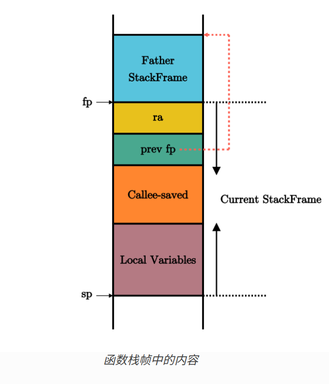
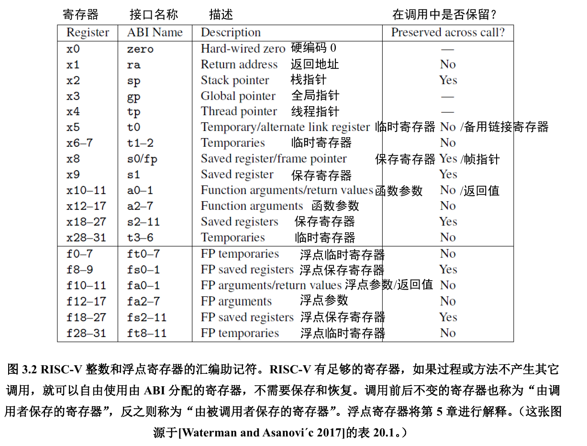
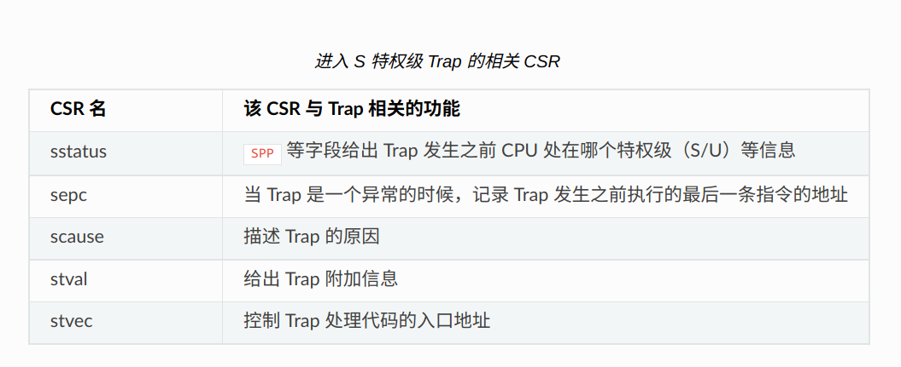
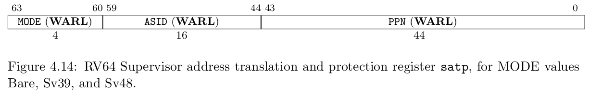

本系列文章是我在阅读和实验 [rCore-Tutorial-Book](https://rcore-os.cn/rCore-Tutorial-Book-v3/index.html) 时的学习笔记，同时我也搭配阅读 [Operating Systems: Three Easy Pieces](https://pages.cs.wisc.edu/~remzi/OSTEP/)。

## RISC-V

> 新生的 RISC-V 架构十分简洁，架构文档需要阅读的核心部分*不足百页*
> ---- rCore Tutorial

指令集扩展:
- RV32/64I：基本整数指令集。它可以用来模拟绝大多数标准指令集拓展中的指令，除了比较特殊的 A 拓展，因为它需要特别的硬件支持。
- M 拓展：整数乘除法相关指令。
- A 拓展：提供原子指令和一些相关的内存同步机制
- F/D 拓展：单/双精度浮点数运算支持。
- C 拓展：压缩指令拓展。

G 拓展是基本整数指令集 I 再加上标准指令集拓展 MAFD 的总称，因此 riscv64gc == riscv64imafdc

> [!NOTE]
>
> 大部分指令中， rs 表示源寄存器 (Source Register)， imm 表示立即数 (Immediate)，是一个常数，二者构成了指令的输入部分；而 rd 表示目标寄存器 (Destination Register)，它是指令的输出部分。

### 寄存器

分类:
- 被调用者保存(Callee-Saved) 寄存器
- 调用者保存(Caller-Saved) 寄存器 

这是为了性能考虑, 减少在函数调用时保存和恢复寄存器所花费的时间.



> [!NOTE]
>
> 栈从高地址向低地址增长。

`x0` ~ `x31` 为通用寄存器, 与特权级无关.

- x10~x17 : 对应 a0~a7
- x1: 对应 ra, 即当前栈帧返回时的跳转地址
- sp: Stack Pointer 指向当前栈帧的顶部，由被调用者保存
- fp: Frame Pointer 指向当前栈帧的底部 (即上一次调用的 sp)

所有寄存器的描述如图：


（图源：RISC-V 手册 一本开源指令集的指南)

控制状态寄存器 (CSR, Control and Status Register), 控制某一特权级的某些行为

- sscratch 用于在保存 trap 上下文时的中转



### 特权架构

详见RISC-V 手册——一本开源指令集的指南第十章。

异常:
- 同步异常, 如某条指令执行错误
- 中断: 由外部事件触发
  - ecall 指令（触发 <curr_mode> environment_call 异常，如在 U 模式下，就触发 Environment call from U-mode 异常 （code 8）。故其用来请求系统调用）

`<x>ret`: 从一个特定模式的 trap 中返回。

RISC-V 架构的 4 种特权级：

- U 模式 (user mode)，应用程序位于该模式。
- S 模式 (supervisor mode)，操作系统位于该模式。
- H 模式 (hypervisor mode)?
- M 模式 (machine mode)，权限最高的模式。RustSBI 位于该模式。

如果处于低特权级状态的处理器执行了高特权级的指令，会产生非法指令错误的异常。常见的特权指令有：

- sret：从 S 模式返回 U 模式
- sfence.vma：刷新 TLB 缓存
- 访问 S 模式 CSR 的指令，如 sscartch/stval/sstatus 等


### 中断
- 如果中断的特权级低于 CPU 当前的特权级，则该中断会被屏蔽，不会被处理；
- 如果中断的特权级高于与 CPU 当前的特权级或相同，则需要通过相应的 CSR 判断该中断是否会被屏蔽。

以内核所在的 S 特权级为例，中断屏蔽相应的 CSR 有 sstatus 和 sie 。sstatus 的 sie 为 S 特权级的中断使能，能够同时控制三种中断，如果将其清零则会将它们全部屏蔽。即使 sstatus.sie 置 1 ，还要看 sie 这个 CSR，它的三个字段 ssie/stie/seie 分别控制 S 特权级的软件中断、时钟中断和外部中断的中断使能。比如对于 S 态时钟中断来说，如果 CPU 不高于 S 特权级，需要 sstatus.sie 和 sie.stie 均为 1 该中断才不会被屏蔽；如果 CPU 当前特权级高于 S 特权级，则该中断一定会被屏蔽。

### 内存
默认情况下 MMU 未被使能，此时无论 CPU 位于哪个特权级，访存的地址都会作为一个物理地址交给对应的内存控制单元来直接访问物理内存。我们可以通过修改 S 特权级的一个名为 satp 的 CSR 来启用分页模式

在这之后 S 和 U 特权级的访存地址会被视为一个虚拟地址，它需要经过 MMU 的地址转换变为一个物理地址，再通过它来访问物理内存；而 M 特权级的访存地址，我们可设定是内存的物理地址。

### Syscall
syscall 的指令代码是自行约定的?
syscall 需要 os 来处理 Trap

## QEMU

virt 平台起始 PC 为 0x1000，在执行了寥寥数条指令后便会跳转到为 0x80000000（来源未知，但通过 gdb 调试发现确实是这样的），rustsbi 执行完初始化将跳转到 0x80200000。我们可以在[这里](https://github.com/rustsbi/rustsbi-qemu/releases)下载到 rustsbi 的二进制文件。

> [!TIP]
>
> 输入 Ctrl+A ，再输入 X 来退出 qemu 终端

rust-objcopy 的作用是去掉生成的 binary 中的元数据，使第一条指令位于正确的位置（即让二进制中**只**包含机器代码）。裁剪后的 bin 文件便无法通过 rust-objdump 读取了：

```
$ rust-objdump -D target/riscv64gc-unknown-none-elf/release/os.bin
/home/user/.rustup/toolchains/nightly-x86_64-unknown-linux-gnu/lib/rustlib/x86_64-unknown-linux-gnu/bin/llvm-objdump: error: 'target/riscv64gc-unknown-none-elf/release/os.bin': The file was not recognized as a valid object file
```

用 hexdump 查看我们仅包含一条指令的内核：

```	
$ hexdump -C target/riscv64gc-unknown-none-elf/release/os.bin
00000000  93 00 40 06                                       |..@.|
00000004
```

> [!NOTE]
>
> qemu 在 7.0 之后可以直接加载 ELF 文件，而不必进行元数据裁剪了。但是为了了解代码的执行流程，还是建议保留这一流程。

## 第二章：批处理系统

- app 的入口点在 `0x80400000`
- 由于还没有文件系统，目前只能把应用和内核编译成一个二进制文件，并让内核知晓
- 在实现完 AppManager 之后，我们需要实现特权级的切换来向应用程序提供服务。
- 有关 CSR 的详细说明可以查阅 [Supervisor-Level ISA, Version 1.12](https://five-embeddev.com/riscv-priv-isa-manual/Priv-v1.12/supervisor.html)。
  - 几个 CSR 的作用，如 sstatus、sepc、scause、stval、stvec，需要熟记


## 参考

- riscv sbi 文档：https://github.com/riscv-non-isa/riscv-sbi-doc
- The RISC-V Instruction Set Manual Volume I: User-Level ISA Document Version 2.2
- RISC-V 手册 一本开源指令集的指南
