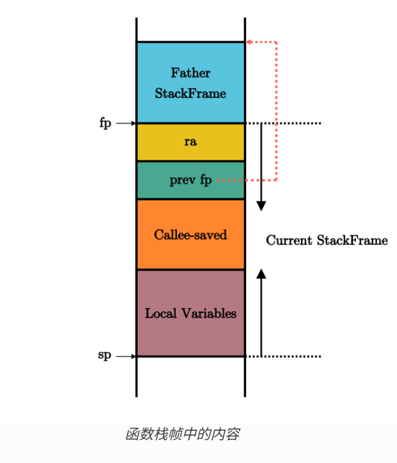
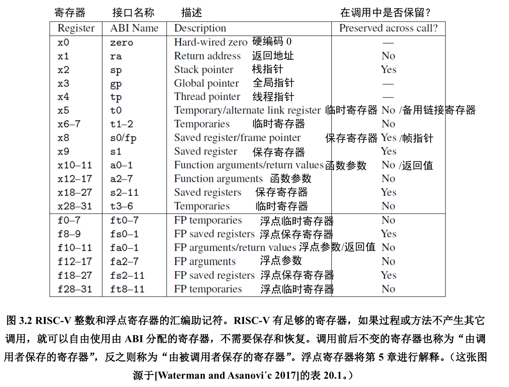
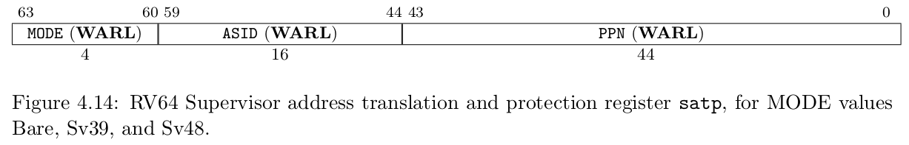
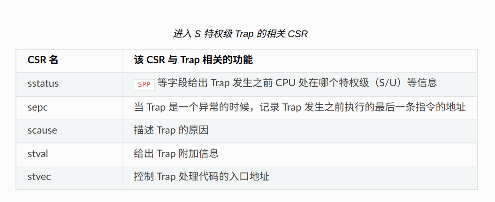

本系列文章是我在阅读和实验 [rCore-Tutorial-Book](https://rcore-os.cn/rCore-Tutorial-Book-v3/index.html) 时的学习笔记，同时我也搭配阅读 [Operating Systems: Three Easy Pieces](https://pages.cs.wisc.edu/~remzi/OSTEP/)。

## RISC-V

> 新生的 RISC-V 架构十分简洁，架构文档需要阅读的核心部分*不足百页*
> ---- rCore Tutorial

指令集扩展:
- RV32/64I：基本整数指令集。它可以用来模拟绝大多数标准指令集拓展中的指令，除了比较特殊的 A 拓展，因为它需要特别的硬件支持。
- M 拓展：整数乘除法相关指令。
- A 拓展：提供原子指令和一些相关的内存同步机制
- F/D 拓展：单/双精度浮点数运算支持。
- C 拓展：压缩指令拓展。

G 拓展是基本整数指令集 I 再加上标准指令集拓展 MAFD 的总称，因此 riscv64gc == riscv64imafdc

> [!NOTE]
>
> 大部分指令中， rs 表示源寄存器 (Source Register)， imm 表示立即数 (Immediate)，是一个常数，二者构成了指令的输入部分；而 rd 表示目标寄存器 (Destination Register)，它是指令的输出部分。

### 寄存器

分类:
- 被调用者保存(Callee-Saved) 寄存器
- 调用者保存(Caller-Saved) 寄存器 

这是为了性能考虑, 减少在函数调用时保存和恢复寄存器所花费的时间.



> [!NOTE]
>
> 栈从高地址向低地址增长。

`x0` ~ `x31` 为通用寄存器, 与特权级无关.

- x10~x17 : 对应 a0~a7
- x1: 对应 ra, 即当前栈帧返回时的跳转地址
- sp: Stack Pointer 指向当前栈帧的顶部，由被调用者保存
- fp: Frame Pointer 指向当前栈帧的底部 (即上一次调用的 sp)

所有寄存器的描述如图：


（图源：RISC-V 手册 一本开源指令集的指南)

控制状态寄存器 (CSR, Control and Status Register), 控制某一特权级的某些行为

### 特权架构

详见RISC-V 手册——一本开源指令集的指南第十章。

异常:
- 同步异常, 如某条指令执行错误
- 中断: 由外部事件触发
  - ecall 指令（触发 <curr_mode> environment_call 异常，如在 U 模式下，就触发 Environment call from U-mode 异常 （code 8）。故其用来请求系统调用）

`<x>ret`: 从一个特定模式的 trap 中返回。

RISC-V 架构的 4 种特权级：

- U 模式 (user mode)，应用程序位于该模式。
- S 模式 (supervisor mode)，操作系统位于该模式。
- H 模式 (hypervisor mode)?
- M 模式 (machine mode)，权限最高的模式。RustSBI 位于该模式。

如果处于低特权级状态的处理器执行了高特权级的指令，会产生非法指令错误的异常。常见的特权指令有：

- sret：从 S 模式返回 U 模式
- sfence.vma：刷新 TLB 缓存
- 访问 S 模式 CSR 的指令，如 sscartch/stval/sstatus 等


### 中断
中断也是一种 一种 Trap，分为**软件中断** (Software Interrupt)、**时钟中断** (Timer Interrupt，由时钟电路发出)、**外部中断** (External Interrupt，由外设发出)，每种中断都有 M/S 特权级两个版本。

- 如果中断的特权级低于 CPU 当前的特权级，则该中断会被屏蔽，不会被处理；
- 如果中断的特权级高于与 CPU 当前的特权级或相同，则需要通过相应的 CSR 判断该中断是否会被屏蔽。以 S 特权级为例：
  - 如果 sstatus.sie 位置 0，则屏蔽中断
  - 如果 sstatus.sie 位至 1，且 sie 的 ssie/stie/seie 位为 0，则屏蔽相应的中断类型

默认情况下，所有的中断都需要到 M 特权级处理。而通过软件设置这些中断代理 CSR 之后，就可以到低特权级处理，但是 Trap 到的特权级不能低于中断的特权级。

#### 时钟

RISC-V 架构要求处理器要有一个内置时钟，其频率一般低于 CPU 主频。此外，还有一个计数器用来统计处理器自上电以来经过了多少个内置时钟的时钟周期。在 RISC-V 64 架构上，该计数器保存在一个 64 位的 CSR `mtime` 中，我们无需担心它的溢出问题，在内核运行全程可以认为它是一直递增的。这个计数器被设计成在所有的特权级均可以通过一条 `rdtime` 的伪指令访问（实际被扩展为 csrrs rd, time, x0）。

另外一个 64 位的 CSR `mtimecmp` 的作用是：一旦计数器 `mtime` 的值超过了 `mtimecmp`，就会触发一次时钟中断。这使得我们可以方便的通过设置 `mtimecmp` 的值来决定下一次时钟中断何时触发。运行在 M 特权级的 SEE （这里是RustSBI）预留了相关接口来实现计时器的控制。

### 内存
默认情况下 MMU 未被使能，此时无论 CPU 位于哪个特权级，访存的地址都会作为一个物理地址交给对应的内存控制单元来直接访问物理内存。我们可以通过修改 S 特权级的一个名为 satp 的 CSR 来启用分页模式

在这之后 S 和 U 特权级的访存地址会被视为一个虚拟地址，它需要经过 MMU 的地址转换变为一个物理地址，再通过它来访问物理内存；而 M 特权级的访存地址，我们可设定是内存的物理地址。

### Syscall
syscall 的指令代码是自行约定的?
syscall 需要 os 来处理 Trap

## QEMU

virt 平台起始 PC 为 0x1000，在执行了寥寥数条指令后便会跳转到为 0x80000000（来源未知，但通过 gdb 调试发现确实是这样的），rustsbi 执行完初始化将跳转到 0x80200000。我们可以在[这里](https://github.com/rustsbi/rustsbi-qemu/releases)下载到 rustsbi 的二进制文件。

> [!TIP]
>
> 输入 Ctrl+A ，再输入 X 来退出 qemu 终端

rust-objcopy 的作用是去掉生成的 binary 中的元数据，使第一条指令位于正确的位置（即让二进制中**只**包含机器代码）。裁剪后的 bin 文件便无法通过 rust-objdump 读取了：

```
$ rust-objdump -D target/riscv64gc-unknown-none-elf/release/os.bin
/home/user/.rustup/toolchains/nightly-x86_64-unknown-linux-gnu/lib/rustlib/x86_64-unknown-linux-gnu/bin/llvm-objdump: error: 'target/riscv64gc-unknown-none-elf/release/os.bin': The file was not recognized as a valid object file
```

用 hexdump 查看我们仅包含一条指令的内核：

```	
$ hexdump -C target/riscv64gc-unknown-none-elf/release/os.bin
00000000  93 00 40 06                                       |..@.|
00000004
```

> [!NOTE]
>
> qemu 在 7.0 之后可以直接加载 ELF 文件，而不必进行元数据裁剪了。但是为了了解代码的执行流程，还是建议保留这一流程。

## 第二章：批处理系统

- app 的入口点在 `0x80400000`
- 由于还没有文件系统，目前只能把应用和内核编译成一个二进制文件，并让内核知晓
- 在实现完 AppManager 之后，我们需要实现特权级的切换来向应用程序提供服务。
- 有关 CSR 的详细说明可以查阅 [Supervisor-Level ISA, Version 1.12](https://five-embeddev.com/riscv-priv-isa-manual/Priv-v1.12/supervisor.html)。
  - 几个 CSR 的作用，如 sstatus、sepc、scause、stval、stvec，需要熟记
  - 
  - sscratch 用于在保存 trap 上下文时的中转

## 第三章：多道程序与分时多任务

### 多道程序

本章会把多个 app 同时加载进内存并运行。由于虚拟内存还没被实现，所以实现方式是在 link app 时根据 app 的序号 link 到约定的地址。 具体而言，从 `0x80400000` 开始，每隔 0x20000 放置一个 app。

任务切换的核心是 `__switch` 函数，其核心是切换内核栈（保存旧寄存器，恢复新寄存器）。大概流程是：

1. A trap 进内核态（__alltraps）
2. 任务切换到 B（__switch）
3. 内核从上一次 B 切换的位置开始重新执行 Trap 控制流
4. B 的 Trap 返回（__restore)，切换回用户栈

由于每个程序都存在于内存中，所以我们需要 n 个内核栈+n 个用户栈。

在初始化阶段，我们为每个 app 构建新的 Trap Context，其中 ra 指向 `__restore`（goto_restore 函数），这意味着 `__swtich` 结束后会马上进入 `__restore`。

### 分时多任务

这一小节的核心是 RISC-V 的中断机制，见前文的中断小节。由于中断也是 Trap，所以也可以由 trap_handler 进行处理。

### 打印调用栈

标准库中自带打印调用栈的函数，但我们用不了标准库。查看源码发现其用的是 miri 提供的[一些函数](https://github.com/rust-lang/miri#miri-extern-functions)，尝试自己调用这几个函数，然而在链接时报错：

```
error: linking with `rust-lld` failed: exit status: 1
  |
  = note:  "rust-lld" "-flavor" "gnu" "/tmp/rustcaBwWIt/symbols.o" "<73 object files omitted>" "--as-needed" "-Bstatic" "/home/user/rust_os/os/target/riscv64gc-unknown-none-elf/debug/deps/{libriscv-08d3a36330a7b582,libcritical_section-f14ab80f0b9e31b4,libriscv_pac-a32c6e49fc9a3e5e,libembedded_hal-7e3046b6d0d0f3b9,liblazy_static-8e9cea13e94ff167,libspin-fd9af8bdccbdccbc,liblog-22d764f4d7396c80,libcfg_if-a34d2ea8b99aadb7}.rlib" "<sysroot>/lib/rustlib/riscv64gc-unknown-none-elf/lib/{libcore-*,libcompiler_builtins-*}.rlib" "-L" "/tmp/rustcaBwWIt/raw-dylibs" "-Bdynamic" "-z" "noexecstack" "-o" "/home/user/rust_os/os/target/riscv64gc-unknown-none-elf/debug/deps/rust_os-a9bee24ba90df4f4" "--gc-sections" "-Tsrc/linker.ld"
  = note: some arguments are omitted. use `--verbose` to show all linker arguments
  = note: rust-lld: error: undefined symbol: miri_resolve_frame
          >>> referenced by backtrace.rs:38 (src/backtrace.rs:38)
          >>>               /home/user/rust_os/os/target/riscv64gc-unknown-none-elf/debug/deps/rust_os-a9bee24ba90df4f4.1t50a88doa236d6km4b3rpjc6.1qeh9ge.rcgu.o:(rust_os::backtrace::resolve_addr::h648c420f83d47657)

```

不知道怎么解决，只能放弃。

搜索发现了 [gimli](https://docs.rs/gimli/latest/gimli/) 这个库能读 DWARF 信息，但是它需要 alloc crate 支持。所以只能先实现一版打印栈指针的，等到下一章之后再实现打印函数名和代码行数的。


## 参考

- riscv sbi 文档：https://github.com/riscv-non-isa/riscv-sbi-doc
- The RISC-V Instruction Set Manual Volume I: User-Level ISA Document Version 2.2
- RISC-V 手册 一本开源指令集的指南
