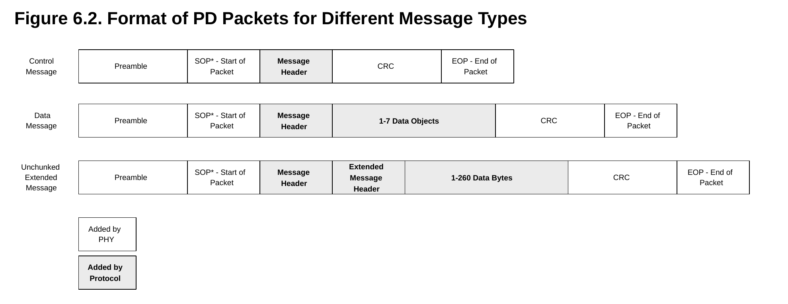

前段时间斥“巨资” 99 购入了一个 USB 功率计维简 K2，在使用过程中发现了不少奇妙的地方。

## 一些发现和吐槽

- 我的酷态科 10 号给一加 15t 充电，总是只有二十几瓦的功率，原来是用的线没有 e-marker 芯片，撞到了 3A 的电流上限。换了一条线之后，成功达到了 40w+。

  

  酷态科 10 号输出的功率比 K2 多了 3W，可能是充电头本身的损耗。

- 15t 附带的充电器（A 口）不支持 PD 协议，随后查到 PD 协议需要 C 口的 CC 引脚通信，所以 USB-A 天然不支持 PD 协议。 TODO: PD 1.0?

- 神奇的是五年前 8T 的充电器却是 C 口的，也支持 PD，这么看 15t 反而是一种倒退。

- 不是很懂国内为什么要搞一个 UFCS 协议，PD 不够用吗？据说在一些手机上 UFCS 的功率会小于 PD，但是手机又会优先使用 UFCS，导致不能发挥充电头最大的性能。这可能也是为什么酷态科 10 号会做一个单独关闭某个协议的功能。

  （TODO：附图）

- 维简的[官方说明书](https://www.witrn.com/?p=2105)写得和💩一样，搜到了一个[民间版本](https://github.com/JohnScotttt/WITRN-K2-Quick-Reference-Manual)，比官方的清晰多了

## PD 相关

看说明书时发现了 [witrn_pd_sniffer](https://github.com/JohnScotttt/witrn_pd_sniffer) 这个项目，原来除了官方的上位机之外，还有其他工具能读取 K2 的数据。于是下下来测试，这个项目只打包了 exe，但是 K2 本身通过 HID 协议通信，应该在 Linux 下也行得通。在这期间碰到了两个问题：

- 第一个是连接设备失败。一开始在我的 asahilinux 下就找不到 hid 设备，然后换了个 C 口就好了.. 可能是 asahi 的限制？	

  手动用 hidapi 库测试，报了下面的错：

  ```
  >>> import hid
  >>> hd = hid.device()
  >>> hd.open(1814, 20576) # 这是 K2 的 vendor_id 和 product_id
  Traceback (most recent call last):
    File "<python-input-5>", line 1, in <module>
      hd.open(1814, 20576)
      ~~~~~~~^^^^^^^^^^^^^
    File "hid.pyx", line 143, in hid.device.open
  OSError: open failed
  ```

  询问 GPT 后发现给 `/dev/bus/usb/00x/00y` （x/y 为 lsusb 输出的 `Bus 00x Device 00y`）加上所有用户的 rw 权限后可以 open 了。

  TODO: udev

  ```
  sudo tee /etc/udev/rules.d/70-local-hid.rules >/dev/null <<'EOF'
  KERNEL=="hidraw*", ATTRS{idVendor}=="0716", ATTRS{idProduct}=="5060", MODE="0666"
  SUBSYSTEM=="usb", ATTR{idVendor}=="0716", ATTR{idProduct}=="5060", MODE="0666"
  EOF
  
  sudo udevadm control --reload-rules
  sudo udevadm trigger
  ```

- 第二个是 K2 会发送 general 和 pd 两种类型的消息，general 是当前的电压、电流等数据，pd 是 pd 报文，但是只能收到 general 消息。debug 了半天后发现文档中写了需要“菜单开启PD联机开关”...

解决了之后顺利抓到了 PD 报文。目前 PD 的规范（r3.2 v1.2）足足有 416 页！只能让 GPT 老师来看了，不过其中基础的部分也不算复杂。下面我们就以以一次充电的 PD 协商为例，来入门一下 PD 协议。

### 历史

在 PD 之前，USB Battery Charging (BC) 最高支持 5V 1.5A（7.5W）的充电。PD（Power Delivery）1.0 在 2012 年发布，这比 USB-C（2014）要更早，这时候的 PD 已经支持六个 profile，最高 100W 的充电了。受限于 USB-A 接口，这时候的 PD 是用 VBUS 引脚通信的。PD 2.0 添加了 USB-C 的支持。3.0 加入了 Programmable Power Supply (PPS) 的支持，能够以 20 mV 的步进调节电压，50 mA 的步进调节电流。目前 PD 最高支持 48V 5A （240W）的充电。

### 开始协商

首先明确两个术语：

> [!NOTE]
>
> - Source/Sink，供电方/受电方，这两个是 Power roles，Source 通常也是 DFP
> - DFP (Downstream Facing Port)/UFP (Upstream Facing Port)，下行/上行端口。DFP 是数据角色协商的 Initiator，UFP 是 Responder。

在一开始，充电头就会作为 Source 和 DFP 发起协商。在第一条 PD 报文之前还有个初始连接的过程，不过那是 USB-C 标准定义的，不在 PD 的范畴之内。第一条报文是 Source_Capabilities 报文，由 Source 广播它的 PDO。

> [!NOTE]
>
> PDO (Power Data Object)，电源能力对象，通常用来声明充电头的电压/电流档位

### 物理层

PD 采用 USB-C 中的 CC (Configuration Channel) 引脚进行通信。数据的比特流先经过 [4b5b 编码](https://en.wikipedia.org/wiki/4B5B)，把每 4 bit 原始数据，编码成 5 bit 码组。然后再通过 [BMC](https://en.wikipedia.org/wiki/Differential_Manchester_encoding) 编码输出成电压波形。


图源：https://en.wikipedia.org/wiki/USB-C

PD 包的格式如下图所示。


图源：PD 规范

其中 Preamble 用于通知接收方开始接收消息，以太网帧中也有类似的东西。SOP* 为 SOP / SOP′ / SOP″ 三类 SOP (Start of Packet) 的统称，它们的区别是发给对端 Port Partner，也就是 Source/Sink 本体，还是发给线缆一端/另一端的 Cable Plug。

> [!NOTE]
>
> Cable Plug，线缆或插头里的 PD 通信能力电路，常见就是 e-marker。它可以告诉主机这根线支持多少电流、什么速率、是否支持 EPR 等。

Message header 和具体的 payload 不是由物理层加入的，后面介绍。接下来是一段 CRC-32，用以校验消息的完整性。只有 Message header 和 payload 会被用于 CRC 计算。最后是 EOP (End-Of-Packet)。

### 消息格式

每个 PD 报文首先会带一个 16 bits 的 header。

一个 PDO 由 32 bits 组成，以下面这个 PDO 为例：

```
[b128-b159] PDO 5: F 20.0V@1.5A (0x00064096)
    [b31-b30]   Supply Type: FPDO (00b)
    [b29-b22]   Reserved
    [b21-b20]   Peak Current: 00 (00b)
    [b19-b10]   Voltage: 20.0V (0110010000b)
    [b9-b0]     Maximum Current: 1.5A (0010010110b)
```

它的类型是 Fixed Supply，Peak Current 指示了不支持短时间过载，声明的电压/电流为 20V/1.5A。PPS 的情况下加入了最大/最小电压，其他类似。
