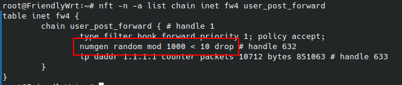

本文缘起于我想测试一下丢包对于网络游戏的影响, 于是在路由器的 openwrt 上加了一条规则随机丢弃 1% 的包:

测试发现这对于 CS:GO 和英雄联盟来说并没有可见的影响, 然而舍友却有了一个意外的发现. 我们的宽带接入带宽是 500M, 当关闭随机丢包时, 使用 `speedtest.net` 和 `speedtest.cn` 测速均能够达到带宽上限, 然而当开启随机丢包后, `speedtest.cn` 测得的下载速度骤降至 50 Mb/s, 而 `speedtest.net` 测速仍然正常.

当确定是丢包导致了测速异常之后, 我第一时间想到了这可能是拥塞控制算法的问题, 于是便想做个实验验证自己的猜测. 在这之前, 让我们先来复习一下 TCP 的拥塞控制. 本文假定读者对于 TCP 有一定的了解, 因此不会过多地介绍基础知识.

## RFC 5681

RFC 5681 定义了四种拥塞控制的基本方法, 分别是慢开始 (slow start), 拥塞避免 (congestion avoidance), 快重传 (fast retransmit) 和快恢复 (fast recovery). 这里仅描述基本算法, 一些在 RFC 中讨论的边界情况没有描述.

下面先给出一些定义:

- 分段 (Segment), 一个分段是任何 TCP 数据包 (包括 ACK)
- 发送端最大分段大小 (Sender Maximum Segment Size, `SMSS`), 发送端能够传输的最大分段大小, 不包含 TCP 头部和选项 (options). 一般由网络的 MTU 确定
- 全尺寸分段 (Full-Sized Segment), 包含了最大允许的字节数的分段 (即包含了 `SMSS` 字节的分段)
- 接收窗口 (Receiver Window, `rwnd`), 对端最近一次声明的接收窗口
- 拥塞窗口 (Congestion Window, `cwnd`), 一个内部变量 (不会被发送给对端), 用于限制 TCP 能够发送的数据. 在任何时间, TCP 不能发送一个`序列号 > 最近一次被 ACK 的序列号 + min(cwnd, rwnd)`的数据包
- 在途大小 (Flight Size), 已经被发送但是尚未接收到 ACK 的数据
- 慢开始阈值 (slow start threshold, `ssthresh`), 用于决定使用慢开始还是拥塞避免算法
- 重复 ACK (Duplicate ACK), 一个 ACK 序号和先前所收到过的 ACK 序号一致

### 慢开始和拥塞避免

`ssthresh` 一开始可以被设置为任意大, `cwnd` 根据 `SMSS` 的不同大概在 `3 * SMSS` 左右. 当 `cwnd < ssthresh` 时, TCP 使用慢开始算法. 此时每接收到一个 ACK (这里默认了 delayed ACK 没有被应用, 即一个分段对应一个 ACK), TCP 就会将 `cwnd` 增加至多 `SMSS` 字节. 直到 `cwnd` 超过 `ssthresh`, 或是观测到了拥塞 (即重传计时器超时, 发生了丢包).

当 `cwnd > ssthresh` 时, TCP 进入拥塞避免状态, 每过一次往返时间 (Round-Trip Time, RTT) `cwnd` 才会增加至多一个 `SMSS`. 拥塞避免状态会持续到拥塞被检测到. 当发生丢包时, `ssthresh` 将被设置为 `ssthresh = max (FlightSize / 2, 2*SMSS)`, 此处的 `FlightSize` 即为上文所述的在途大小, 使用 Flight Size 的原因是因为 `rwnd` 的影响 `cwnd` 可能会远大于  Flight Size.

`cwnd` 会被设置为 `1 SMSS`, 然后重新进入慢开始阶段.

### 快重传/快恢复

当 TCP 收到一个无序的分段时, 应该立即发送一个 duplicate ACK. 这个 ACK 的目的是告知发送方一个无序的分段到达了, 并且指示期望分段的序列号. 在发送方看来, 这个 duplicate ACK 的可能原因是: a) 发生了丢包 b) 网络导致的包顺序的变化 c) 网络导致的 ACK 或数据段的复制. 发送方应该使用快重传来应对 duplicate ACK, 即收到 3 个 duplicate ACK 就可以认为发生了丢包, 此时不用等待重传计时器超时即可重传被认为是丢失的包.

在重传发生后, 快恢复算法被使用, 直到一个非 duplicate ACK 到达. 不进行慢开始的原因是收到 duplicate ACK 不仅预示着丢包, 也预示着分段很可能仍然在离开网络. 因为接收方只可能在收到一个分段后发送 ACK, 所以我们知道这个分段已经不会再占用网络中的资源了.

快重传和快恢复应该按如下步骤进行:

1. 

## BBR

2017 年，Google 在 [BBR: congestion-based congestion control](https://queue.acm.org/detail.cfm?id=3022184) 这篇论文中提出了 BBR 拥塞控制算法，而事实上，在这之前 BBR 已经在 Google 的生产环境中被广泛使用了。下面我转述一下论文的核心思想。

传统的基于丢包的拥塞控制（包括 Cubic）已经不再适用于当今互联网了。

## TODO

- tc

## References

- https://en.wikipedia.org/wiki/TCP_congestion_control
- [[译] [论文] BBR：基于拥塞（而非丢包）的拥塞控制（ACM, 2017）](https://arthurchiao.art/blog/bbr-paper-zh/)