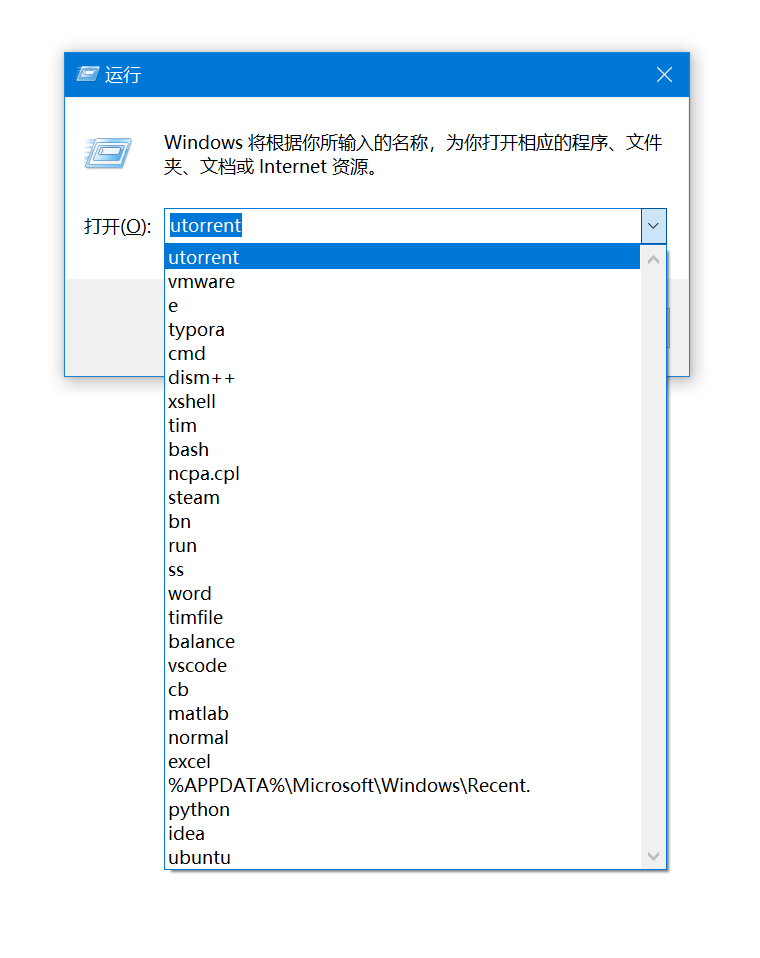
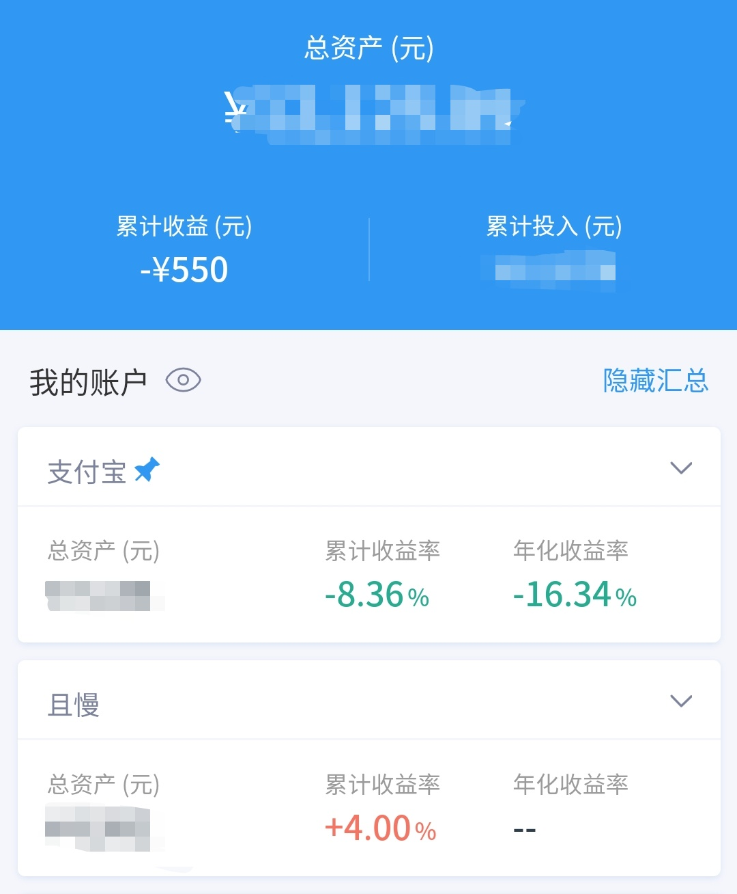
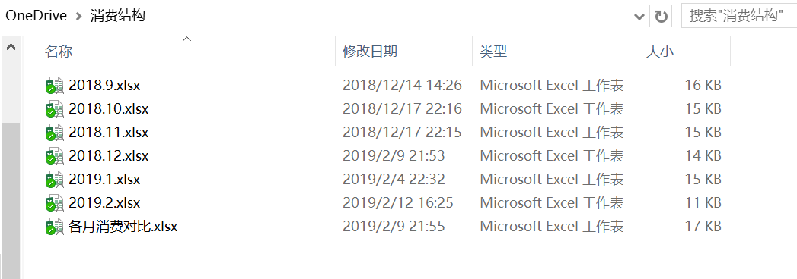

今天是己亥猪年的大年初七，很惭愧到今天我才想起寒假前就想写的年终总结还没有写。

<!-- more -->

## 2018 总结

时间及事件依据：印象笔记、Google 相册、我的记忆。

事件大致以时间顺序排列。

* 一月初，经历了在西安的第一场雪。
* （时间未知）使用了 Windows 运行来快速启动程序，~~（感觉上）大大提高了效率~~（不（感觉装逼才是真的

* 从 1.13 开始寒假训练， 3.24 校赛，3.31 天梯赛，5.17 左右 ACM省赛，7.19 开始暑假多校训练，10.26 徐州区域赛， 11.23 深圳 CCPC 总决赛，整个一年我算是比较积极地参与 ACM-ICPC 竞赛（虽然下半年逐渐开始划水

（六张照片依次为 CCPC、寒假训练、省赛、校赛、天梯赛、徐州区域赛）

* 一月末，开始种草轻薄本，并寻求把游戏本卖了，未果。
* 从年初开始，用空闲资金进行投资，并开始学习相关知识。一月末我第一次买入了一个基金，入坑。一开始赚了点钱很高兴，后来贸易战开始就亏了。七月初买了一本金融方面的书然而并没有看多少。八月开始跟投某大V的投资计划，九月末把主要账户转移到且慢。回想起一开始什么都不懂就冲着某个行业买基金，现在慢慢有些了解但知识仍然很浅薄。时刻要提醒自己：不要盲从。

* 定下（并践行）了在美（英）剧中学英语的目标，然后每当我看剧时总是自我安慰同时我也在~~学习~~（并没有）。

到目前为止看过的剧有（不限于18年）：Friends，Sherlock，Black Mirror 一季， The IT Crowd 两季，Monday Mornings，Greys Anatomy 一季， Person of Interest 三季，Modern Family 半季多

* 从3月份开始，我开始撸 DigitalOcean 的 Github 学生优惠，到现在为止服务器运维的相关知识增长地挺快...应该是从大学开始吧，我开始用VPS自建SS，一开始是 Cloudcone 还是 Vultr 后来撸到了 DO，再后来19年年初的时候知道了一个超便宜的深港专线，后来又撸了阿里云的学生机。
* 四月中旬看了死亡诗社，Seize the day 成了我的座右铭，虽然我一直没有做到这一点。
* 整个一年我总有一种感觉，学习不在状态，有时候一直陷入一种昏昏沉沉的状态，那种状态下，犯困，没有学习的心思，干其他事也提不起兴趣。仿佛就在虚度光阴。从那个寒假开始我就（似乎）养成了不良的生活习惯。
* 四五月份入了创新IE3P 和 iPad 2018，拔草成功，却没有对我的学习质量有多大的改善。后来又开始种草蓝牙降噪耳机...
* 六月末，转专业考试。一年中最重要的一件事，从环境科学与工程转到了软件工程专业，进入了理想的专业。
* 然而同时打算换宿舍的（非常不喜欢我们宿舍的氛围和作息），最终没有成功。后来也尝试过 Bose Sleepbuds 这个方案，效果不佳。遂产生了租房的想法。
* 尝试读英文原著，从大一上开始读星际穿越的剧本，读到18年年中读完了。然后开始看三体的英文版，到现在看了一半多。
* 九月中旬开始用 Excel 记账，对日常消费进行记录和管理，持续至今。

* 九月中旬，在学校有了一辆自己的自行车。
* 大二上是忙碌的一学期。首先课就很多，粗略统计之下每周有38个学时，作为对比，大一上是27学时，大一下是33学时。然后学期初的时候偶然间看到网络中心招学生助理，于是去了。（~~并没有学什么东西~~好歹还是学了点的）然后是计协（主要）和其他社团的活动。
* 学习成绩仍然不尽如人意，而且有着每学期逐步下滑的趋势...
* 记不清某个时间了，折腾过Ubuntu，碰到了N+I卡驱动的问题，卡启动Logo，最后也没解决。后来就弃疗了，平时就瞎搞搞虚拟机和 WSL 了。
* 十二月下旬，我校ACM新生赛，我负责了评测环境的搭建，这大概是我一年来做过的最有意义的一件事。
* 好多书都只读到一半，然后处于半弃坑状态，比如未来简史，值得反思...
* 下半年的印象笔记笔记数量似乎少了很多...
* 更加怀念高中时候的生活了...或许到了工作之后我也会更加怀念大学的生活吧。

## 2019 年初计划

* 学习 Linux，参考书目《Linux&Unix 大学教程》
* 学习 Git，参考书目 《Pro Git》
* 学习计算机网络，参考书目《Computer Networking:A Top-down Approach》（这本书TM还是去年七月下旬借的）
* 学习使用 Anki （去年九月初就知道了这个软件并一直想学 emmm..)
* 写一篇关于 Lumia 的博客（同样是去年鸽到现在了...）
* 用 AutoHotkey 把 Markdown 编辑器打造地更顺手一点
* 在豆瓣建立起我的书单，并写书评
* 买轻薄本（从去年年初我就开始有这个想法了QAQ），目前种草 LG Gram，等一个19款
* 多运动，多出去骑车
* 实现本博客的 Todo（虽然大半都是在瞎搞
* 搬出去！
* 做好未来的打算，考研 OR 出国，是否找个实验室去做项目，未来的方向等等
* 记录生活

## 后记

这篇文章写了三天才写完，写的也比较杂乱。事实上在一开始我就没有一个整体的构思。

2019年已经快过去了两个月，我才堪堪写完年初计划。这些计划（或者说我未来的目标）虽有个模糊的大方向，却又不甚明了，或许我还需要更深层次的思考吧。