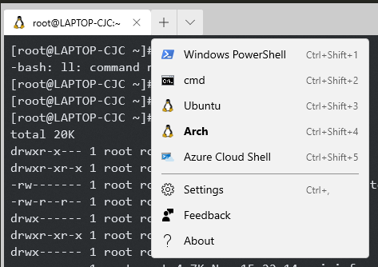
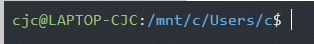
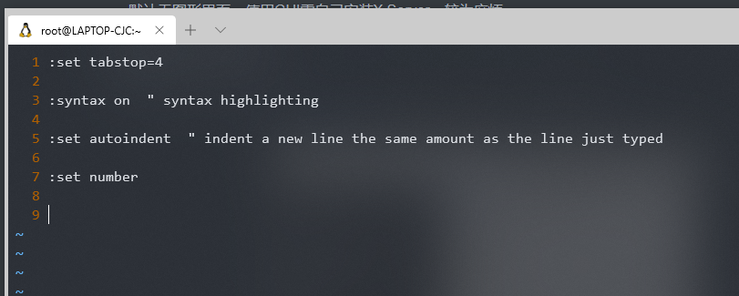
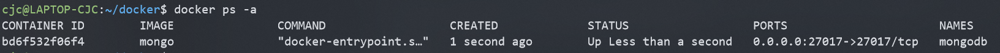
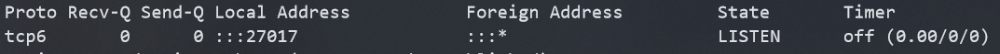
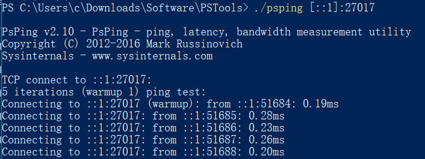
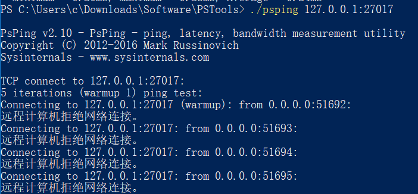
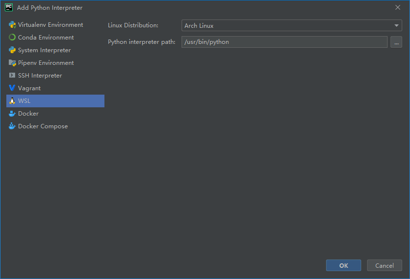
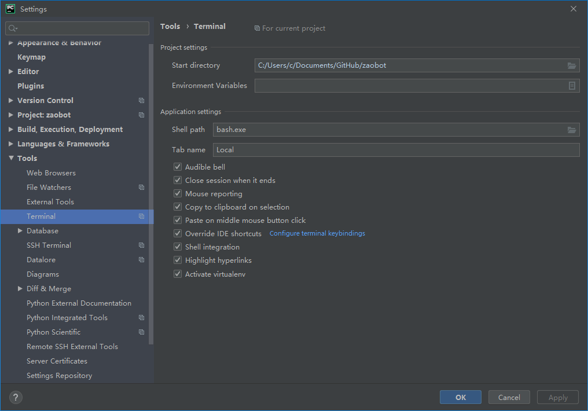
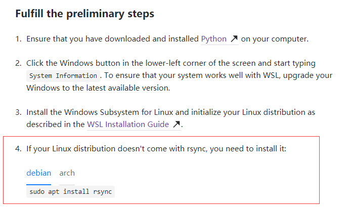

首先，WSL真香！

<!-- more -->

## 开启WSL

最简单的方式是使用管理员权限运行Powershell，然后输入：

`Enable-WindowsOptionalFeature -Online -FeatureName Microsoft-Windows-Subsystem-Linux`

重启电脑，然后在应用商店中安装WSL发行版。

## Arch

注意到WSL是没有Arch Linux发行版的（以前有一个非官方的，很快被下架了），但是我们有办法添加Arch发行版。去[这个仓库](https://github.com/yuk7/ArchWSL)下载打包好的appx文件和证书，首先将证书导入至受信任的根证书颁发机构，然后安装appx即可。

## 体验

### 坑

* 默认WSL不会读取`~/.bashrc`而会读取`~/.bash_profile`，所以需要在`~/.bash_profile`中写入：

  ```bash
  if [[ -f ~/.bashrc ]] ; then
  	. ~/.bashrc
  fi
  ```

  才能够正常读取bash配置。

  

### 缺点

* WSL下无法使用Docker等涉及内核的操作，该缺陷在WSL2中被解决。
* 默认无图形界面，使用GUI需自己安装X Server，较为麻烦。

## Windows Terminal

注意，截至目前，Windows Terminal仍处于预览阶段，正式发布预计要到2020年4月。



安装WSL后，Windows Terminal能够自动识别WSL并添加至可用Terminal列表中。

### Bug

* 启动Shell后的工作目录为Windows当前用户的Home目录，而非Linux的用户Home目录。



​	可以通过在配置文件中加入`"commandline" : "wsl ~"`来解决，不过这个方案只适用于默认WSL发行版，对于其他发行版无效，可以通过在`.bashrc`中添加一条判断语句来解决。

* Windows Terminal目前暂无法自动添加至右键菜单上下文，需手动添加注册表。

* 往Terminal中粘贴内容是会自动在行间加空格。（更新：这个bug是由于\r\n与\n的处理问题，在0.7中被解决）

  

## WSL2

### Docker

可喜可贺，WSL终于能用Docker了。

配置镜像源（无systemd）：

> 在配置文件 `/etc/default/docker` 中的 `DOCKER_OPTS` 中配置Hub地址：
>
> ```
> DOCKER_OPTS="--registry-mirror=https://docker.mirrors.ustc.edu.cn/"
> ```
>
> 重新启动服务:
>
> ```
> sudo service docker restart
> ```

### 坑

* 官方宣称在18945之后的版本中Windows访问WSL提供的网络服务只需使用localhost即可（服务需绑定之0.0.0.0而不是127.0.0.1，因为实际上这些连接被认为是局域网中的连接）。

  尝试在Docker中使用。

  

  使用`netstat -ano`如下：

  

  然而在Windows下只能使用IPv6地址访问：

  b

  而不能使用IPv4：

  

* 无法使用systemd。

## Pycharm

Pycharm能够将Python解释器设置为WSL中的Python。



同时能够将terminal设置为WSL：



只需要将Shell path设置成`bash.exe`即可。注意设置为`arch.exe`等自定义的发行版名称时，无法将当前工作目录传递给Shell。

注意到由于WSL没有图形界面，无法在Python中运行GUI程序。

### Bug

~~在WSL中安装的包无法被识别：~~


~~因此也无法使用这个包的自动补全、查看定义等一系列功能。~~

[文档里](https://www.jetbrains.com/help/pycharm/using-wsl-as-a-remote-interpreter.html)写得清清楚楚：



我错了，我应该看文档的。安装rsync之后问题解决。

## 参考资料

