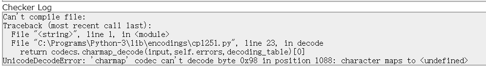
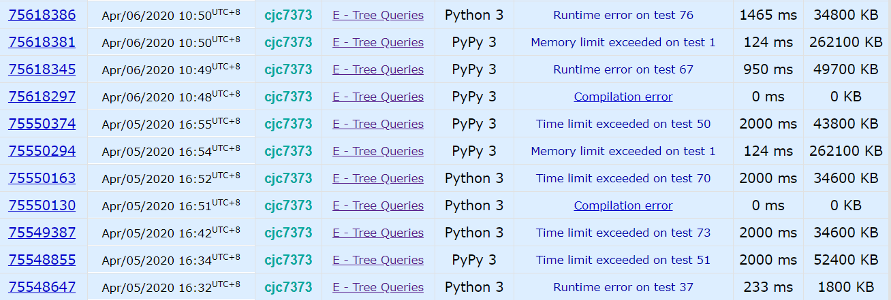
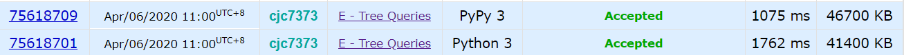

快乐划水。

<!-- more -->

## [1328A - Divisibility Problem](https://codeforces.com/contest/1328/problem/A)

`1/0 Accepted`

快乐签到。

## [1328B - K-th Beautiful String](https://codeforces.com/contest/1328/problem/B)

`1/0 Accepted`

给一个数n，要求构造一个字符串，包含n-2个a，2个b，且在这个字符串的按字典序的全排列中排在第k个。

找b的位置即可。

```python
t = int(input())
for _ in range(t):
    n, k = [int(i) for i in input().split()]
    for p in range(max(n+1,k+1)):
        if (p - 1) * p / 2 >= k:
            break
    pos1 = n - p
    pos2 = n - (k - int(((p - 1) * (p - 2) / 2)))
    for i in range(n):
        if i == pos1 or i == pos2:
            print('b', end='')
        else:
            print('a', end='')
    print()
```

## [1328C - Ternary XOR](https://codeforces.com/contest/1328/problem/C)

`1/0 Accepted`

给一个三进制数x，求两个数a，b，使这两个数的异或为x，且max(a, b)最小。

从左往右对每一位考虑最优解，若是0或2，则平均分配，若为1，则分配到0的那方获得接下来所有的数。

```python
t = int(input())
for _ in range(t):
    l = int(input())
    x = input()
    ans1 = ''
    ans2 = ''
    for i in range(len(x)):
        if x[i] == '0' or x[i] == '2':
            ans1 += str(int(x[i]) // 2)
            ans2 += str(int(x[i]) // 2)
        else:
            ans1 += '1'
            ans2 += '0'
            for j in range(i+1, len(x)):
                ans1 += '0'
                ans2 += x[j]
            break
    print(ans1, ans2, sep='\n')
```

## [1328D - Carousel](https://codeforces.com/contest/1328/problem/D)

`Not Attempted`

大概是能做的，只是到了十二点太困了。。就睡觉去了。

n个动物围成一圈，相邻的不同动物要有不同的颜色，求最少的颜色和对应的颜色序列。

考虑几种情况：所有动物都相同，总数为偶数，总数为奇数但存在相邻的相同动物，总数为奇数且不存在相邻的相同动物。

```python
t = int(input())
for _ in range(t):
    n = int(input())
    figure = [int(i) for i in input().split()]
    if figure.count(figure[0]) == n:
        print(1)
        print('1 ' * n)
    elif n % 2 == 0:
        print(2)
        for i in range(n):
            print(i % 2 + 1, end=' ')
        print()
    else:
        flg = -1
        for i in range(n):
            if figure[i] == figure[i-1]: # -1 即最后一个
                flg = i
                break
        if flg != -1:
            print(2)
            for i in range(n):
                if i < flg:
                    print(i % 2 + 1, end=' ')
                else:
                    print((i + 1) % 2 + 1, end=' ')
            print()
        else:
            print(3)
            for i in range(n-1):
                print(i % 2 + 1, end=' ')
            print(3)
```

## [1328E - Tree Queries](https://codeforces.com/contest/1328/problem/E)

`Not Attempted`

给一棵树，有m个查询，每个查询给出树上的一些节点，若有一条从根节点出发的路径，使这些节点属于这条路径或和这条路径上某个点的距离为一，输出 YES，否则为 NO。

补题的时候都是泪。按题解写了个 dfs 序，然后对每个查询去它的父节点，对每个节点检查其是否为最深的那个节点的祖先。

然后上来一个 CE：



我就奇怪了你为什么不用 utf-8，而且之前交过带中文注释的正常啊。于是把注释改回英文。

之后是无尽的 RE 和 TLE。分析了一波复杂度没毛病啊，只能是优化的锅了。



看了别人的代码，主要是两点：用栈模拟 dfs 和输入使用`input = sys.stdin.readline`。试了一下确实，直接 dfs 会爆栈空间，不优化输入会 TLE。

最终结果可以看出，PyPy 和 CPython 差距还是挺大的。



```python
import sys
input = sys.stdin.readline

n, m = [int(i) for i in input().split()]
tree = [[] for i in range(n+1)]
for _ in range(n-1):
    u, v = [int(i) for i in input().split()]
    tree[u].append(v)
    tree[v].append(u)

t = 0
tin = [-1 for _ in range(n+1)]
tout = [-1 for _ in range(n+1)]
par = [-1 for _ in range(n+1)]
dep = [-1 for _ in range(n+1)]

stack = [(1, -1, 0, 1)]
while stack:
    to, parent, depth, state = stack.pop()
    if state:
        par[to] = parent
        dep[to] = depth
        tin[to] = t
        t += 1
        stack.append((to, parent, depth, 0))
        for i in tree[to]:
            if i == parent: continue
            stack.append((i, to, depth+1, 1))
    else:
        tout[to] = t
        t += 1

# print(f"tin={tin}\ntout={tout}")

for _ in range(m):
    # replace every non-root vertex with its parent
    query = [par[int(i)] if i != "1" else int(i) for i in input().split()]

    del(query[0])
    
    fv = -1
    max_dep = 0
    for i in query:
        # search the deepest vertex fv
        if dep[i] > max_dep:
            max_dep = dep[i]
            fv = i
    flg = 0
    # for every vertex, should be fv's parent
    for i in query:
        if not (tin[i] <= tin[fv] and tout[fv] <= tout[i]):
            flg = 1
            break
    if flg: print("NO")
    else: print("YES")
```

## [1328F - Make k Equal](https://codeforces.com/contest/1328/problem/F)

`Not Attempted`

给 n 个数，给一个数 k <= n，要使得至少 k 个数相等。有两种操作：使一个最小的数 +1，使一个最大的数 -1。求最少的操作数。

根据[这篇题解](https://www.cnblogs.com/st1vdy/p/12579249.html)，本题一共三种情况，给最大值 -1，给最小值 +1，同时进行两种操作（此时一定有 $a_1=a_n$ ）。（这个解法感觉比官方的还要好）

第一和第二种情况类似，将最左（右）边的 k 个数变为一致即可。第三种情况下，$\sum_{i=1}^{\frac{n}{2}}(a_{n-i}-a_i)$即将所有数变为相同（但是如果 n 为奇数，中间那个数怎么办？待考虑。。但结果是对的），但我们只需要 k 个，所以减去$n-k$。

```python
import sys
input = sys.stdin.readline

n, k = [int(i) for i in input().split()]
a = [int(i) for i in input().split()]
a.sort()

for i in range(n-k+1):
    if a[i] == a[i+k-1]:
        print(0)
        sys.exit(0)

l = r = m = 0
# suppose val is the number where k numbers are the same
# case 1, turn the leftmost k numbers to val (or val-1)
for i in range(k-1):
    l += a[k-1] - a[i]
for i in range(k-1, n-1):  # if a[k-1] have many same numbers
    if a[i] == a[i+1]:
        l -= 1
    else:
        break

# case 2, turn the rightmost k numbers to val (or val-1)
a_reverse = a[::-1]
for i in range(k-1):
    r += -(a_reverse[k-1] - a_reverse[i])
for i in range(k-1, n-1):
    if a_reverse[i] == a_reverse[i+1]:
        r -= 1
    else:
        break

# case 3, all the numbers are val or val-1 or val+1
for i in range(n//2):
    m += a[n-i-1] - a[i]
m -= n - k
print(min(l, r, m))
```

