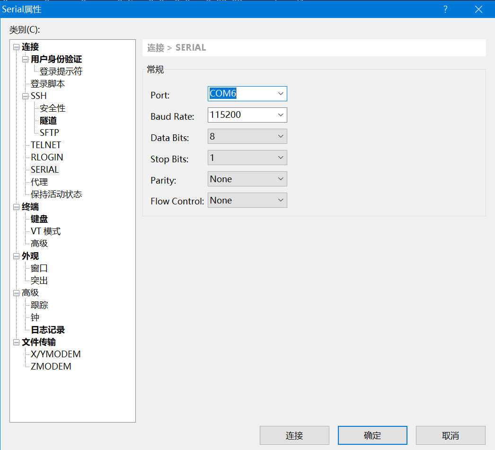
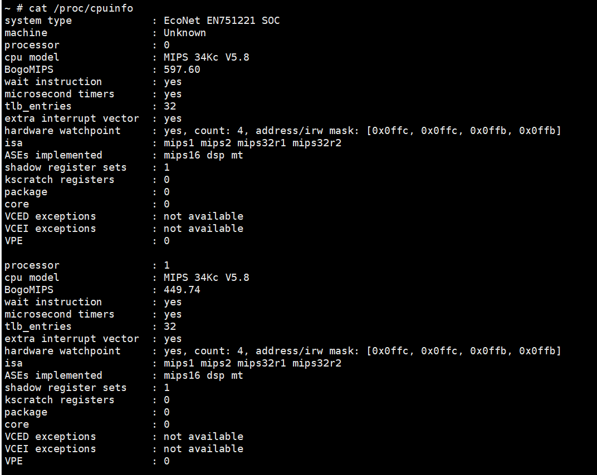

寒假回家，欣闻家中宽带升级成了 200M，然而坑爹的是一直以来的桥接模式被改成路由模式。由于想公网访问本地的 NAS，且想看看 IPV6 是否已在我家区域部署，所以想破解光猫获取管理员密码。

Google 该设备的型号，发现网上并没有相关的教程，可能是型号比较新的缘故。致电中国电信，被告知无法透露管理员密码，派人上门调试则需额外花费。本着自己折腾的原则，遂在某宝购入 CH340G USB转TTL板，准备拆机 TTL 破解光猫。

<!-- more -->

## 0x01 拆机

拆机后发现 PCB 板上有 TTL 插针，用万用表测得倒数第二根为 GND（接地pin），然后剩余四根随机组合，测得 RX（接收数据pin）和 TX（发送数据pin）。用杜邦线连接 USB转TTL板和 TTL 插针。

## 0x02 串口调试

电脑安装好 USB转TTL板的驱动，USB端连接上电脑。网上的教程一般使用 SecureCRT， 然而我后来发现 Xshell 也能连接串口，遂用 Xshell 进行调试。

如图设置参数，port 按照自己的情况设置。

然后连接。接通电源后等待。大概等待两分钟后，按回车，出现 `Login:` 字样，用 `root/hg2x0` 登陆。

用 `cat /proc/cpuinfo` 看一下 CPU 信息，居然是 MIPS...

超级密码在`/flash/cfg/agentconf/factory.conf `文件中。文件前两行即为管理员账户和密码。至此，光猫破解完成。

## 0x03 参考资料

[如何通过TTL调试光猫](https://paper.seebug.org/506/#0x03)
[破解电信光猫](https://m2.zhugh.com:26800/po-jie-dian-xin-guang-mao/)