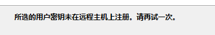

待填坑。。

<!-- more -->

## 意义

使用公钥最大的好处应该在于避免了弱密码吧。目前很多 VPS 也已强制使用公钥登录了。

在易用性上似乎没什么区别，可能免去了记多个密码的麻烦，在多端使用的时候免去了试密码的麻烦（特别是有多个服务器的时候）。

## 问题

首先，我使用 Xshell 生成了 2048 位的 RSA 密钥。

导入至 GCP 时，一切正常。（GCP 强制使用公钥进行连接，在网页端导入公钥，且对公钥有格式要求）

然后在阿里云上导入公钥后，无法连接。

在 DigitalOcean 上尝试，同样出现上述错误。

## 尝试

~~我是不是应该先搞清楚 `sshd` 配置文件各项的意义和`ssh`各项参数的意义？~~

首先，标准的做法是复制公钥至 home 目录下的 `.ssh/authorized_keys`文件中，重启`sshd`服务，即完成配置。